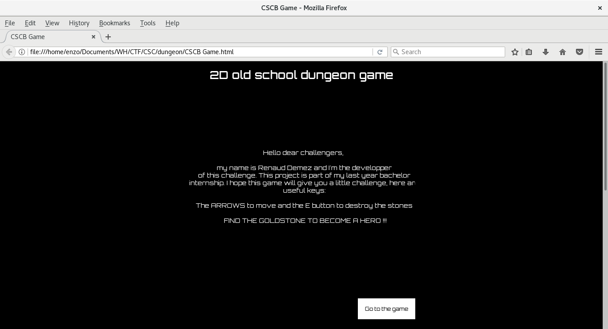
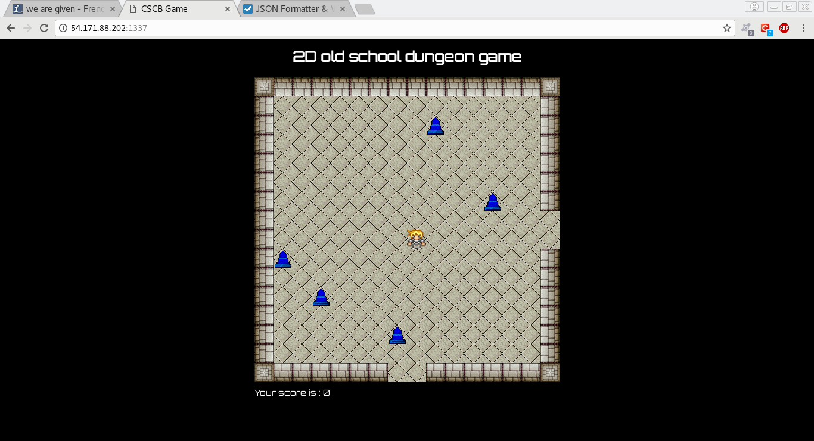

# Dungeon master

### [~$ cd ..](../)

We are given a URL, and found a old 2D game running on port 1337. The game engine is PIXI.js, then we downloaded all sources.

The goal is to find a hidden stone, and get the flag. We first started a static analysis of the code in order to see where could be hidden this stone.

*requestmanager.js*
> ```Javascript
>function RequestManager(){
>    this.baseUrl = "http://54.171.88.202:8000";
>}
>...
>
>RequestManager.prototype.createFlagRequest = function(method, endUrl, gamestage){
>    var xhr = new XMLHttpRequest();
>    var finalUrl = this.baseUrl +""+ endUrl;
>    xhr.onreadystatechange = function(){
>        if (this.readyState == 4 && this.status == 200) {
>            let data = this.responseText;
>            gamestage.createEndGameStage(data);
>        }
>    };
>    xhr.open(method, finalUrl, true);
>    xhr.send();
>};
> ```

When then tried to locate where this routine was called to see which parameter was set.
*gameStage.js*
> ```Javascript
>GameStage.prototype.verifyThePossibilityToMove = function(requestManager){
>    let isInsideTheLimits = this.actualLevel.verifyLimits(this.player);
>    let canGoThrough = false;
>    if(isInsideTheLimits){
>        canGoThrough = this.actualLevel.verifyCollisionWithPlayer(this.player);   
>    }else{
>        this.changeRooms(requestManager);
>    }
>    if(this.stoneRequestUrl != undefined && this.stoneRequestUrl != null && this.stoneRequestUrlInitialized === 0){
>        requestManager.createFlagRequest("GET", this.stoneRequestUrl, this);
>        this.stoneRequestUrl = undefined;
>	this.stoneRequestUrlInitialized -= 1;
>    }
>    return canGoThrough; 
>};
> ```

And in the same file:
> ```Javascript
>breakKey.press = () => {
>         let nearStone = this.actualLevel.findNearStone(this.player); 
>         if(nearStone != undefined){
>             nearStone.lifePoint -= 1;
>             if(nearStone.lifePoint > 0){
>                 this.actualLevel.changeStoneTexture(nearStone);
>             }else{
>                 this.score.addPointToScore(nearStone.points);
>                 this.actualLevel.changeStoneTexture(nearStone);
>                 if(nearStone.treasureStoneTexture != undefined && this.stoneRequestUrlInitialized > 0){
>                     let actualLevel = this.actualLevel;
>                     let gameStage = this;
>		     this.stoneRequestUrlInitialized -= 1;
>                     setTimeout(function(){
>                         actualLevel.removeStone(nearStone);
>                         gameStage.stoneRequestUrl = nearStone.afterDesctruction;
>                     }, 1500);
>                 }else{
>                     this.actualLevel.removeStone(nearStone); 
>                     this.stoneRequestUrl = nearStone.afterDesctruction;    
>                 }
>             }
>         }
>    }
> ```
Okay, then we know that the most interesting URL is given by the attribute `afterDestruction`.

When a game is launched, a request is made to http://...:8000/easy/start to fetch game data. For the first stage, it is:
> ```JSON
> {  
>   "stones":[  
>      {  
>         "afterDestruction":null,
>         "treasureStone":null,
>         "y":9,
>         "points":10,
>         "baseStone":"stone",
>         "crackedStone":"crackedstone",
>         "x":1
>      },
>      {  
>         "afterDestruction":null,
>         "treasureStone":null,
>         "y":11,
>         "points":10,
>         "baseStone":"stone",
>         "crackedStone":"crackedstone",
>         "x":3
>      },
>      {  
>         "afterDestruction":null,
>         "treasureStone":null,
>         "y":2,
>         "points":10,
>         "baseStone":"stone",
>         "crackedStone":"crackedstone",
>         "x":9
>      },
>      {  
>         "afterDestruction":null,
>         "treasureStone":null,
>         "y":13,
>         "points":10,
>         "baseStone":"stone",
>         "crackedStone":"crackedstone",
>         "x":7
>      },
>      {  
>         "afterDestruction":null,
>         "treasureStone":null,
>         "y":6,
>         "points":10,
>         "baseStone":"stone",
>         "crackedStone":"crackedstone",
>         "x":12
>      }
>   ],
>   "file_name":"bcaf9b5900af250b0e465a7de72aa557",
>   "map":[
>     
>      ...
>      
>   ],
>   "gateways":{  
>      "left":null,
>      "right":"7ca50ae1483b0472aabd42949af2026d",
>      "up":null,
>      "bottom":"0d0bd32f934762ea407d5766f5942ed9"
>   },
>   "name":"1x1"
>}
> ```


We noticed 4 things:
* md5(name) = file_name
* md5("1x2")= 7ca50ae1483b0472aabd42949af2026d
* md5("2x1")= 0d0bd32f934762ea407d5766f5942ed9
* "afterDestruction" is always null

We guessed that all stages would be stored in a file whose name is a md5 of the location in the grid.
We then wrote a small [script](dungeon.py) to download all files:
> ```Python
>import requests
>import json
>url = 'http://54.171.88.202:8000/easy/'
>
>s = 'start'
>gates = []
>def call(str):
>	global gates
>	res = requests.get(url+str)
>	data = json.loads(res.text)
>	gateways =  data['gateways']
>	for g in gateways:
>		gate = gateways[g]
>		if gate != None and gate not in gates:
>			gates.append(gate)
>			call(gate)
>call(s)
>print gates
> ```
Output:
> ```
>[u'0d0bd32f934762ea407d5766f5942ed9',
>u'83318d6bceb030aa91808964ca4ec00f',
>u'541505bcf5246b07f22a8db5a8d76ef8',
>u'd2625f6889501bdfac9dca2e88dd3b21',
>u'b08664fb863bf21599bce7684501ce84',
>u'7cbe42c02ce7d36d24bd8fb50e8f0b2f',
>u'76e9ffb523f71d5328eaf3c106c88112',
>u'abb93147aa8ca8f6e582a7409e35444d',
>u'ff2a7c32fec89bc0e339f3c9ff8bac09',
>u'01da62082a0ee1648808b9736e37409b',
>u'0cdb227968eebd3a8f803a5133dc4edc',
>u'5bba8a9f18f5078f9bd6fc07db609fff',
>u'2bef27f3ca8031066b8f8249a9088a91',
>u'6e434e6ec5460386d27c23082bfc7d35',
>u'bcaf9b5900af250b0e465a7de72aa557',
>u'7ca50ae1483b0472aabd42949af2026d',
>u'edccbba329cc090ccff77ab0abb6059d',
>u'c3ab34b45bb583ccecc1ba5995cc55a2',
>u'5f04b21ceaa877445303a21f27b9a9de',
>u'8d0f0e6d51dea054f51ce0176778737b',
>u'3416294e2c65ef1a69bd19d4ced3c14a',
>u'cb18a73034d55d1d7883077571dd275d',
>u'3c805e894e7b0e33ee3eaaef41ca4e2d',
>u'2f293c4d2e4649bdcb4faf949b3b477e']
> ```
We then used these hashes to download all stages, but the attribute `afterDestruction` was always null.
However, once we reversed hashes, we noticed that 3x3 was missing
> ```	
>0d0bd32f934762ea407d5766f5942ed9 MD5 : 2x1
>83318d6bceb030aa91808964ca4ec00f MD5 : 3x1
>541505bcf5246b07f22a8db5a8d76ef8 MD5 : 4x1
>d2625f6889501bdfac9dca2e88dd3b21 MD5 : 5x1
>b08664fb863bf21599bce7684501ce84 MD5 : 5x2
>7cbe42c02ce7d36d24bd8fb50e8f0b2f MD5 : 5x3
>76e9ffb523f71d5328eaf3c106c88112 MD5 : 5x4
>abb93147aa8ca8f6e582a7409e35444d MD5 : 5x5
>ff2a7c32fec89bc0e339f3c9ff8bac09 MD5 : 3x2
>01da62082a0ee1648808b9736e37409b MD5 : 4x2
>0cdb227968eebd3a8f803a5133dc4edc MD5 : 4x3
>5bba8a9f18f5078f9bd6fc07db609fff MD5 : 4x4
>2bef27f3ca8031066b8f8249a9088a91 MD5 : 4x5
>6e434e6ec5460386d27c23082bfc7d35 MD5 : 3x5
>bcaf9b5900af250b0e465a7de72aa557 MD5 : 1x1
>7ca50ae1483b0472aabd42949af2026d MD5 : 1x2
>edccbba329cc090ccff77ab0abb6059d MD5 : 2x2
>c3ab34b45bb583ccecc1ba5995cc55a2 MD5 : 2x3
>5f04b21ceaa877445303a21f27b9a9de MD5 : 1x3
>8d0f0e6d51dea054f51ce0176778737b MD5 : 1x4
>3416294e2c65ef1a69bd19d4ced3c14a MD5 : 1x5
>cb18a73034d55d1d7883077571dd275d MD5 : 2x5
>3c805e894e7b0e33ee3eaaef41ca4e2d MD5 : 2x4
>2f293c4d2e4649bdcb4faf949b3b477e MD5 : 3x4
> ```
The MD5 hash of "3x3" is 106a3b51dace02cbed6f1a1928e5927b, and sending a GET on http://54.171.88.202:8000/easy/106a3b51dace02cbed6f1a1928e5927b gave us:
> ```
>{  
>   "stones":[  
>      {  
>         "afterDestruction":null,
>         "treasureStone":null,
>         "y":5,
>         "points":10,
>         "baseStone":"stone",
>         "crackedStone":"crackedstone",
>         "x":14
>      },
>      {  
>         "afterDestruction":null,
>         "treasureStone":null,
>         "y":4,
>         "points":10,
>         "baseStone":"stone",
>         "crackedStone":"crackedstone",
>         "x":1
>      },
>      {  
>         "afterDestruction":null,
>         "treasureStone":null,
>         "y":1,
>         "points":10,
>         "baseStone":"stone",
<         "crackedStone":"crackedstone",
>         "x":1
>      },
>      {  
>         "afterDestruction":"/resources/913401bb99a49d0566b0e8c5f9773900",
>         "treasureStone":"treasureStone",
>         "y":11,
>         "points":8000,
>         "baseStone":"stone",
>         "crackedStone":"crackedstone",
>         "x":13
>      }
>   ],
>   "file_name":"106a3b51dace02cbed6f1a1928e5927b",
>   "map":[
>     
>      ...
>      
>   ],
>   "gateways":{  
>      "left":null,
>      "right":null,
>      "up":null,
>      "bottom":null
>   },
>   "name":"3x3"
>}
> ```

All gateways are null, this room was not reachable by playing normally. By sending a request on http://54.171.88.202:8000//resources/913401bb99a49d0566b0e8c5f9773900, we got the flag:
**CSCBE{It's dangerous to hack alone}**
