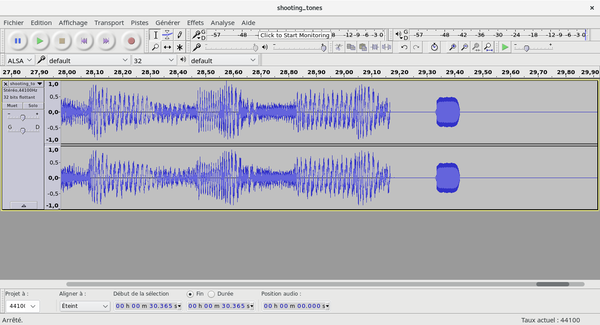
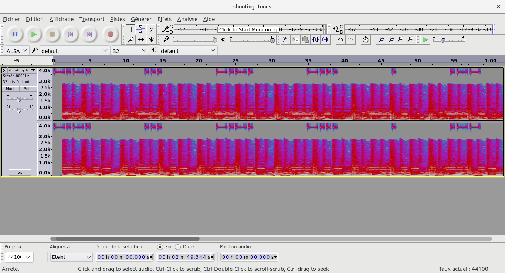

# Shooting tones

### [~$ cd ..](../)

We are given a [.wav file](shooting_tones.wav), and the goal is to find the hidden message. Steganography is not our area of expertise, but we opened the file with Audacity in order to search some clues.
We spent some hours on this challenge, and finally the answer was very simple ...
The music we can hear is Shooting Stars (Bag Raiders), and we first notices that there was an inaudible trailing part:

Wrong path, solution was not there.

We tried several basic tests: spectrogram, change rate, low-pass filter, but found nothing immediately. Finally, we found the solution by setting the rate to 8'000 Hz and displaying the spectrogram:

We noticed these long and short dashes, the first and the thirs one being similar. We then thought about morse code, and finally found:
-.-. ... -.-. -... . .-- . .-.. --- ...- . -- --- .-. ... . or, **cscbewelovemorse**

