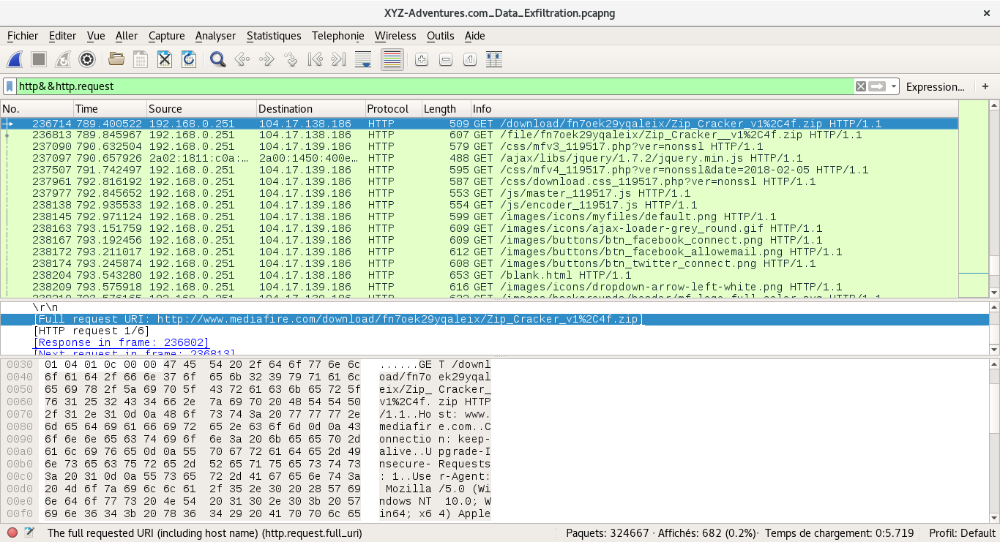
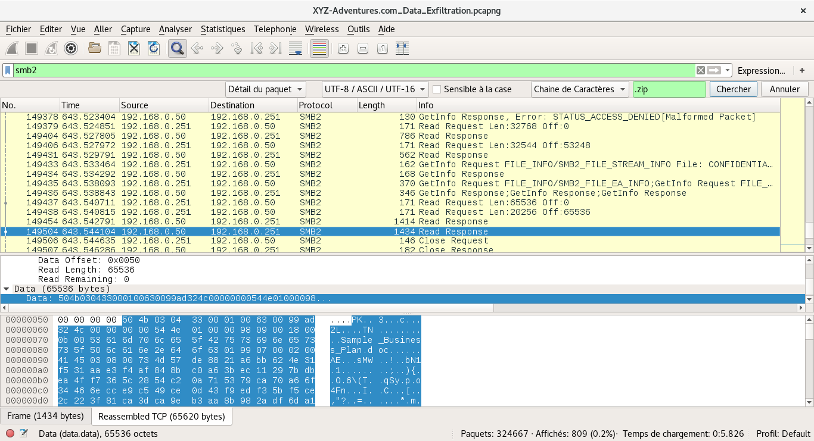
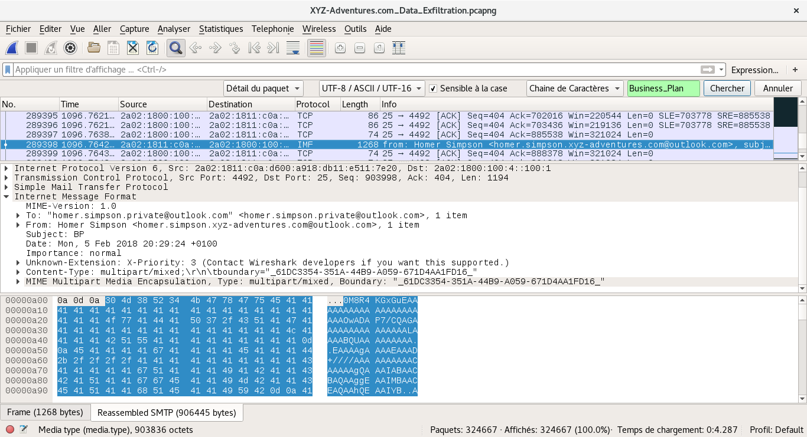

# XYZ Data Exfiltration

### [~$ cd ..](../)

We spent several hours on this challenge, and the solution was finally quite simple... The statement tells that someone tries to exfiltrate some confidential data, the goal is then to recover it.
The [pcap](XYZ-Adventures.com_Data_Exfiltration.zip) file is quite big (285 Mo), the analyze will take some time...

## Search for clues

There are a lot of packets and a vast majority of them a totally useless for the challenge. We then searched some human readable packets to get some clues.
The first interesting thing we noticed was this, in a FTP exchange:
> ```
>type=dir;modify=20180129200814; 00_Basics 
>type=dir;modify=20180129200814; 01_Tensile 
>type=dir;modify=20180129200814; 02_Catenary 
>type=dir;modify=20180129200814; 03_Bending 
>type=dir;modify=20180129200814; 04_Folding 
>type=dir;modify=20180129200814; 05_Inflation 
>type=dir;modify=20180129200814; 06_Wind 
>type=dir;modify=20180129200814; 07_Panelization 
>type=dir;modify=20180129200814; 08_Collisions 
>type=dir;modify=20180129200814; 09_CirclePacking 
>type=dir;modify=20180129200814; 10_Analysis&Display 
>type=dir;modify=20180129200814; 11_Reciprocal 
>type=dir;modify=20180129200814; 12_Kinetic 
>type=dir;modify=20180129200814; 13_Gears 
>type=dir;modify=20180129200814; 14_MeshUtilities 
>type=dir;modify=20180129200814; 15_Tensegrity 
>type=dir;modify=20180201201007; CONFIDENTIAL 
>type=file;modify=20180129192618;size=46; desktop.ini 
>type=dir;modify=20180129200814; Misc
> ```
A few minutes ago, we found another interesting thing:

We saw that many searches regarding fcrackzip were done. We then guessed that the attacker was trying to exfiltrate a confidential zip file, and tried to crack it.
We then looked for the string "CONFIDENTIAL", and found some SMB2 requests packets. We saw that the attacker was looking for "CONFIDENTIAL\Company_XYZ-Adventures.com_Business_Plan_2018.zip",
and knew that we were on the right path.

## Extract the ZIP

Many SMB2 requests are done, but they are all followed by a packet containing "Expert Info (Error/Malformed): Malformed Packet (Exception occurred)", except the last one:

We located the two packets "Read response" and we extracted them in the right order, by looking at the offset (the first one is then the 149'504, and the second one is the 149'454).
Using `cat` we rebuilt the [.zip](xyz.zip) (with [xyz.1txt](xyz1.txt), [xyz2.txt](xyz2.txt), but it was obviously protected by a password. We then tried to break the password with `fcrackzip` and our good friend `rockyou.txt` but unfortunately it gave us nothing.
We started a brute force, but found the solution before. Indeed, we just found the zip archive, stolen by the attacker, and we guessed that he/she will try to exfiltrate this sensitive data, once decrypted. While `fcrackzip` did its job, we went back to Wireshark
in order to see if such packet was captured.

## Find the solution which was there from the beginning

We then searched the name "Business_Plan" in all files, and found:

See [mail.txt](mail.txt)
We then decoded the big base64 string, and wrote it in a [file](plan.doc).
The command `strings plan.doc -n 10` gave us:
> ```
>Microsoft Word-Dokument
>Word.Document.8
>Business Plan 2018
>Confidential
>Q1NDQkV7NEZDNTFGQTJEREMxMjY1RTcxQjlBRDk1RkY3Qzg4QTV9
>Normal.dotm
>Nico Callens
>AppVersion
>DocSecurity
>HyperlinksChanged
>LinksUpToDate
>contentStatus
>oooooooooo
>XYZ-Adventures.com
>Business Strategie
>Final version 1.0
> ```
We then decoded the 4th string:
> ```Python
> base64.b64decode('Q1NDQkV7NEZDNTFGQTJEREMxMjY1RTcxQjlBRDk1RkY3Qzg4QTV9')
>'CSCBE{4FC51FA2DDC1265E71B9AD95FF7C88A5}'
> ```
And voila!
