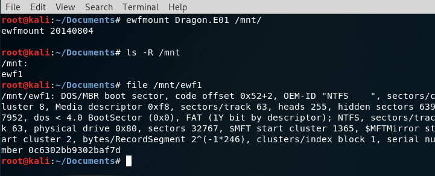
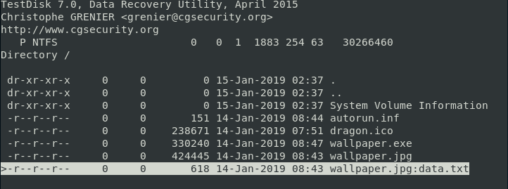
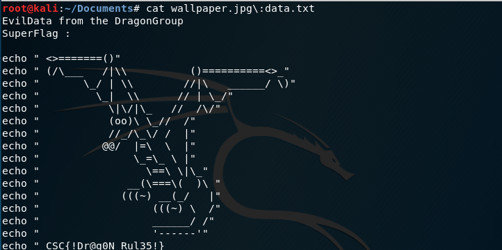

# Dragon E01 (Forensics)

### [~$ cd ..](../)

We were given a file named [Dragon.E01](Dragon.E01), recognized by `file` as:

> ```sh
>$ file Dragon.E01 
>Dragon.E01: EWF/Expert Witness/EnCase image file format
> ```

By googling we found that we could use `ewfmount` to mount it. 



Once mounted, we found another file, `ewf1`, that we analyzed with `testdisk`:



The last file, with a colon, made us think about Alternate Data Stream. Hence we extracted the file, and found:



