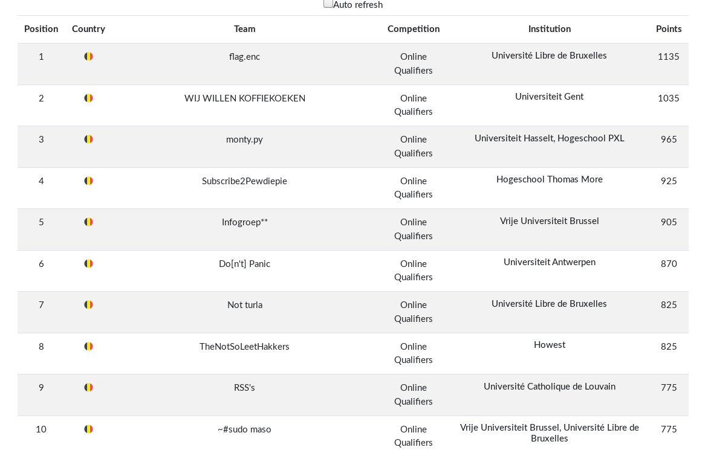

# CSCBE Qualifiers - 2019

### [~$ cd ..](../)

This week, I took part with 3 team mates to the CSCBE 2019 Qualifiers. The contest was open during 32 hours, and we really enjoyed it- We finally took a tenth place

These write ups cover some challenges we managed to solve.

* [Jail break 1, 2, 3](jail_break/)
* [Hacker C4tz 1, 2, 3, 4, 5](hacker_c4tz/)
* [Dragon.E01](Dragon.E01)
* [Digital Brussels](digital_brussels/)
* [Cert Trouble](cert_trouble/)
* [Bot communication](bot_communication/)
* [Base64  + xor = <3](base64_xor/)
* [Ancient Writings 1, 2](ancient_writings/)
* [Alien object](alien_object/)
* [Access Denied](access_denied/)

