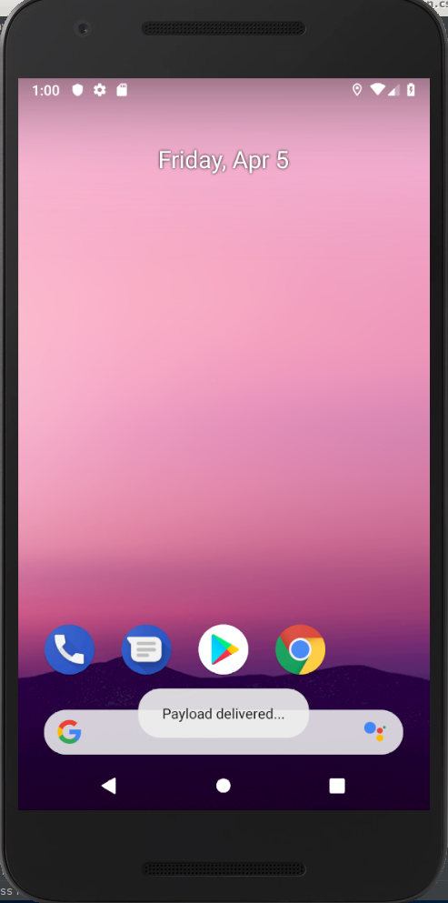
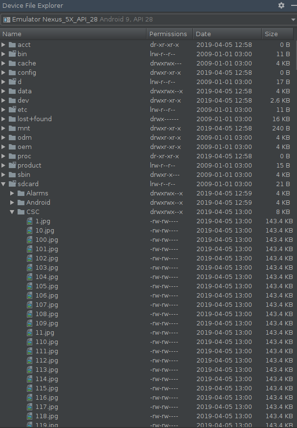

# NOT MALWARE - Mobile (90 pts)

### [~$ cd ..](../)

>We recently received this Android app for analysis, but we're kind of short on hands right now, and our automated scanner is not yet functioning perfectly...  
>Would you mind taking a look?

_We didn't manage to solve this challenge during the contest, but found the solution (or what we suppose to be the solution, at least)_

We were given an [APK file](be.rhofman.csc19.apk), or, in other words, an Android application archive. Typically, as we are given this kind of file as a CTF challenge, we usually start with `apktool` and `jd-gui` to reverse engineer the program, but it was not necessary here (furthermore, the decompiled code is quite messy, and reverse it would be quite difficult). Unfortunately, we didn't have the time to install the heavy Android Studio and were unable to solve this task.

Indeed, we only had to let the program run in the emulator and all the job was done. Looking at the decompiled code only provides a large overview of what happens:

### MainActivity

The `MainActivity.class` is as follows. We can see that a toast is displayed telling us that the payload has been delivered, and checking if the permission to write files on the SD card has been granted. The routine `c` creates an instance of `a`, the second file located in the package `be.rhofman.csc19`:

```
package be.rhofman.csc19;

import a.d.b.b;
import android.content.Context;
import android.os.Bundle;
import android.support.v4.app.e;
import android.widget.Toast;

public final class MainActivity
  extends e
{
  private final void c()
  {
    Context localContext = getApplicationContext();
    b.a(localContext, "applicationContext");
    new a(localContext).a();
    Toast.makeText((Context)this, (CharSequence)"Payload delivered...", 1).show();
    finish();
  }

  public final void onCreate(Bundle paramBundle)
  {
    super.onCreate(paramBundle);
    setContentView(2131427356);
    if (checkSelfPermission("android.permission.WRITE_EXTERNAL_STORAGE") != 0)
    {
      requestPermissions(new String[] { "android.permission.WRITE_EXTERNAL_STORAGE" }, 0);
      return;
    }
    c();
  }

  public final void onRequestPermissionsResult(int paramInt, String[] paramArrayOfString, int[] paramArrayOfInt)
  {
    b.b(paramArrayOfString, "permissions");
    b.b(paramArrayOfInt, "grantResults");
    if (paramInt != 0) {
      return;
    }
    if (paramArrayOfInt.length == 0) {
      paramInt = 1;
    } else {
      paramInt = 0;
    }
    if (((paramInt ^ 0x1) != 0) && (paramArrayOfInt[0] == 0))
    {
      c();
      return;
    }
    Toast.makeText((Context)this, (CharSequence)"Please grant permission to write files!", 1).show();
    finish();
  }
}
```

### Unpacking the Payload

No need to reverse the following code, important informations are perfectly understandable:

```
package be.rhofman.csc19;

import a.a.f.a;
import a.a.t;
import a.d.b.b;
import android.content.Context;
import android.content.res.Resources;
import android.os.Environment;
import android.util.Base64;
import java.io.ByteArrayOutputStream;
import java.io.File;
import java.io.FileOutputStream;
import java.io.InputStream;
import java.io.OutputStream;
import java.util.Arrays;
import java.util.Collection;
import java.util.List;

public final class a
{
  public static final a a = new a((byte)0);
  private final Context b;

  public a(Context paramContext)
  {
    this.b = paramContext;
  }

  public final void a()
  {
    if (b.a(Environment.getExternalStorageState(), "mounted"))
    {
      Object localObject1 = a.e.c.c;
      int k = a.e.c.c().b(500) + 1;
      long l = 102695 - k * 10;
      File localFile = new File(Environment.getExternalStorageDirectory(), "CSC");
      localFile.mkdirs();
      localObject1 = this.b.getResources().openRawResource(2131558400);
      b.a(localObject1, "payload");
      b.b(localObject1, "receiver$0");
      Object localObject2 = new ByteArrayOutputStream(Math.max(8192, ((InputStream)localObject1).available()));
      a.c.a.a((InputStream)localObject1, (OutputStream)localObject2);
      byte[] arrayOfByte1 = ((ByteArrayOutputStream)localObject2).toByteArray();
      b.a(arrayOfByte1, "buffer.toByteArray()");
      int i = 1;
      while (i <= 500)
      {
        localObject1 = this.b.getResources().openRawResource(2131558400);
        localObject2 = new byte[15];
        ((InputStream)localObject1).skip(i * 10 + l);
        ((InputStream)localObject1).read((byte[])localObject2);
        ((InputStream)localObject1).close();
        int j = 0;
        localObject1 = localObject2;
        if (i == k)
        {
          arrayOfByte2 = "CSC{".getBytes(a.h.a.a);
          b.a(arrayOfByte2, "(this as java.lang.String).getBytes(charset)");
          localObject1 = new a.f.c(0, 9);
          b.b(localObject2, "receiver$0");
          b.b(localObject1, "indices");
          if (((a.f.c)localObject1).a()) {}
          int n;
          for (localObject1 = t.a;; localObject1 = new f.a((byte[])localObject1))
          {
            localObject1 = (List)localObject1;
            break;
            int m = ((a.f.a)localObject1).a;
            n = ((a.f.a)localObject1).b + 1;
            b.b(localObject2, "receiver$0");
            if (n > 15) {
              break label374;
            }
            localObject1 = Arrays.copyOfRange((byte[])localObject2, m, n);
            b.a(localObject1, "java.util.Arrays.copyOfR���this, fromIndex, toIndex)");
            b.b(localObject1, "receiver$0");
          }
          localObject1 = a.a.c.a(arrayOfByte2, (Collection)localObject1);
          localObject2 = "}".getBytes(a.h.a.a);
          b.a(localObject2, "(this as java.lang.String).getBytes(charset)");
          localObject1 = a.a.c.a((byte[])localObject1, (byte[])localObject2);
          break label417;
          label374:
          localObject1 = new StringBuilder("toIndex (");
          ((StringBuilder)localObject1).append(n);
          ((StringBuilder)localObject1).append(") is greater than size (15).");
          throw ((Throwable)new IndexOutOfBoundsException(((StringBuilder)localObject1).toString()));
        }
        label417:
        localObject2 = new StringBuilder();
        ((StringBuilder)localObject2).append(String.valueOf(i));
        ((StringBuilder)localObject2).append(".jpg");
        localObject2 = new File(localFile, ((StringBuilder)localObject2).toString());
        if (((File)localObject2).exists()) {
          ((File)localObject2).delete();
        }
        ((File)localObject2).createNewFile();
        localObject2 = new FileOutputStream((File)localObject2);
        byte[] arrayOfByte2 = new byte[2];
        while (j < 2)
        {
          arrayOfByte2[j] = 10;
          j += 1;
        }
        arrayOfByte2 = a.a.c.a(arrayOfByte1, arrayOfByte2);
        localObject1 = Base64.encode((byte[])localObject1, 2);
        b.a(localObject1, "Base64.encode(dataString, Base64.NO_WRAP)");
        ((FileOutputStream)localObject2).write(a.a.c.a(arrayOfByte2, (byte[])localObject1));
        ((FileOutputStream)localObject2).flush();
        ((FileOutputStream)localObject2).close();
        i += 1;
      }
    }
  }

  public static final class a {}
}
```
We can saw that the program creates a directory named `CSC`, and that it tries to load a raw resource. By taking a look at the files provided by `apktool`, we found in `res/raw` a file named `payload`:


The programs loads this file 500 times and reads 15 bytes at specific locations, and base64-encode them. Then we let the app run in the emulator:



and saw in the browser on the right that 500 files were written in a directory named `CSC`:



Knowing the first letters of the flag and that it has been probably base64-encoded, we ran:

```bash
~$ grep Q1ND *
  Binary file 298.jpg matches
```

Download [image 298.jpg](298.jpg)

We also knew that 15 bytes were base64-encoded, which means that the length of the encoded string is greater than 15:

```bash
~$ strings 298.jpg -n 15
  Copyright Apple, Inc., 2012
  %&'()*456789:CDEFGHIJSTUVWXYZcdefghijstuvwxyz
  &'()*56789:CDEFGHIJSTUVWXYZcdefghijstuvwxyz
  Q1NDe3Y3Ynh0W18qRVN9
```
 By decoding the last string, we got **CSC{v7bxt[_*ES}**, probably the flag we were supposed to find...
