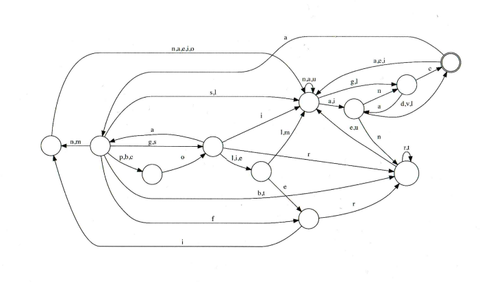

## Agent extraction

### [~$ cd ..](../)

>After having ejected from his hijacked Lockheed SR-71 Blackbird,
>Agent X needs to be extracted. We have an address, but not a country.
>Find the country, and find it fast! Agent X's life depends on it!
>
> The diagram below was automatically synchronized from Agent X's StrongPhone
> before we lost control.

We knew that it was a state machine, and that the circle on the right was a final state.
Then, the name of the country should end with "c", "d", "v", or "l".
We downloaded a [list of countries](https://gist.githubusercontent.com/kalinchernev/486393efcca01623b18d/raw/daa24c9fea66afb7d68f8d69f0c4b8eeb9406e83/countries) in order to apply regular expressions.
* `c$` gave us only "Czech Republic", and "Dominican Republic", and none of them was possible, since the previous state could not be reached with an "i".
* `v$` gave us nothing
* `l$` gave us "Brazil", "Israel", "Nepal", "Portugal" and "Senegal". We tried them all, and saw that **Portugal** was right.
(We actually didn't even try those ending with "d")

