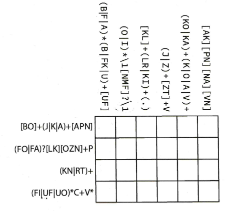

## Delirious

### [~$ cd ..](../)

>I just got a call from Agent X. He sounded delirious ...
>Can you understand him ?

We are given the following grid:

We didn't immediately saw that it was about regular expressions ...

We started with the last column:
* 1st row => only A in common
* 2nd row => P
* 3rd row => only N in common
* 4th row => only V in common

4th column:
* 1st row => only J in common
* 2nd row => only Z in common
* 3rd row => only T in common
* 4th row => V

5th column:
* 1st row: begins with KO or KA => K
* 2nd row: O or A in the column and \[OZN\] in the row => O
* 3rd line: ends with N, K expected just before => K
* 4th line: V before and after => V

3rd column:
* 1st row: K or L, but L doesn't appear in the row => K
* 3rd row: we have a T in the row, a R is required just before => R
* 2nd row: we just put an R, therefore an L is required above => L
* 4th row: a C is required in this row, but we cannot put it in the first or second column => C

1st column:
* 1st row: O or B, but O doesn't appear in the column => B
* 2nd row: an L already appears, so it means that the second group has been reached. The first groupe is FO or FA => F
* 3rd row: the 4th row is reserved by the third group (\[UF\]). This third slot has to match the second group: (B|FK|U). F has been placed in the second row => K
* 4th row: don't know yet

2nd column:
* 2nd row: O or A, but A doesn't appear in the column => O
* 1st row: has to be O, so as the first row => O
* 3rd row: a K has been put in the first column => N
* 4th row: has to be O, so as the first row => O

The remaining slot contains therefore the letter U.

The final grid is then:

BOKJKA
FOLZOP
KNRTKN
UOCVVV
