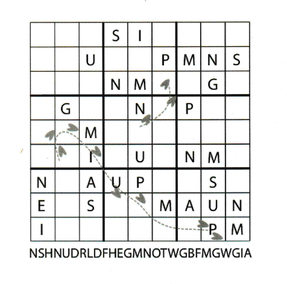

## Favourite drink

### [~$ cd ..](../)

>Agent X made me cry today. He knows I like Sudokus and apparently had hidden
>one in my bottom drawer to surprise me...
>Agent X was one of the best friends I ever had... To bad I'll never be able
>to buy him his favourite drink again...

We were too lazy to solve hand by ourselves, therefore we let [dcode](https://www.dcode.fr/wordoku-solver) do it for us.

PDF: [Solution](solution.pdf):

We then followed the trail and found the words "USE PENGUINS". We then guessed that it was a key to decrypt the sentence below the grid.
Once again, our friend dcode.fr did the job with its [Vigenere app](https://www.dcode.fr/vigenere-cipher):
Ciphertext: NSHNUDRLDFHEGMNOTWGBFMGWGIA

Key: penguins

Output: YOUHAVETOBUYMEAWESTVLETEREN

Agent X loves the **WESTVLETEREN** beer!
