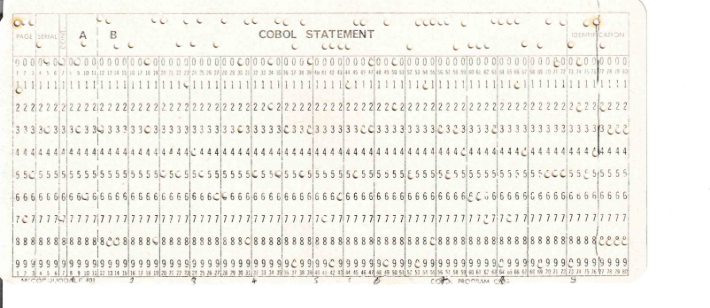

## Punched card

### [~$ cd ..](../)

>We just received message from Agent X. He broke in to the bunker and
>extracted the intel. Apparently they still store their information on
>punched cards. Joel, our resident punched-card ninja was murdered yesterday.
>Just one day from retirement... Sigh. You better learn how to read this stuff!

We are given a punch card, and obviously, none of us knew how to read it!

Actually, it was not so complicated. The first three rows (upper section + row 0 of the second section) tells us whether we are reading a letter or a number.
If no hole is punched, we are then reading a number which is labeled by the hole falling in the same column. Otherwise, it's a letter, and the row where the hole appears tells
us if the letter is between A and I, J and R, or S and Z, and hole falling in the same column gives the rank (+1 is the first hole is in the third row).

[See more here](https://craftofcoding.wordpress.com/2017/01/28/read-your-own-punch-cards/)

For example:
* 1st column: one hole in the first row, the second one labeled with "1": it's an A.
* 2nd column: one hole in the first row, the second one labeled with "7": it's a G
The message should begin with 'Agent'.

We then decoded and gotb (ignoring the last characters):

"agent x to hq the name of the secret project is niahceldoopcigamreversed"
