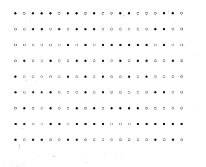

## Death of Agent X

### [~$ cd ..](../)

> I've just received terrible news from GHQ... our spy was murdered.
> In order to get the correct security cam footage, we need to find
> out when he was murdered ... Can you help us?



We were given this set of black and white dots, and we had to find out
which kind of code it was. We first thought about binary or morse, but,
but it didn't gave us readable informations.

After a few minutes, we noticed that it could be braille, because of the
size of the rows and columns. Indeed, we knew that each character is written
in a 3*2 matrix.

We translated the first characters, and saw that the message began with "Agent".
To save time, we then focused on the end of the message. Since we were expected to
find a hour, we looked for the symbol 

> ```
>  .
>  .
>. .
> ```

put before numbers.
By translating, the last line, we can read: "t_h0938++"

**09:38**
