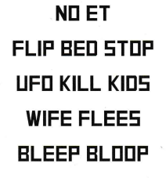
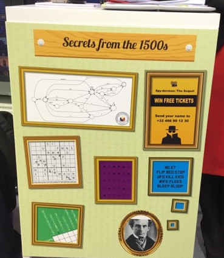
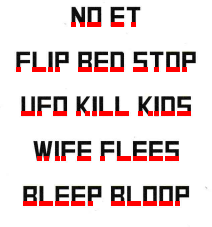

## Unlock the safe

### [~$ cd ..](../)

>We found a safe, hidden under the carpet. It requires 6 digits, so no use in
>bruteforcing it. I'm also pretty sure the whole place will explode if we
>don't enter the right code. I took another look at the pictures from his
>appartment. There's a painting on the wall with a weird text. Is it his
>father ? Grandfather ?

We were given the following text:

At the beginning, we noticed that if we flip the text, some numbers appear:
"BLEEP BLOOP" becomes "d0078 d3378" for example. But we were on the wrong track.

There were these desks in the building with clues:

but we didn't make the link between the picture a Samuel Morse and the text.
Actually, the cropped pictures was a big hint: we had to crop letters too:

..- -. .-.. --- -.-. -.- ...-- ...-- ....- .---- ----. ----.

or:

**UNLOCK334199**
