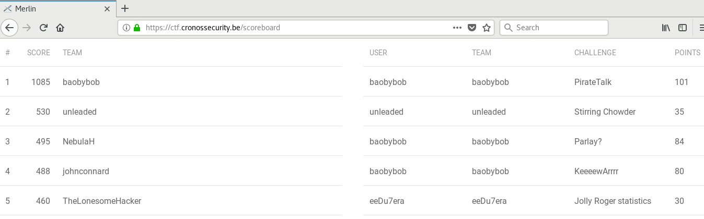

# Cronos CTF - BruCON 2018

### [~$ cd ..](../)

This week, I had the chance to go to the BruCON conference in Gent for three days. A CTF on the theme of piracy was organized by Cronos Security,
and I finally reached a 4th place!

It was a really nice CTF, various and with a well-balanced difficulty. The write up covers some challenges I solved

### ~$ ls

* [Strange](strange/)
* [Stirring Chowder](stirring_chowder/)
* [Steven Seagull](steven_seagull/)
* [PorkAndPen](porkandpen/)
* [PirateNet](piratenet/)
* [Lost Treasure](lost_treasure/)
* [Draw Flag](draw_flag/)
* [Angry Parrot](angry_parrot/)

