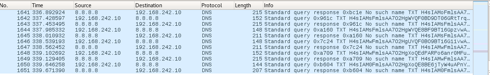
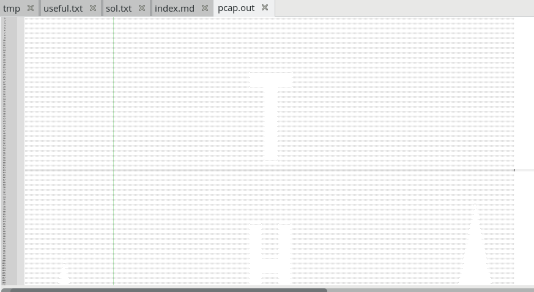

# Pirate Net

>we noticed some RATs in the ship, find out what they're planning!

### [~$ cd ..](../)

We are a PCAP [file](pcap.pcap) with a bunch of suspicious DNS requests:



All strings are base64-encoded, so let's extract them (be careful, some strings are split in two queries. Each string should starts with "H4sIA")

All strings can be found in [pcap.strings](pcap.strings)

If we decode the first string, it gives us:

> ```sh
>% base64 -d|xxd
>H4sIAHkEmlsAA7O2HgWDCXABAB91xi6RAQAA
>00000000: 1f8b 0800 7904 9a5b 0003 b3b6 1e05 8309  ....y..[........
>00000010: 7001 001f 75c6 2e91 0100 00              p...u......
> ```

The three first bytes, 0x1f8b08, are the magic number of gzip data. I then wrote a small python script to uncompress:

> ```python
>f = open('pcap.strings', 'r')
>data = f.read().splitlines()
>f.close()
>import base64
>import StringIO
>import gzip
>for line in data:
>	x =StringIO.StringIO(base64.b64decode(line))
>	print gzip.GzipFile(fileobj=x).read()
> ```

By redirecting the output to [pcap.out](pcap.out), I only found semi-colons and blanck spaces. However, by unzooming:



We can see a letter "T", and by scrolling, we can read the flag **PIRATEART**

