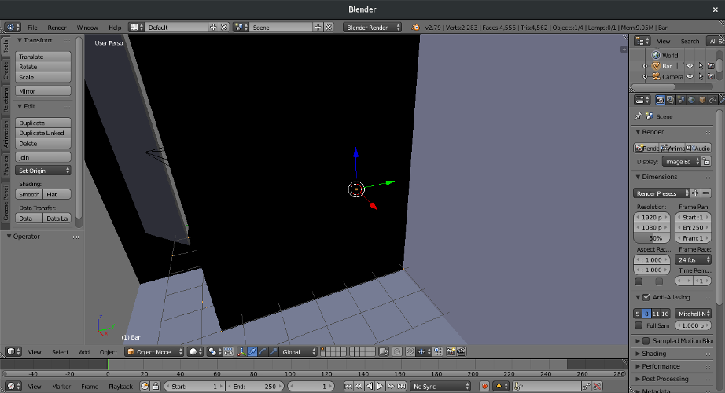
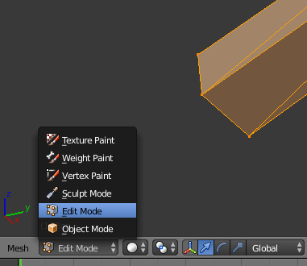
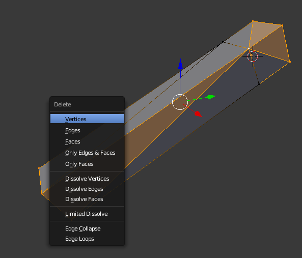
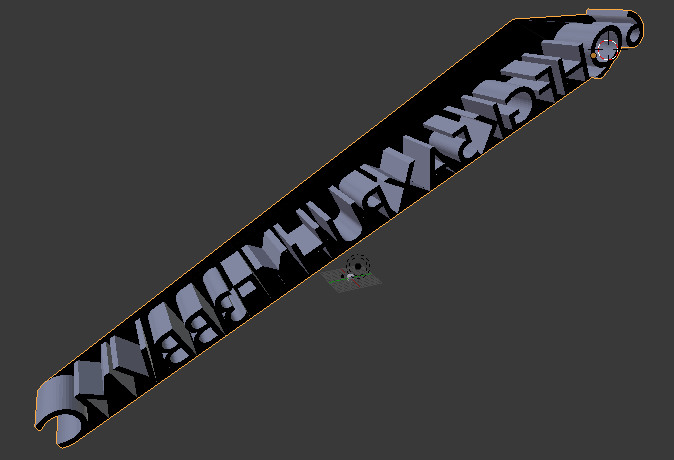

# Strange

>Alas matey! We got this weird bar that we do not know what to do with!
>Can you find the flag?

### [~$ cd ..](../)

We are given a [file](Bar.stl), not recognized by `file`. Asking Google revealed that it was a Blender file. Quite innovative, 
it was the first time I saw this kind of challenge in a CTF!

Blender is a really powerful 3D-modelisation program. This challenge was not really hard since that was no misleading clues or 
there was no need to be a high-skilled hacker to succeed. However, since I'm not a Blender-master, and since Blender is a really complex program,
it was not so easy !

To open the file: **File >> Import >> Stl (.stl)**

By playing with the rotation tool, one can guess some characters of the flag, but the camera is too close to read it, and the flag is embedded in an opaque box.

The goal is then to remove this box by erasing some vertices. To do this, one has to use the **Edit mode**

Select the vertices to remove by right-clicking on them, and then hit **Suppr**, and click on **Vertices**

By returning in **Object mode**, we can now see/guess what the flag is: **6QHFGK5AXPUHYF3BBVMC**

