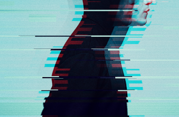
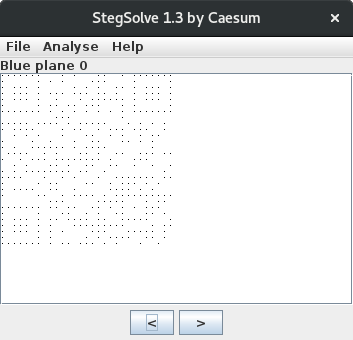
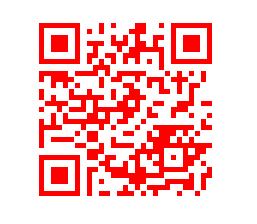

# Drumbone (Steganography)

### [~$ cd ..](../)

> I joined a couple of hacking channels on IRC and I started recieving these strange messages.
> Someone sent me this image.
> Can you figure out if there's anything suspicous hidden in it?

We are given the following picture:



First thing we did was to run zsteg, but it didn't give us something relevant. Second thing we did was to run StegSolve, and we found this:



A QR code! Unfortunately, we didn't succeed to extract any data, because dots were to small.

We wrote a [python script](drumbone.py) to extend each dot, and got a valid picture:

> ```
>from PIL import Image
>im = Image.open('drumbone.new.png')
>pixels = im.load()
>out = Image.new(im.mode, im.size)
>new_pix = out.load()
>width, height = im.size
>for i in xrange(width):
>	for j in xrange(height):
>		pix= pixels[i,j]
>		if pix[0] == 0:
>			a = -2
>			while a < 4:
>				b = -2
>				while b < 4:
>					new_pix[i+a,j+b] = (255,0,0)
>					b += 1
>				a += 1
>		elif new_pix[i,j] != (255,0,0):
>			new_pix[i,j] = (255,255,255)		
>im.close()
>out.save("drumbone.out.png")
>out.close()
> ```

Result:



We scanned the QR code, and finally got: **IceCTF{Elliot_has_been_mapping_bits_all_day}**
