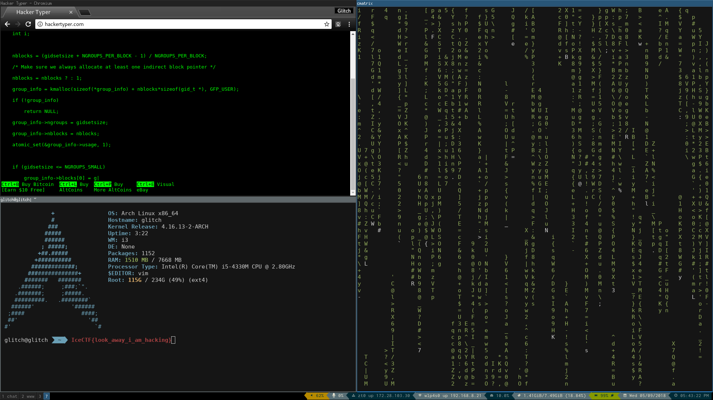

# Hard Shells (Forensic)

### [~$ cd ..](../)

> After a recent hack, a laptop was seized and subsequently analyzed.
> The victim of the hack?
> An innocent mexican restaurant.
> During the investigation they found this suspicous file.
> Can you find any evidence that the owner of this laptop is the culprit?

We are given [this file](hardshells), detected as a zip archive:

> ```sh
> $ file hardshells 
> hardshells: Zip archive data, at least v1.0 to extract
> ```

Unfortunately, the file is protected by a password ...

> ```sh
> $ unzip hardshells 
>Archive:  hardshells
>checkdir error:  hardshells exists but is not directory
>                 unable to process hardshells/.
>[hardshells] hardshells/d password:
> ```

We didn't succeed to break it using fcrakzip, but finally, we tried the password "tacos" (because it was about a mexican restaurant) and it was a win!

Here is the [extracted file](d):

> ```sh
> $ file d
>d: Minix filesystem, V1, 30 char names, 20 zones 
> ```

So let's mount it:

> ```sh
> $ mkdir /mnt/minix
> $ mount -t minix d /mnt/minix
> $ ls -a /mnt/minix/ 
>.  ..  dat
> ```

The file [dat](dat) was not recognized by `strings`, but by running `xxd`, we saw that it was probably a corrupted PNG file:

> ```
> $ xxd dat|head
>00000000: 8950 5547 0d0a 1a0a 0000 000d 4948 4452  .PUG........IHDR
>00000010: 0000 0780 0000 0438 0806 0000 00e8 d3c1  .......8........
>00000020: 4300 0020 0049 4441 5478 9cec dd79 7854  C.. .IDATx...yxT
>00000030: f5d5 c0f1 ef2c d926 fb0a 49c8 beb0 9884  .....,.&..I.....
>00000040: b043 d877 1441 b18a 8a76 515b 6d9f da6a  .C.w.A...vQ[m..j
>00000050: 5b5b fb6a ad7d ad56 5bfb da62 a95a 5cea  [[.j.}.V[..b.Z\.
>00000060: 862b 6aa1 22a2 ecb2 25ec 1042 0221 fbbe  .+j."...%..B.!..
>00000070: cf64 9b49 3273 df3f 6206 0201 32c9 2493  .d.I2s.?b...2.$.
>00000080: 84f3 799e 3c30 77e6 fee6 6499 3b77 eef9  ..y.<0w...d.;w..
>00000090: 9df3 534d 9830 4141 0821 8410 4208 2184  ..SM.0AA.!..B.!.
> ```

We first replaced the 3rd byte by an 'N' with `hexedit` in order to be able to run `pngcheck`:

> ```sh
> $ pngcheck dat
>dat  additional data after IEND chunk
>ERROR: dat
> $ xxd dat|tail
>0004d930: 4110 0441 10ee 3853 6c29 349f 45fb 6927  A..A..8Sl)4.E.i'
>0004d940: bb0a 132e 2a34 74b2 ab20 0813 a2b3 b777  ....*4t.. .....w
>0004d950: b2ab 2008 934a c473 6944 ac10 04ef f40f  .. ..J.siD......
>0004d960: 6826 bb0a 5352 60c0 9d77 fd20 4c2c d17e  h&..SR`..w. L,.~
>0004d970: 4f7d 4ab0 af1d 7ba7 99aa c734 51f5 4e9f  O}J...{....4Q.N.
>0004d980: 9136 21fb 1104 4110 0441 1004 4110 0441  .6!...A..A..A..A
>0004d990: 1004 4110 0441 1004 61ea 9061 5f2e 4010  ..A..A..a..a_.@.
>0004d9a0: 0441 1004 4110 0441 1004 4110 0441 1004  .A..A..A..A..A..
>0004d9b0: 4110 0441 98e2 fe1f 9313 1f4a 0afd 20d2  A..A.......J.. .
>0004d9c0: 0000 0000 4945 4e44 ae42 6082 0a         ....IEND.B`..
> ```

There was an unexpected carriage return (0x0a) at the end of the file, so we removed it:

> ```
> $ truncate --size=-1 dat
> $ pngcheck dat 
> OK: dat (1920x1080, 32-bit RGB+alpha, non-interlaced, 96.2%).
> ```

And we finally got



FLAG: **IceCTF{look_away_i_am_hacking}**
