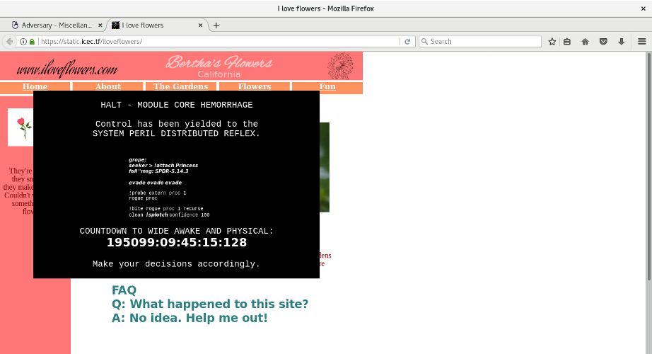

# I love bees (Misc)

### [~$ cd ..](../)

>I stumbled on to this strange website.
>It seems like a website made by a flower enthusiast, but it appears to
>have been taken over by someone... or something.
>Can you figure out what it's trying to tell us?

This website is similar to ilovebees.co



but all \*.html links are dead. We analyzed the JS code of the countdown timer, but found was nothing. We tried to analyze the pictures, but it was unsuccessful, until we noticed 
the favicon.gif had a really suspicious size


> ```
>$ wc favicon.gif 
> 330   1581 115036 favicon.gif
> ```

and a really suspicious content:

> ```sh
> $ hexdump -C favicon.gif|head
>00000000  47 49 46 38 39 61 10 00  10 00 87 00 00 51 e5 74  |GIF89a.......Q.t|
>00000010  00 d8 06 00 d0 01 00 c0  06 00 bc 06 00 90 05 6e  |...............n|
>00000020  74 66 70 72 69 75 78 2d  2e 73 6f 67 6d 6f 6c 69  |tfpriux-.sogmoli|
>00000030  6e 61 69 6e 69 62 63 74  61 72 6c 69 62 6c 64 2d  |nainibctarlibld-|
>00000040  74 64 04 74 5f 6d 6e 5f  73 74 5f 5f 63 5f 73 7f  |td.t_mn_st__c_s.|
>00000050  45 4c 49 42 43 47 4e 55  06 60 00 05 40 00 02 40  |ELIBCGNU.`..@..@|
>00000060  00 00 50 e5 00 5f 5f 00  47 4c 00 48 10 00 40 00  |..P..__.GL.H..@.|
>00000070  f0 03 40 d8 06 60 c0 06  00 c0 01 00 bc 06 00 78  |..@..`.........x|
>00000080  38 36 64 06 00 90 05 00  36 34 2f 2d 36 34 2e 36  |86d.....64/-64.6|
>00000090  00 2e 32 00 46 02 01 30  02 00 1c 02 40 00 24 00  |..2.F..0....@.$.|
> ```

Hmm, looks like an ELF header, but quite messy ...

After some researches about the GIF file format, we learned that the beginning of a GIF file was structured as follows:

* 47 49 46 38 39 61: GIF89a
* 10 00 10 00: the size (little endian), here 16*16
* 87: packed field, don't care
* 00: Background Color Index 
* 00:  Pixel Aspect Ratio
* 51 e5 ...: Global Color Table

Each frame has its own header, and its data is compressed by a custom LZW algorithm. We guessed that we had to concatenate each pixel value to rebuild the ELF.7
First thing to do was then to split the GIF into frames properly: the important thing to note was that frames can have a **local color table**

This [script](https://gist.github.com/BigglesZX/4016539) did the job very well, and 110 frames were extracted.

We then wrote a [Python script](parsepng.py) to extract data:

> ```python
>import Image		
>def read_pic(index):
>	im = Image.open('frames/frame-'+str(index)+'.png')
>	rgb_im = im.convert('RGB')
>	width, height = im.size
>	res = []
>	for i in xrange(width):
>		for j in xrange(height):
>			pixel = rgb_im.getpixel((j, i))
>			res.extend(pixel)
>	return "".join(chr(i) for i in res)
>file = open('execme', 'wb')
>file.write("".join(read_pic(i) for i in xrange(110)))
>file.close()
> ```

However, some lines were duplicated, and we noticed that only the last 48 bytes of each new picture (except the first one) should be appended. Then, we replaced the last three lines of the script by:

> ```
>res = read_pix(0)
>for i in xrange(1,110):
>	res += read_pix(i)[:48]
>file = open('execme', 'wb')
>file.write(res)
>file.close()
> ```

No need to reverse the binary, `strings` gave us

> ```sh
> $ strings execme|grep -i ctf
> IceCTF{MY_FAVORITE_ICON}
> ```
