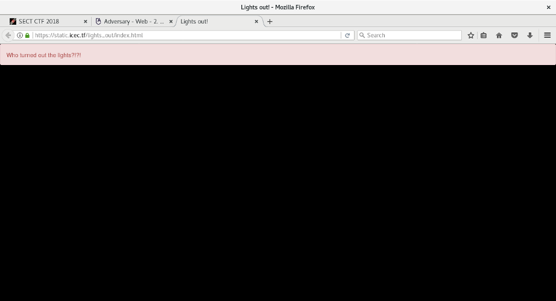
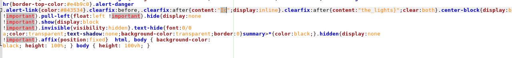

# Lights out (Web)

### [~$ cd ..](../)

> Help! We're scared of the dark!

We face a dark website, with a message saying "Who turned out the lights ?!?!" (making me immediately thing about Doctor Who).
I spent actually a quite long time on this challenge, looking for a well-known vulnerability. 



The source code of the page is a follows:

> ```html
><!doctype html>
><html>
>    <head>
>        <meta charset="utf-8" />
>        <title>Lights out!</title>
>        <link rel="stylesheet" href="main.css" />
>    </head>
>    <body>
>        <div class="alert alert-danger">Who turned out the lights?!?!</div>
>        <summary>
>        <div class="clearfix">
>            <i data-hide="true"></i>
>            <strong data-show="true">
>            <small></small>
>            </strong>
>            <small></small>
>        </div>
>        </summary>
>    </body>
></html>
> ```

And [main.css](main.css)

> ```css
>/*!
> * Bootstrap v3.3.7 (http://getbootstrap.com)
> * Copyright 2011-2018 Twitter, Inc.
> * Licensed under MIT (https://github.com/twbs/bootstrap/blob/master/LICENSE)
> */
>
>/*!
> * Generated using the Bootstrap Customizer (<none>)
> * Config saved to config.json and <none>
> *//*!
> * Bootstrap v3.3.7 (http://getbootstrap.com)
> * Copyright 2011-2016 Twitter, Inc.
> * Licensed under MIT (https://github.com/twbs/bootstrap/blob/master/LICENSE)
> *//*! normalize.css v3.0.3 | MIT License | github.com/necolas/normalize.css */html{font-family:sans-serif;-ms-text-size-adjust:100%;-webkit-text-size-adjust:100%}body{margin:0}article,aside,details,figcaption,figure,footer,header,hgroup,main,menu,nav,section,summary{display:none;}summary:hover{display:block;}audio,canvas,progress,video{display:inline-block;vertical-align:baseline}audio:not([controls]){display:none;height:0}[hidden],template{display:none}a{background-color:transparent}a:active,a:hover{outline:0}abbr[title]{border-bottom:1px dotted}b,strong{font-weight:bold;}strong[data-show]:after{content: "turned";color:black}strong[data-show]:before{content:"styles"}dfn{font-style:italic}h1{font-size:2em;margin:0.67em 0}mark{background:#ff0;color:#000}small{font-size:80%}small:after{content: "_"}sub,sup{font-size:75%;line-height:0;position:relative;vertical-align:baseline}sup{top:-0.5em}sub{bottom:-0.25em}img{border:0}svg:not(:root){overflow:hidden}figure{margin:1em 40px}hr{-webkit-box-sizing:content-box;-moz-box-sizing:content-box;box-sizing:content-box;height:0}pre{overflow:auto}code,kbd,pre,samp{font-family:monospace, monospace;font-size:1em}button,input,optgroup,select,textarea{color:inherit;font:inherit;margin:0}button{overflow:visible}button,select{text-transform:none}button,html input[type="button"],input[type="reset"],input[type="submit"]{-webkit-appearance:button;cursor:pointer}button[disabled],html input[disabled]{cursor:default}button::-moz-focus-inner,input::-moz-focus-inner{border:0;padding:0}input{line-height:normal}input[type="checkbox"],input[type="radio"]{-webkit-box-sizing:border-box;-moz-box-sizing:border-box;box-sizing:border-box;padding:0}input[type="number"]::-webkit-inner-spin-button,input[type="number"]::-webkit-outer-spin-button{height:auto}input[type="search"]{-webkit-appearance:textfield;-webkit-box-sizing:content-box;-moz-box-sizing:content-box;box-sizing:content-box}input[type="search"]::-webkit-search-cancel-button,input[type="search"]::-webkit-search-decoration{-webkit-appearance:none}fieldset{border:1px solid #c0c0c0;margin:0 2px;padding:0.35em 0.625em 0.75em}legend{border:0;padding:0}textarea{overflow:auto}optgroup{font-weight:bold}table{border-collapse:collapse;border-spacing:0}td,th{padding:0}i[data-hide]:before{content:"eCTF{";color:black;}/*! Source: https://github.com/h5bp/html5-boilerplate/blob/master/src/css/main.css */@media print{*,*:before,*:after{background:transparent !important;color:#000 !important;-webkit-box-shadow:none !important;box-shadow:none !important;text-shadow:none !important}a,a:visited{text-decoration:underline}a[href]:after{content:" (" attr(href) ")"}abbr[title]:after{content:" (" attr(title) ")"}a[href^="#"]:after,a[href^="javascript:"]:after{content:""}pre,blockquote{border:1px solid #999;page-break-inside:avoid}thead{display:table-header-group}tr,img{page-break-inside:avoid}img{max-width:100% !important}p,h2,h3{orphans:3;widows:3}h2,h3{page-break-after:avoid}.navbar{display:none}.btn>.caret,.dropup>.btn>.caret{border-top-color:#000 !important}.label{border:1px solid #000}.table{border-collapse:collapse !important}.table td,.table th{background-color:#fff !important}.table-bordered th,.table-bordered td{border:1px solid #ddd !important}}*{-webkit-box-sizing:border-box;-moz-box-sizing:border-box;box-sizing:border-box}*:before,*:after{-webkit-box-sizing:border-box;-moz-box-sizing:border-box;box-sizing:border-box}html{font-size:10px;-webkit-tap-highlight-color:rgba(0,0,0,0)}body{font-family:"Helvetica Neue",Helvetica,Arial,sans-serif;font-size:14px;line-height:1.42857143;color:#333;background-color:#fff}input,button,select,textarea{font-family:inherit;font-size:inherit;line-height:inherit}a{color:#337ab7;text-decoration:none}a:hover,a:focus{color:#23527c;text-decoration:underline}a:focus{outline:5px auto -webkit-focus-ring-color;outline-offset:-2px}figure{margin:0}img{vertical-align:middle}.img-responsive{display:block;max-width:100%;height:auto}.img-rounded{border-radius:6px}.img-thumbnail{padding:4px;line-height:1.42857143;background-color:#fff;border:1px solid #ddd;border-radius:4px;-webkit-transition:all .2s ease-in-out;-o-transition:all .2s ease-in-out;transition:all .2s ease-in-out;display:inline-block;max-width:100%;height:auto}.img-circle{border-radius:50%}hr{margin-top:20px;margin-bottom:20px;border:0;border-top:1px solid #eee}.sr-only{position:absolute;width:1px;height:1px;margin:-1px;padding:0;overflow:hidden;clip:rect(0, 0, 0, 0);border:0}.sr-only-focusable:active,.sr-only-focusable:focus{position:static;width:auto;height:auto;margin:0;overflow:visible;clip:auto}[role="button"]{cursor:pointer}.alert{padding:15px;margin-bottom:20px;border:1px solid transparent;border-radius:4px}.alert h4{margin-top:0;color:inherit}.alert .alert-link{font-weight:bold}.alert>p,.alert>ul{margin-bottom:0}.alert>p+p{margin-top:5px}.alert-dismissable,.alert-dismissible{padding-right:35px}.alert-dismissable .close,.alert-dismissible .close{position:relative;top:-2px;right:-21px;color:inherit}.alert-success{background-color:#dff0d8;border-color:#d6e9c6;color:#3c763d}.alert-success hr{border-top-color:#c9e2b3}.alert-success .alert-link{color:#2b542c}.alert-info{background-color:#d9edf7;border-color:#bce8f1;color:#31708f}.alert-info hr{border-top-color:#a6e1ec}.alert-info .alert-link{color:#245269}.alert-warning{background-color:#fcf8e3;border-color:#faebcc;color:#8a6d3b}.alert-warning hr{border-top-color:#f7e1b5}.alert-warning .alert-link{color:#66512c}.alert-danger{background-color:#f2dede;border-color:#ebccd1;color:#a94442}.alert-danger hr{border-top-color:#e4b9c0}.alert-danger .alert-link{color:#843534}.clearfix:before,.clearfix:after{content:"Ic";display:inline}.clearfix:after{content:"the_lights}";clear:both}.center-block{display:block;margin-left:auto;margin-right:auto}.pull-right{float:right !important}.pull-left{float:left !important}.hide{display:none !important}.show{display:block !important}.invisible{visibility:hidden}.text-hide{font:0/0 a;color:transparent;text-shadow:none;background-color:transparent;border:0}summary>*{color:black;}.hidden{display:none !important}.affix{position:fixed}
>
> html, body {
>     background-color: black;
>     height: 100%;
> }
> body {
>     height: 100vh;
> }
> ```

At the beginning, I didn't look carefully at this messy code, but by opening it with Geany and reformatting, I saw:



The string "Ic" and "the_lights}" caught my attention (knowing that flag looks like IceCTF{blablabla})

I made a research based on the regular expression: `content:".*"`:

> ```
>main.css:12: "turned";color:black}strong[data-show]:before{content:"styles"}dfn{font-style:italic}h1{font-size:2em;margin:0.67em
>main.css:20: 0.75em}legend{border:0;padding:0}textarea{overflow:auto}optgroup{font-weight:bold}table{border-collapse:collapse;border-spacing:0}td,th{padding:0}i[data-hide]:before{content:"eCTF{";color:black;}/*!
>main.css:27: (" attr(href) ")"}abbr[title]:after{content:" (" attr(title)
>main.css:28: ")"}a[href^="#"]:after,a[href^="javascript:"]:after{content:""}pre,blockquote{border:1px
>main.css:58: .alert-link{color:#843534}.clearfix:before,.clearfix:after{content:"Ic";display:inline}.clearfix:after{content:"the_lights}";clear:both}.center-block{display:block;margin-left:auto;margin-right:auto}.pull-right{float:right
>Found 5 matches for "content:".*"".
> ```

And found the strings:
* turned
* styles
* eCTF{
* Ic
* the_lights}

I then tried **IceCTF{styles_turned_the_lights}** and it was a win
