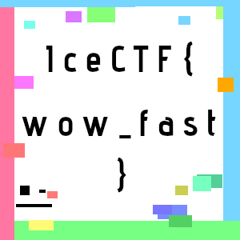

# Modern Picasso (Forensics)

### [~$ cd ..](../)

> Here's a rendition of some modern digital abstract art. Is it more than art though?


We are given the following picture:


We guessed that we should merge frames, and that combined colored areas should give us a flag, (or at least a hint). However,
to merge frames properly, we had to make the background transparent:

> ```sh
>$ convert picasso1.gif -transparent white result.gif
> ```

Result:


We can guess the flag with this picture, but to make it more readable, we can split frames and recombine them:

> ```
> $ mkdir frames
> $ convert result.gif frames/target.png
> $ convert frames/* -background none -flatten result.png
> ```

The second command will extract all frames, using the format target{index}.png. `convert` will finally merge them properly and give:



FLAG:**IceCTF{wow_fast}**

