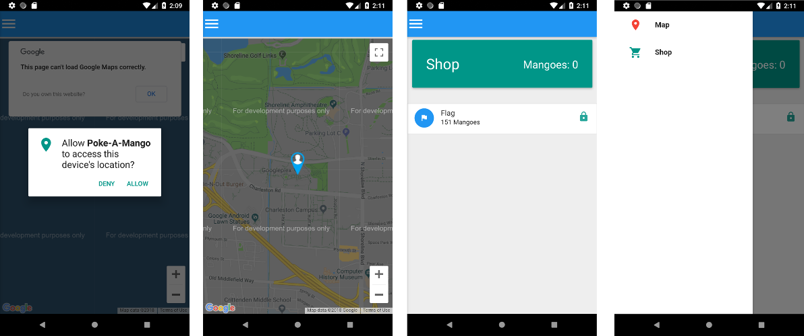
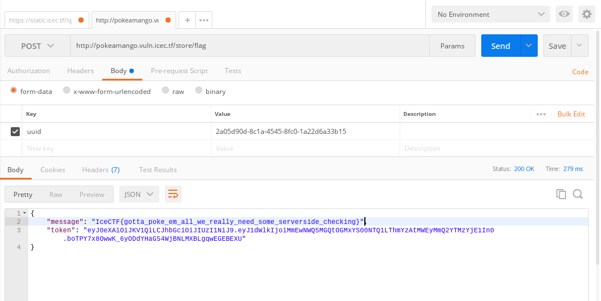

# Poke-a-Mango (Reverse)

### [~$ cd ..](../)

>I love these new AR games that have been coming out recently,
> so I decided that I would make my own with my favorite fruit! The Mango!
> Can you poke 151 mangoes?
>
>NOTE Make sure that you allow the app access to your GPS location and camera
>otherwise the app will not work. You can do that in App Permissions in Settings.

We are given the [APK file](pokeamango.apk), an Android game similar to the well-known Pokemon Go.
As usual, we used `apktool` to extract [files](pokeamango.zip) properly in order to analyse how we could trick the game to capture mangoes efficiently.

The app has only four screens:



## Reversing

We first took a look at the Java decompiled code (dex2jar, jd-gui, you know what I mean...), but there was nothing useful. The app actually uses Cordova,
and then, the useful code was in assets/www/js.

The principle is as follows:

### Where are the mangoes ?

[map.js](map.js): in `updateMap`, the location and the uuid of the user are sent to http://pokeamango.vuln.icec.tf/mango/list to know where are the nearby mangoes

> ```js
>var updateMap = function() {
>	...
>	payload["uuid"] = uuid
>	$.post("http://pokeamango.vuln.icec.tf/mango/list", payload, function(results){
>		var data = results["mangos"];
>		for (var i = 0; i < data.length; i++) {
>			var place = data[i];
>			var mango = new google.maps.Marker({
>				position: place,
>				map: map,
>				icon: 'img/mangie_marker.png'
>			});
>			mangos.push(mango);
>			mango.addListener('click', function(event){
>				window.name = (currentPos.lat()) + "," + (currentPos.lng()) + "," + (this.getPosition().lat()) + "," + (this.getPosition().lng());
>				window.location.href = "camera.html";
>			});
>		}
>	});
>};
> ```

### Capture the mangoes

[mango.js](mango.js): when a user captures a mango, the routine `catchMango` sends uuid and mango's and user's location to http://pokeamango.vuln.icec.tf/mango/catch.
Locations would be then compared and if the user is close enough, the mango would be captured:

> ```js
>function catchMango() {
>	var payload = {
>		"curLat": currentPosLat,
>		"curLong": currentPosLng,
>		"mangoLat": mangoPosLat,
>		"mangoLong": mangoPosLng,
>		"uuid": device.uuid
>	};
>	$.post("http://pokeamango.vuln.icec.tf/mango/catch", payload, function(results){
>		window.plugins.toast.showLongBottom(results["message"], function(a){console.log('toast success: ' + a)}, function(b){alert('toast error: ' + b)})
>		$("#mango").removeClass("bounce infinite");
>		$("#mango").addClass("bounceOutRight");
>		setTimeout(function(){ window.location.href = "map.html"; }, 1000);
>	});
>};
> ```

### Capture the flag

[store.js](store.js): in `updateMangoCount`, a request is sent in order to know how many mangoes have been captured:

> ```js
>function updateMangoCount(){
>	payload = {
>		"uuid": device.uuid
>	};
>	$.post("http://pokeamango.vuln.icec.tf/mango/count", payload, function(data){
>		$("#mango-count").text(data["count"]);
>	});
>}
> ```
and if the user clicks on "Flag", a request on http://pokeamango.vuln.icec.tf/store/flag is sent:
> ```js
>$("#buyFlag").click(function(event){
>	payload = {
>		"uuid": device.uuid
>	};
>	$.post("http://pokeamango.vuln.icec.tf/store/flag", payload, function(data){
>		window.plugins.toast.showLongBottom(data["message"], function(a){console.log('toast success: ' + a)}, function(b){alert('toast error: ' + b)})
>	});
>});
> ```

## Scripting

To get the flag, we have to capture 151 mangoes, and then, we have to move all around the world to do it quickly. However, it was harder than expected because
of 2 things:
* we had to find in which cities mangoes were. We used [this](cities.txt)list (http://gael-varoquaux.info/images/misc/cities.txt) to iterate over biggest cities
* the server often returned an error 500, making the script crash
* we had to wait some seconds between each request

The [script](solve.py) was probably not the best, but did the job:

> ```python
>import requests
>import time
>import random
>import ast 
>import uuid
>xuuid= "2a05d90d-8c1a-4545-8fc0-1a22d6a33b15" #uuid.uuid4()
>#read database
>fcity = open('cities.txt', 'r')
>cities = fcity.read().splitlines()
>fcity.close()
>
> #get next city location		
>def getcurrpos():
>	global curr_city
>	data = cities[curr_city].split('\t')
>	return (data[2], data[1])
>
>def getmangoes():
>	global cookies
>	global currpos
>	r = requests.post("http://pokeamango.vuln.icec.tf/mango/list", data={"uuid":xuuid,"lat":currpos[0],"long":currpos[1]}, cookies=cookies)
>	print r.text
>	# if we receive an error message, the first char is a "<". Otherwise, parse the response
>	if r.text[0] != "<":
>		res = ast.literal_eval(r.text)
>		if res['mangoes'] != None:
>			time.sleep(5)
>			return res['mangoes']
>	#retry
>	time.sleep(5)
>	return getmangoes()
>	
>curr_city = 0		
>mangoes_count = 0
>currpos = getcurrpos()
>cookies = {}
>print currpos
>while mangoes_count < 151:
>	mangoes = getmangoes()
>	currpos = getcurrpos()
>	#capture all mangoes at the current location
>	for i in xrange(len(mangoes)):
>		mangoLat = str(mangoes[i]["lat"])
>		mangoLong = str(mangoes[i]["lng"])
>		myLat = mangoLat[:mangoLat.find('.')+5]
>		myLng = mangoLong[:mangoLong.find('.')+5]
>		r = requests.post("http://pokeamango.vuln.icec.tf/mango/catch", data={"uuid":xuuid,
>			"curLat":float(myLat),"curLong":float(myLng),
>			"mangoLat":float(mangoLat), "mangoLong":float(mangoLong)}, cookies =cookies)
>		print r.text
>		time.sleep(5)
>	curr_city +=1
>	#check how many mangoes have been captured. Counting locally isn't reliable because of server errors.
>	r = requests.post("http://pokeamango.vuln.icec.tf/mango/count", data={"uuid":xuuid	})
>	print r.text
>	if r.text[0] != "<":
>		res = ast.literal_eval(r.text)
>		mangoes_count = int(res["count"])
>		print 'Count %d' % mangoes_count	
>#if 151 mangoes have been captured, get the flag		
>while True:
>	r = requests.post("http://pokeamango.vuln.icec.tf/store/flag", data={"uuid":xuuid}, cookies=cookies)
>	print r.text
>	#retry in case of failure. We want the flag!!
>	if r.text[0] != "<":
>		break
>	time.sleep(5)
> ```	

Finally, as we saw that 151 mangoes were captured, we didn't wait until the end and sent a request with Postman:



FLAG:**IceCTF{gotta_poke_em_all_we_really_need_some_serverside_checking}**


