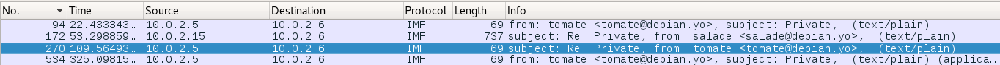

## Kebab STO (350 pts)

>The challenge consists in finding the flag into a network capture.
>
>Challenge is listening on port 8888

We are given a [pcapng file](kebabsto.pcapng), and have to find a flag hidden inside.

We launched Wireshark to see what it was all bout, and noticed some mail exchanges in the capture. To read their content, we filtered on "imf", and got
4 packets:



### Step 1

We took a look at the third (because it contains previous mails):

> ```
>Subject: Re: Private 
>To: salade <salade@debian.yo> 
>References: <6c9268e7-035b-0fa4-0486-c6624af41265@debian.yo> 
> <5f8e93f0-9b6a-522f-f35a-3225bc919df7@debian.yo> 
>From: tomate <tomate@debian.yo> 
>Message-ID: <9468245b-cfd1-4756-7fe4-0912efceaf9b@debian.yo> 
>Date: Thu, 21 Dec 2017 17:09:22 +0100 
>User-Agent: Mozilla/5.0 (X11; Linux x86_64; rv:52.0) Gecko/20100101 
> Thunderbird/52.4.0 
>MIME-Version: 1.0 
>In-Reply-To: <5f8e93f0-9b6a-522f-f35a-3225bc919df7@debian.yo> 
>Content-Type: text/plain; charset=utf-8 
>Content-Transfer-Encoding: 7bit 
>Content-Language: en-US 
> 
>Thank you. You can take it the same way as usual. The name of the file 
>begins with "kd". 
> 
> 
>On 12/21/17 18:59, salade wrote: 
>\> I can help you if you want. 
>\> 
>\> 
>\> On 12/21/17 17:07, tomate wrote: 
>\>> They provided a file but I don't know what it contains. 
>\>> 
>\> 
>
> ```

And the fourth one:

> ```
>To: salade <salade@debian.yo> 
>From: tomate <tomate@debian.yo> 
>Subject: Private 
>Message-ID: <3b6a11fe-60fb-f7b3-421e-29b5c0699eb9@debian.yo> 
>Date: Thu, 21 Dec 2017 17:12:57 +0100 
>User-Agent: Mozilla/5.0 (X11; Linux x86_64; rv:52.0) Gecko/20100101 
> Thunderbird/52.4.0 
>MIME-Version: 1.0 
>Content-Type: multipart/mixed; 
> boundary="------------821D8D192BDE01EA2B1C5E07" 
>Content-Language: en-US 
> 
>This is a multi-part message in MIME format. 
>--------------821D8D192BDE01EA2B1C5E07 
>Content-Type: text/plain; charset=utf-8 
>Content-Transfer-Encoding: 7bit 
> 
>They also retrieved a public key and an interesting cipher text 
>(attached documents). 
> 
>Besides, they also found a service at mydomainndh.ndh (port 55555) which 
>decrypts every text encrypted with the public key, apart from the 
>interesting one. 
> 
> 
>--------------821D8D192BDE01EA2B1C5E07 
>Content-Type: application/zip; 
> name="docs.zip" 
>Content-Transfer-Encoding: base64 
>Content-Disposition: attachment; 
> filename="docs.zip" 
> 
>UEsDBAoAAAAAAFZ6lUsAAAAAAAAAAAAAAAAFABwAZG9jcy9VVAkAA8PCO1rdwjtadXgLAAEE 
>AAAAAAQAAAAAUEsDBBQAAAAIALd5lUvQbcUR4wAAABABAAAPABwAZG9jcy9wdWJrZXkucGVt 
>VVQJAAOawTtamsE7WnV4CwABBAAAAAAEAAAAAGXPvVaDMABA4Z2n6M7hlAoKjEmIIWDTRsQD 
>bBESaKAHqBZant6f1Tve7bOsnyAmlG2OGXyhaJPg4vdZxp4StQc2QelEUvrhhBxDwDMAXMJA 
>iOCJJ7DhyI9Zy6iQHS91tfO3c1HK3dO8xEZeTcr/fNflBXHlicfbpSZjdOg7hL8EVolIUG76 
>7EwCoO/SC1yXVlHkyb7QrT1Kaqy79PU6d+71efRANYAgdtb6EGdi3T6oocl7YS5qPca3KRig 
>NxdAuW+lduwwS9WY0co4iWaxdat13Y5nqbC50BBwAI0/IWbhP/Q3UEsDBBQAAAAIAFZ6lUus 
>24QeoQAAADUBAAAPABwAZG9jcy9jaXBoZXJUZXh0VVQJAAPDwjtaw8I7WnV4CwABBAAAAAAE 
>AAAAABWPyREAQQgC/xuNFwL5J7bOS6pstWWJTYxoe/3qYopgqq6OQruta0ieSC8nAmvPMGJU 
>dmics9wyyrkHpTRV0wVPZoYboT5GDCYmr+GHtrBhLuuGW4llFBXLTFgBbJPOEurBXQ6c0m1c 
>xGlI0ZF9wq0L1SeoSkY/n+jtPLcLieaBhiYBAtmsZutOmad7MwzEiXVy4+6Z991gvMPi2ewk 
>6/sBUEsBAh4DCgAAAAAAVnqVSwAAAAAAAAAAAAAAAAUAGAAAAAAAAAAQAO1BAAAAAGRvY3Mv 
>VVQFAAPDwjtadXgLAAEEAAAAAAQAAAAAUEsBAh4DFAAAAAgAt3mVS9BtxRHjAAAAEAEAAA8A 
>GAAAAAAAAQAAAKSBPwAAAGRvY3MvcHVia2V5LnBlbVVUBQADmsE7WnV4CwABBAAAAAAEAAAA 
>AFBLAQIeAxQAAAAIAFZ6lUus24QeoQAAADUBAAAPABgAAAAAAAEAAACkgWsBAABkb2NzL2Np 
>cGhlclRleHRVVAUAA8PCO1p1eAsAAQQAAAAABAAAAABQSwUGAAAAAAMAAwD1AAAAVQIAAAAA 
> 
>--------------821D8D192BDE01EA2B1C5E07-- 
> ```

We decoded this base64-encoded string and found 2 files in the archive: [cipherText](cipherText), and [pubkey.pem](pubkey.pem).

Since it was written in the mail that the service would not decrypt messages encrypted using the public key, we first tried to lead a chosen cipher text attack
by sending `c * 2^e`, but actually it was useless. The oracle answers with the following plaintext: *Th1s1s2P@ss_W0rd%M0f0*

It was obviously not the flag, it would be too easy...

### Step 2

Because of the first mail exchange, we know that a file with a name beginning with "kd" is sent. We looked for this string and found in packet 345 that this file was sent over HTTP.
We found it in packet 384, and saw that it was once again a zip archive, with a [tcmdump capture](lkdjflknezcz) inside. We opened it in Wireshark, and saw that it was encrypted 802.11 traffic.

We first tried to use the decrypted password, but it didn't work as expected. The right way was actually the simplest:

> ```bash
>~$ aircrack-ng -w ~/Documents/WH/rockyou.txt data/lkdjflknezcz
>Opening data/lkdjflknezcz
>Read 1358 packets.
>
>   #  BSSID              ESSID                     Encryption
>
>   1  F0:D7:AA:77:BD:46  wifiAccess                WPA (1 handshake)
>
>Choosing first network as target.
>
>Opening data/lkdjflknezcz
>Reading packets, please wait...
>
>                                 Aircrack-ng 1.2 rc4
>
>      [00:00:00] 604/7120714 keys tested (1365.65 k/s) 
>
>      Time left: 1 hour, 26 minutes, 56 seconds                  0.01%
>
>                           KEY FOUND! [ abcdefgh ]
>
>
>      Master Key     : 46 DE 68 77 59 26 52 28 68 59 E3 E9 27 C2 75 66 
>                       77 A0 C0 C2 59 7C B7 6A 52 06 A3 B8 5D 7F 33 29 
>
>      Transient Key  : C8 2A 89 4B 43 93 57 73 35 B7 9E 21 99 8A 5A F2 
>                       B6 89 B8 10 F6 AF 77 68 A8 B4 69 E7 30 E4 A7 9B 
>                       88 32 93 FF AA B5 8E CE 9E AC 4A 05 05 0C EC BB 
>                       37 C9 12 11 5B DA 0C E9 D8 25 02 5E F3 D2 AA 4F 
>
>      EAPOL HMAC     : 76 32 AE BA 65 FD A2 64 BD FD 8E 76 BA 1F B7 84 
> ```

In the decrypted trace, we found new mails and an FTP exchange. In packet 1292, there was a third zip archive, protected with a password.
We then tried "Th1s1s2P@ss_W0rd%M0f0", got a [final file](slkfdsflj) with the flag: **ndh2k18{M4k3M4tr10cHKa9r34T4g41n}**
