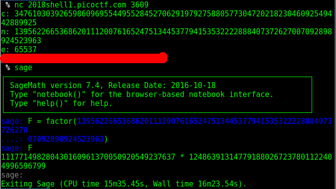

# Super-safe RSA (1, 2 & 3)

Three "Super-safe RSA" challenges were proposed. The three solutions are given here

## Super safe RSA 1

>Dr. Xernon made the mistake of rolling his own crypto..
>Can you find the bug and decrypt the message? Connect with nc 2018shell1.picoctf.com 3609. 

### [~$ cd ..](../)

One has to be a little bit patient to solve this challenge, but there was no difficulty:



Computing F took a while, but once done:

> ```python
>from Crypto.Util import number
>p = 111771498280430160961370050920549237637
>q = 124863913147791880267237801122404996596799
>phi = (p-1)*(q-1)
>d = number.inverse(65537, phi)
>c = 3476103039265986096955449552845270629197927588057730472021823046092549442889925
>print hex(pow(c, d, p*q))[2:-1].decode('hex')
> ```

FLAG: **picoCTF{us3_l@rg3r_pr1m3$_5157}**

## Super Safe RSA 2

>Wow, he made the exponent really large so the encryption MUST be safe, right?!
>Connect with nc 2018shell1.picoctf.com 56543. 

By connecting to the service, we are 3 well-known values:

> ```
>c: 13301275369519108417731633336520910583928739664422443043511688318660964593085788136938171137063718030355828076890241312432851143484030240036781270659064458431246609454631039446545470348999372505885071687397081605067583157080146611434521318443158700285425554484201011445617660410256182877817611349381010599295
>n: 106950775589860162121569000311118367663351022282147511815774587439637011148161926824183222062437980665368924850581107479153691639489751606016779164110286091514460412729249728068309254399645273308202759607131133879418795095488149660684406800596516275591543382919849709032711523159511161403325746947750929769003
>e: 36189334261268275252268400306687228913475933749315702916316237408813194977213465511895374100990656564005390504394260333211960660349493135404856718240226191332588127410681698170921358163366253357016820846997162161719966575870646806152119276279084986707637840276698545855394222353575065131562038836113440138497
> ```

The public exponent is an exaggerated number, leading to a small `d`. A bruteforce attack on `d` could work, but we used the Wiener's attack and continued fractions:

> ```python
>import decimal
>from Crypto.Util import number
>E = 36189334261268275252268400306687228913475933749315702916316237408813194977213465511895374100990656564005390504394260333211960660349493135404856718240226191332588127410681698170921358163366253357016820846997162161719966575870646806152119276279084986707637840276698545855394222353575065131562038836113440138497
>N = 106950775589860162121569000311118367663351022282147511815774587439637011148161926824183222062437980665368924850581107479153691639489751606016779164110286091514460412729249728068309254399645273308202759607131133879418795095488149660684406800596516275591543382919849709032711523159511161403325746947750929769003
>
>e = E
>n = N
>array = []
>
>while 1:
>	if n < e:
>		a = n
>		n = e
>		e = a
>	if e == 0:
>		break
>	x = n/e
>	array.append(x)
>	y = n -x*e
>	n = y
>denom = [array[0], array[0] * array[1]+1]
>num = [1, array[1]]
>i = 2
>while i < len(array):
>	ni = array[i] * num[-1] + num[-2]
>	di = array[i] * denom[-1] + denom[-2]
>	num.append(ni)
>	denom.append(di)
>	i+=1
>e = E
>n = N
>p = q = 0
>decimal.getcontext().prec = 617
>for i in range(len(num)):
>	phi = (e * denom[i] - 1)/num[i]
>	b = (n-phi)+1
>	c = n
>	delta = decimal.Decimal(pow(b, 2) - 4 * c)
>	if delta > 0:
>		x1 = (-b - delta.sqrt())/2
>		x2 = (-b + delta.sqrt())/2
>	if x1 * x2 == n:
>		p = abs(x1)
>		q = abs(x2)
>		break
>print 'P: %d, Q: %d' % (p,q)
>phi = (p-1)*(q-1)
>d = number.inverse(e,phi)
>print "Private %d" % d
> ```

By running the script, `d` appeared: 65537.

> ```python
>c = 13301275369519108417731633336520910583928739664422443043511688318660964593085788136938171137063718030355828076890241312432851143484030240036781270659064458431246609454631039446545470348999372505885071687397081605067583157080146611434521318443158700285425554484201011445617660410256182877817611349381010599295
>N = 106950775589860162121569000311118367663351022282147511815774587439637011148161926824183222062437980665368924850581107479153691639489751606016779164110286091514460412729249728068309254399645273308202759607131133879418795095488149660684406800596516275591543382919849709032711523159511161403325746947750929769003
>print hex(pow(c, 65537, N))[2:-1].decode('hex')
> ```

FLAG: **picoCTF{w@tch_y0ur_Xp0n3nt$_c@r3fu11y_2104643}**

## Super Safe RSA 3

> The more primes, the safer.. right.?.? Connect with nc 2018shell1.picoctf.com 11423

Hmmm, no, not necessarily! By connecting to the service, we are given the following values:

> ```
>c: 46066709200479565045643633945909350070941435398746851521142156604580601434791063615994107049816887834068484025364489490893715741613278204404877221257353522305081511441536626460383890083243843897638133855945700713955918990289713959130113026541468571577180004903625028571271699184756057384677036649690466509
>n: 51461539547431516892895130467552544303276757643463776614743515218906458630164003670054351172686828082130608148350671576040452516060343089628585605516573678396095207234917831381175418156349266182010823934748257809530966818024865105798042883675664724811372412965079458224323589175095955900248964334489540431
>e: 65537
> ```

This [online tool](https://www.alpertron.com.ar/ECM.HTM) gave us the result of the full factorisation. The rest of the challenge is then straight forward. In a classical RSA-factorisation challenge,
once we have P and Q, we compute `phi = (p-1)x(q-1)`. Here, it's the same principle:

> ```python
>from Crypto.Util import number
>factors = [2562260579 ,  2680664249 ,  2685843367 ,  2710064683 ,  2716237361 ,  2730346207 ,  2831896747 ,  2832971759 ,  2945563441 ,  2990796197 ,  3161709119 ,  3189915329 ,  3195465967 ,  3256277797 ,  3358210291 ,  3361109813 ,  3377726069 ,  3424664107 ,  3441295603 ,  3506466277 ,  3586007827 ,  3600793991 ,  3690575417 ,  3720194963 ,  3721933289 ,  3924483109 ,  3938881511 ,  3959293769 ,  4029527083 ,  4082792849 ,  4221427967 ,  4234803589]
>phi = 1
>for x in factors:
>	phi *= x-1
>d = number.inverse(65537, phi)
>c = 46066709200479565045643633945909350070941435398746851521142156604580601434791063615994107049816887834068484025364489490893715741613278204404877221257353522305081511441536626460383890083243843897638133855945700713955918990289713959130113026541468571577180004903625028571271699184756057384677036649690466509
>N = 51461539547431516892895130467552544303276757643463776614743515218906458630164003670054351172686828082130608148350671576040452516060343089628585605516573678396095207234917831381175418156349266182010823934748257809530966818024865105798042883675664724811372412965079458224323589175095955900248964334489540431
>m = pow(c, d, N)
>print hex(m)[2:-1].decode('hex')
> ```

FLAG: **picoCTF{p_&_q_n0_r_$_t!!_6629910}**


