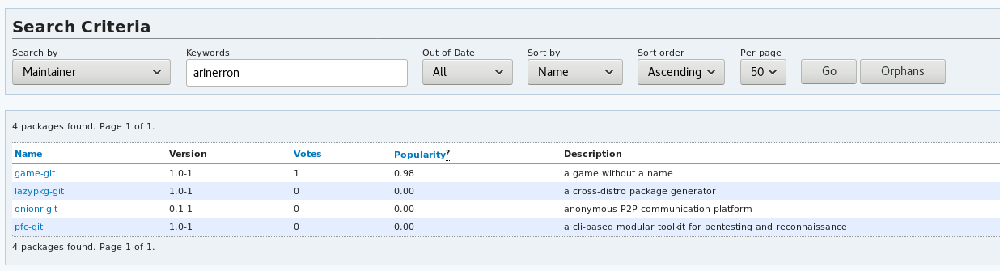
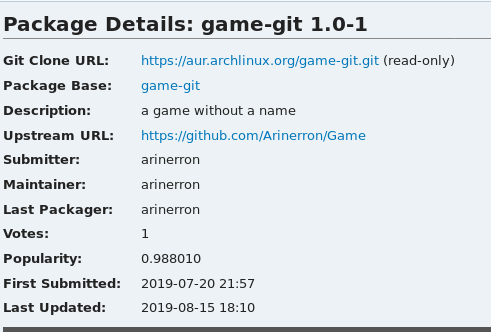
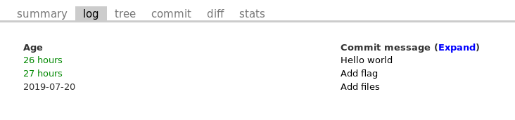
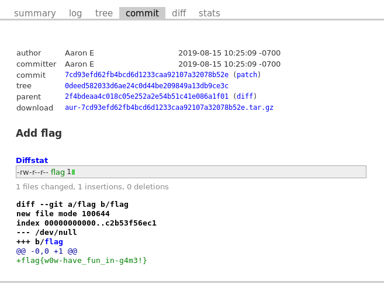

# AUR - Misc

### [~$ cd ..](../)

>AUR
>
>Written by: arinerron
>
>Help! We lost aur flag in the Arch User Repository! Go find it for us.

This challenge was quite fun, and more like an OSINT challenge. I didn't really know what to do at the beginning: I noticed the link to ArchWiki on the home page, but didn't really know what I was looking for.

Finally, I decided to look for the author name, `arinerron`, on the Wiki:

By taking a closer look to each package, one can see that `game-git` was recently updated (the day before):

By clicking on `View changes` on the right, one could find a interesting commit message:

And finally, by clicking on the second commit, one could find the flag:

FLAG: **flag{w0w-have_fun_in-g4m3!}**

EOF
