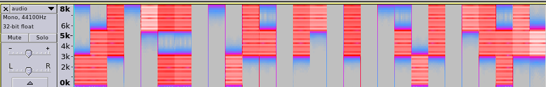
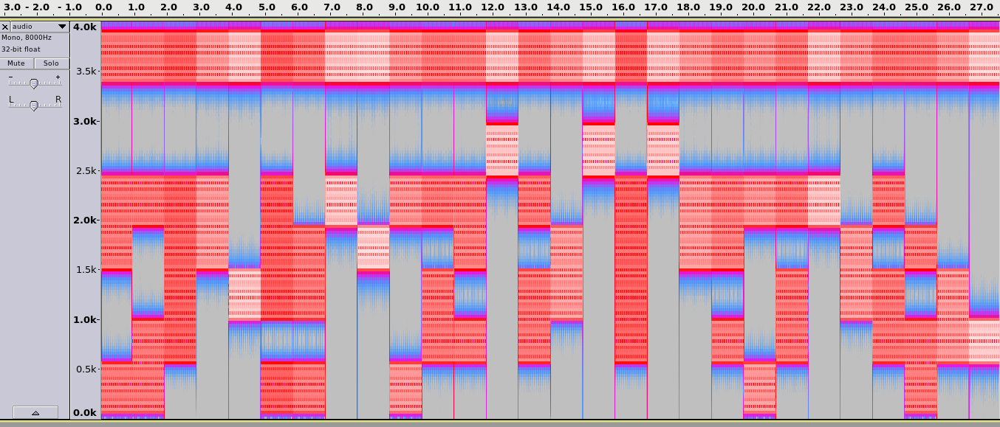

# Easy Encodings - Forensics

### [~$ cd ..](../)

>Easy Encoding
>
>Written by: Brownie
>
>Brownie was browsing Discord when a notification popped up. Included was a wav file and a promise of a $100 prize. Desperate for funds towards redpwn's upcoming ctf, he tried solving it but his attempts were of no avail. Can you help redpwn pay off its debt?

A [WAV file](audio.wav) file was attached, and as usual, Audacity was our best friend.

By drawing the spectrogram, one can see red areas, as shown below:



By resizing the area, zooming and changing the rate to 8000Hz, one can finally get this kind of spectrogram, where each "column" contains 8 cells, the first one being always red.



As we were looking for printable characters, we guessed that red meant 0, and blue meant 1. Tedious job began:

```python

flag = ''
flag += chr(0b01100110)
flag += chr( 0b01101100)
flag += chr( 0b01100001)
flag += chr( 0b01100111)
flag += chr( 0b01111011)
flag += chr( 0b01100010)
flag += chr( 0b01110010)
flag += chr( 0b01101111)
flag += chr( 0b01110111)
flag += chr( 0b01101110)
flag += chr( 0b01101001)
flag += chr( 0b01100101)
flag += chr( 0b01011111)
flag += chr( 0b01101001)
flag += chr( 0b01110011)
flag += chr( 0b01011111)
flag += chr( 0b01100001)
flag += chr( 0b01011111)
flag += chr( 0b01100111)
flag += chr( 0b01100101)
flag += chr( 0b01101110)
flag += chr( 0b01101001)
flag += chr( 0b01101111)
flag += chr( 0b01110011)
flag += chr( 0b01101001)
flag += chr( 0b01110100)
flag += chr( 0b01111001)
flag += chr( 0b01111101)
print flag
```

FLAG: **flag{brownie_is_a_geniosity}**

EOF
