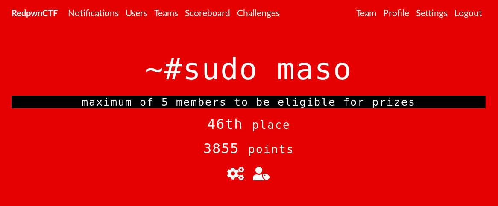

# Red Pwn 2019

### [~$ cd ..](../)

The write-ups cover some challenge I solved during the [Red pwn 2019](https://redpwn.net/). 926 teams took part to the competition.  
Difficulty was well-balanced, and challenges interesting, even if one of them were really frustrating (see `Dedication` ...) or with a lot of guessing

* [Duance Crypto](duance_crypto/)
* [MSB](msb/)
* [0100100100100...](parity_rsa)
* [Trinity](trinity/)
* [Easy encoding](easy_encoding/)
* [Tux Trivia Show](tux_trivia_show/)
* [Generic pyjail](gen_pyjail/)
* [Generic pyjail 2](gen_pyjail2/)
* [Super hash](super_hash)
* [Dedication](dedication/)
* [Easy Encoding Ever](easy_encoding_ever/)
* [AUR](aur/)
* [Java is EZ](java_isez/)
* [Generic Crackme](generic_crackme/)
* [Generic Crackme Redux](generic_crackme_redux/)
* [L-star](l_star/)
* [Skywriting](skywriting/)
* [Easy cipher](esay_cipher/)
* [Crypt](crypt/)
* [Ghast](ghast/)
* [Blueprint](blueprint/)
* [He sed she sed](he_sed_she_sed/)
