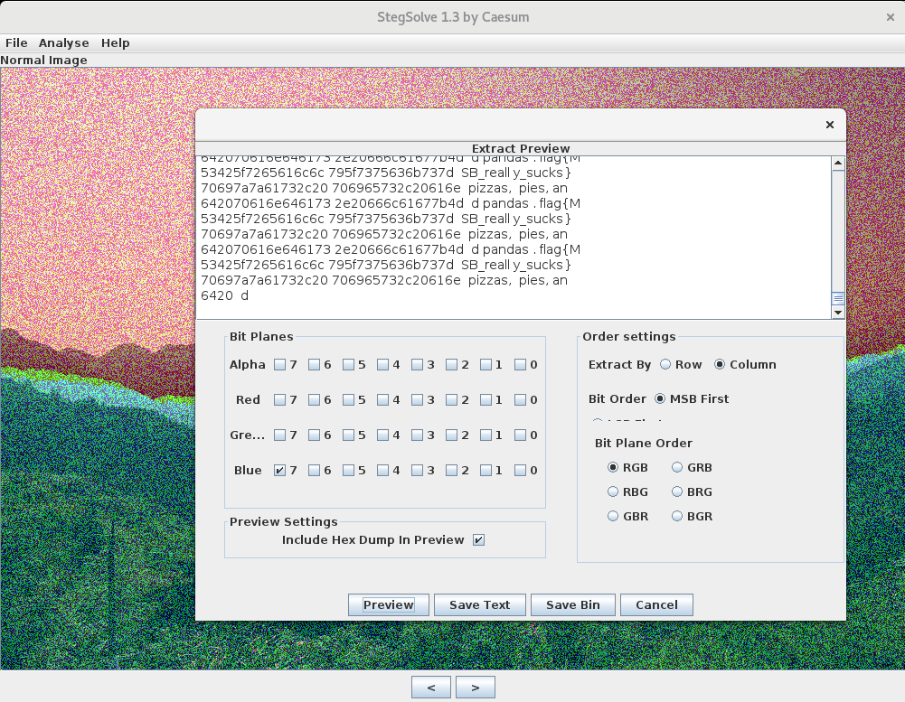

# MSB - Forensics

### [~$ cd ..](../)

>msb  
>
> Written by: NotDeGhost
>
>It's not LSB, its MSB!
>
>Red is Random, Green is Garbage, Blue is Boring.
>
>Hint: Only one channel is correct. Also, I like doing things top down.

We were given the following image, and as the title and the description suggest, something was hidden in the most significant bits

The hint almost gives the solution, as we only had to try each channel in Stegsolve, with the correct setting for the order (column instead of the default)

flag: **flag{MSB_really_sucks}**

EOF
