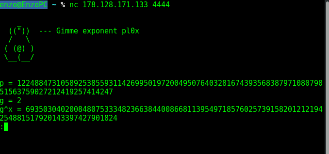
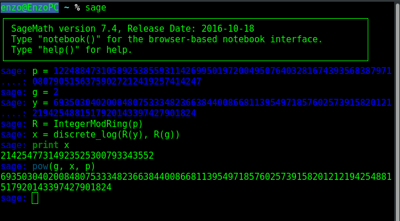

## Matry0ska1 (Crypto)

### [~$ cd ..](../)

> Discrete logarithms are hard... 
>Service: nc 178.128.171.133 4444 | nc crypto.sect.ctf.rocks 4444
>Author: grocid

The service gives us 3 values, `p`, `g`, and `pow(g,x)`. Our mission (should we choose to accept) is to compute `x`, which is known to be difficult (for some groups).
However, verification can be done quickly.

As usual, Sage will do the job:

The computation of `x` takes a few seconds, and we can send the answer to the server,
which sends back the flag: **SECT{Ru$$ian_D0LLZ_h0lDs_TH3_S3cR3T}**
