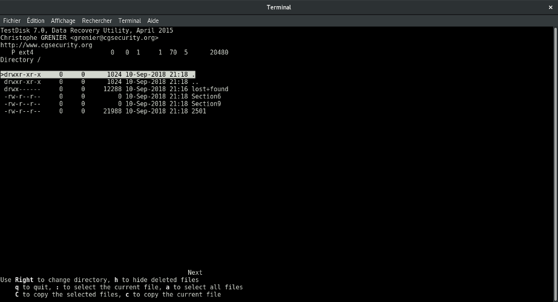

# Puppetmatryoshka - (Misc)

### [~$ cd ..](../)

>Greetings Kusanagi, your mission is to find Puppet Master.
>Author: d3vnu11 

We are given an [archive](puppetmatryoshka.tar.gz) containing a PCAP file. Because of the name, I guessed that we had to deal with embedded payload.

By opening the file in Wireshark, I found 3 interesting packets by filtering on protocol kismet:


The 3 payloads start with the magic number **BZ**, meaning that it bzip2 data. To export them, we have to right click on the packet > **Follow** > **TCP Stream**,
and export the payload as raw data. I got 3 files, and analyzed them with `testdisk`. In one of them, I found the following files:



2501 is also an archive, wich contains a [file](2501_2) with a long base64-encoded string:

> ```
> $ cat 2501_2|base64 -d > 2501_3
> $ file 2501_3
> 2501_3: OpenDocument Text
> ```

Instead of opening the file [2501_3](2501_3) with a viewer, I uncompressed it as an archive, and ran:

> ```
> $ grep -nrw */ -ie "sect" --color=always
>META-INF/documentsignatures.xml:49:xmlns:loext="urn:org:documentfoundation:names:experimental:office:xmlns:loext:1.0"><PGPKeyID>MkMzNjcxODdCQzU3RkUyRDVGQkQ1QTEzRjUxQTJEREYyM0UzQkQzOQA=</PGPKeyID><PGPKeyPacket>mQENBFuWvYcBCADltpCyYUjX7RclQ9GcgvUQFAMMQxldw1+ye9qjwk4ByzE4o1esk2NlknsS+ANW9atTdlWaU2CfW3htasLNtXAnj47s/sFoOr/w1Lo8XwU1aylLlljtEnKp4yOSKFtry5ZhbGbevd1LbYHLpzpSa13o/sKENtB9za7yhkzarAs30X7DsTPCAvZ3NCS9H3piUvvR2nooGVntzTpgEm5/cBltz25EbLQ+RlHr5StS4WNkP1DTXGiz0I0CTiZuCDZCL0U/XkKqe7CobQ8+QYZbekc69p4fSRrUJQG3nnNqiOx9/SkLgvZb6k4GREhDCvz0le3Q93fVdr5J6rtrrFlokUozABEBAAG0ZFNFQ1R7UHVwcDN0X000c3Qzcl9oMWQzNV8xbl9UaDNfdzFyM30gKFNFQ1R7UHVwcDN0X000c3Qzcl9oMWQzNV8xbl9UaDNfdzFyM30pIDxQdXBwZUBtYXN0ZXIuZDN2bnUxMT6JAT8EEwECACkFAluWvYcCGw8FCQAZ4RkHCwkIBwMCAQYVCAIJCgsEFgIDAQIeAQIXgAAKCRD1Gi3fI+O9OT8UB/0Y8yEAgb+YG2tbNDJ9coL5emfsWxjl/oMjBTtuBLZEY9WG5kaL9fmZOt09Zs1ksK8AF4UvdrzZlf9pWl/EkuYw2ZIiBmKUvsbbJ5B46Q5Zj5mcSJpq156CwgcvqnpuK+lyspOdH8gh3e4HSMKfjEvrJznvmEKgueMKe8Y7Rm0hKHXs//b9dJtH3ePjfFMrpgg8TN+fYcX87+dIopYdRa3m+zWiwLf+IU30eH39tO7wiqam041gqnH116UEdaIAAzys/RQadqIfRp+HejTsYCph5hTe+gToA6W7UABqbDWect36jtQ/HN3CNM3Qr9q2OM0oqQyVL/C11kjNlfpDjsk0</PGPKeyPacket><loext:PGPOwner>SECT{Pupp3t_M4st3r_h1d35_1n_Th3_w1r3} 
>META-INF/documentsignatures.xml:50:(SECT{Pupp3t_M4st3r_h1d35_1n_Th3_w1r3})
> ```

FLAG: **SECT{Pupp3t_M4st3r_h1d35_1n_Th3_w1r3}**
