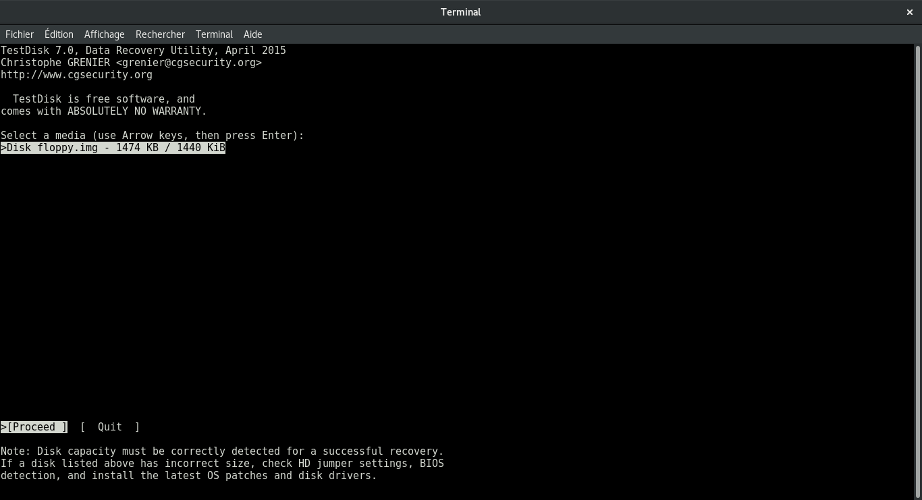
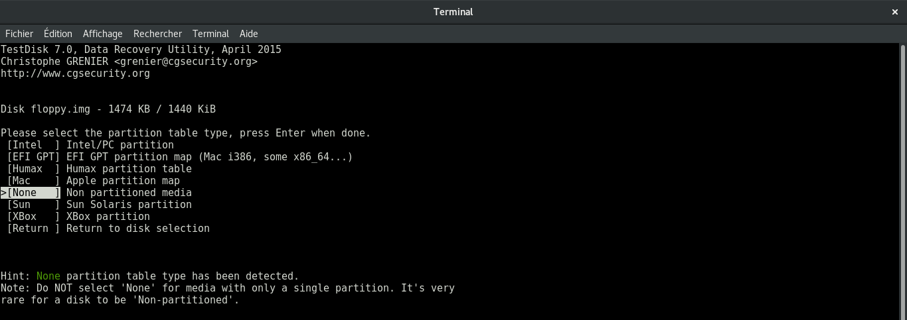
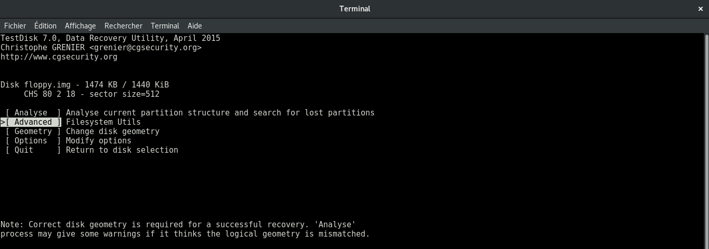
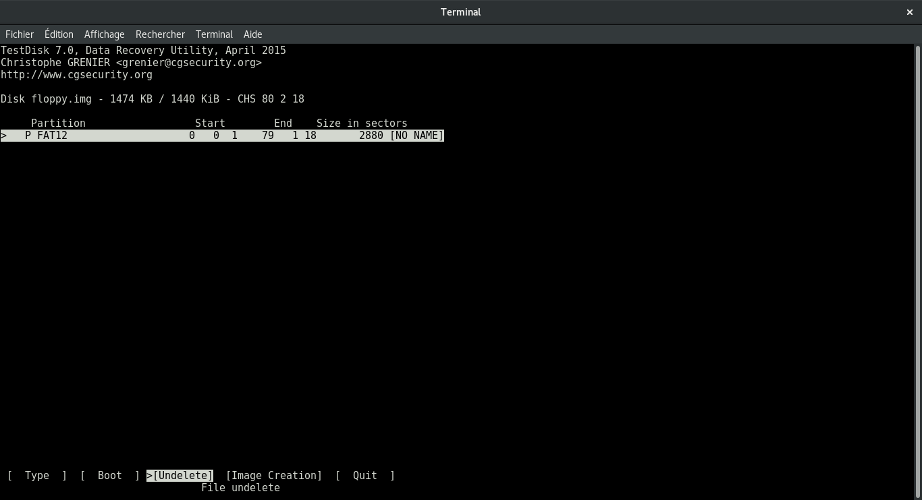
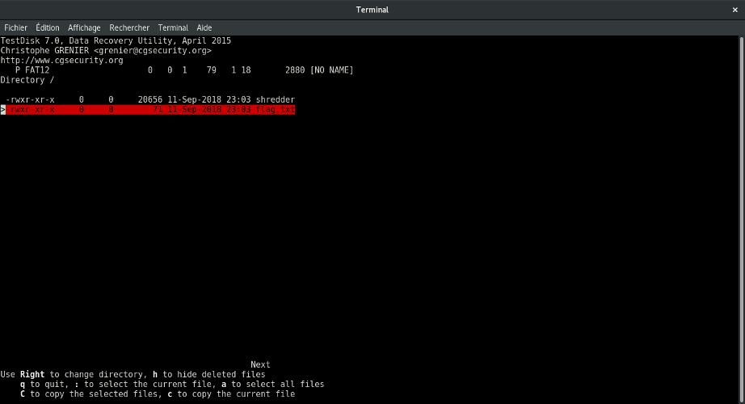
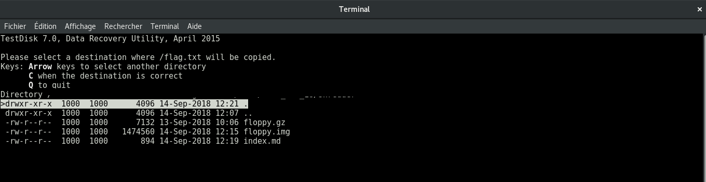
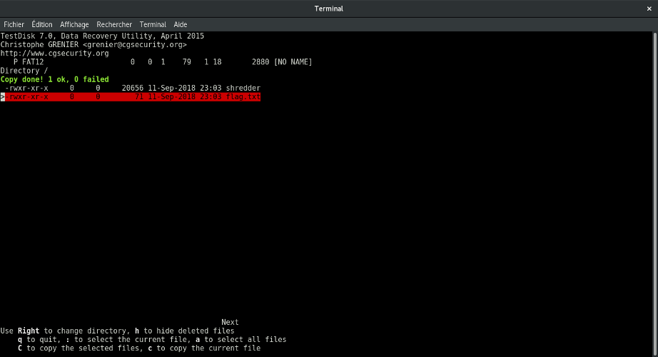

## Shredder (Misc)

### [~$ cd ..](../)

>We intercepted this floppy we believe belonged to the laughing man.
>We haven't found anything other than this shredder tool though
>Author: klondike 

We are given [this archive](floppy.gz), with a file named `floppy.img` inside (actually, I think that
the challenge has been updated, and as I solved it, and was not exactly the same file):

> ```sh
> $ file floppy.img 
> floppy.img: DOS/MBR boot sector, code offset 0x3c+2, OEM-ID "mkfs.fat", root entries 112, sectors 2880 (volumes <=32 MB) , sectors/FAT 9, sectors/track 18, serial number 0xb4d31337, unlabeled, FAT (12 bit), followed by FAT
> ```

By mounting the partition, we found the file named `shredder`, which was actually totally useless, no need to reverse it. Because
of the statement, I guessed that I had to find something else, that's why I decided to investigate using `testdisk`.
Here is the step-by-step procedure:

* Run `testdisk <file>` and choose **Proceed**

* **None**, was the default, just pressed Enter

* Choose **Advanced|Filesystem Utils** 

* Choose **Undelete** to recover deleted files

* Uh uh, a file named `flag.txt`! Move the cursor on this file, and press **c**

* Choose the destination (current folder here), and press **C**

* Copy is done!



However, [flag.txt](flag.txt) doesn't not a readable flag:

> ```sh
> $ xxd flag.txt
>00000000: 3f29 2f38 175d 0a33 3933 595b 5815 331e  ?)/8.].393Y[X.3.
>00000010: 5d0b 045b 331b 045f 1e5f 3339 333e 4033  ]..[3.._._393>@3
>00000020: 5b04 5f02 331c 5f5c 1c00 5f33 1b5d 0000  [._.3._\.._3.]..
>00000030: 335f 1a5f 025b 1958 0000 1533 0f5c 015f  3_._.[.X...3.\._
>00000040: 335b 5c33 3911 66                        3[\39.f
> ```

Knowing that the flag format is "SECT{blablabla}", I tried to XOR the first byte of the cipher text with 'S':

> ```python
> >>> ord('?')^ord('S')
> 108
> ```

and the second byte with 'E':

> ```python
> >>> ord(')')^ord('E')
>108
> ```

Okay, then:

> ```python
>file = open('flag.txt', 'r')
>data = file.read()
>file.close()
>"".join(chr(ord(data[i])^108) for i in xrange(len(data)))
>	'SECT{1f_U_574y_r1gh7_wh3r3_U_R,_7h3n_p30pl3_w1ll_3v3n7u4lly_c0m3_70_U}\n'
> ```
