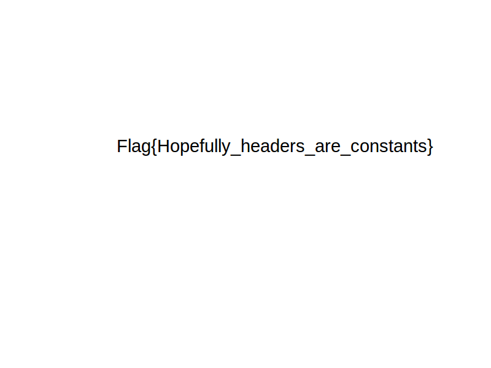

## Looser (Crypto)

### [~$ cd ..](../)

We are given an [encrypted file](flag.png.crypt) named flag.png.crypt.

Let's look what is inside:

> ```bash
>~$hexdump -C flag.png.crypt|head
>00000000  67 be a0 a9 e3 e4 f4 e4  ee ee ee e3 a7 a6 aa bc  |g...............|
>00000010  ee ee ed ce ee ee ec b6  e6 e8 ee ee ee 74 98 6c  |.............t.l|
>00000020  9e ee ee ee ea 9d ac a7  ba e6 e6 e6 e6 92 e6 8a  |................|
>00000030  66 ee ee ce ee a7 aa af  ba 96 72 03 33 99 76 b2  |f.........r.3.v.|
>00000040  9b 53 2e 0f 01 00 48 83  e4 07 ca ef fc fc ae ce  |.S....H.........|
>00000050  ae 86 cc f3 07 fe 40 6e  64 6e 4e c6 4c 46 66 a4  |......@ndnN.LFf.|
>00000060  fd aa c2 4e e6 bc c3 4e  9c bb be 6c c6 c6 6c fa  |...N...N...l..l.|
>00000070  ef bf 7e c8 46 ef 4a fd  fc a4 f4 ea e6 4a 7c 54  |..~.F.J......J|T|
>00000080  1b 99 11 36 37 5e a7 88  d9 75 22 02 c1 25 0b 93  |...67^...u"..%..|
>00000090  71 69 69 27 00 20 22 07  dd 71 dd 9d 20 47 a6 c7  |qii'. "..q.. G..|
> ```

and compare it against a well-formed PNG:

> ```bash
>~$ hexdump -C ~/Images/logo1.png|head 
>00000000  89 50 4e 47 0d 0a 1a 0a  00 00 00 0d 49 48 44 52  |.PNG........IHDR|
>00000010  00 00 02 58 00 00 02 58  08 06 00 00 00 be 66 98  |...X...X......f.|
>00000020  dc 00 00 00 06 62 4b 47  44 00 ff 00 01 00 01 45  |.....bKGD......E|
>00000030  e2 26 52 00 00 00 09 70  48 59 73 00 00 0b 13 00  |.&R....pHYs.....|
>00000040  00 0b 13 01 00 9a 9c 18  00 00 00 07 74 49 4d 45  |............tIME|
>00000050  07 e0 0a 1c 06 20 24 27  e5 fd 65 00 00 00 1d 69  |..... $'..e....i|
>00000060  54 58 74 43 6f 6d 6d 65  6e 74 00 00 00 00 00 43  |TXtComment.....C|
>00000070  72 65 61 74 65 64 20 77  69 74 68 20 47 49 4d 50  |reated with GIMP|
>00000080  64 2e 65 07 00 00 20 00  49 44 41 54 78 da ec bd  |d.e... .IDATx...|
>00000090  71 54 63 e7 79 ee fb 48  02 0d 03 48 30 36 1d a4  |qTc.y..H...H06..|
> ```

As we can see, it's a kind of mono-alphabetic substitution, where each character has been xor'ed with the constant value 0xee. Python will do the job:

> ```python
>picture = open('flag.png.crypt', 'rb')
>flag = open('flag.decrypt.png', 'wb')
>content = picture.read()
>picture.close()
>flag.write(''.join(chr(ord(content[i])^0xee) for i in range(len(content))))
>flag.close()
> ```
And here is the result


