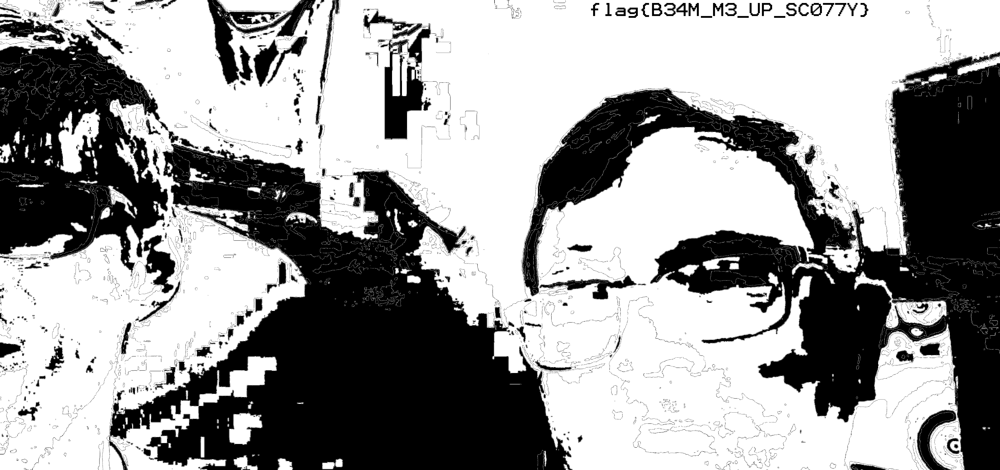

# Last transmission - Misc

### [~$ cd ..](../)

>Two of our squad leaders got beamed up before they could finish their transmission, but they left a clue behind as to where they were taken.  
>-= Created by P4PA_0V3RL0RD =-

We were given the following picture:

and because of the colors and rectangular areas, the solution was likely about colors manipulation. By opening the picture in Stegsolve, and browsing through the common steganography methods, we finally found this (Red plane 1):

FLAG: **flag{B34M_M3_UP_SC077Y}**

EOF
