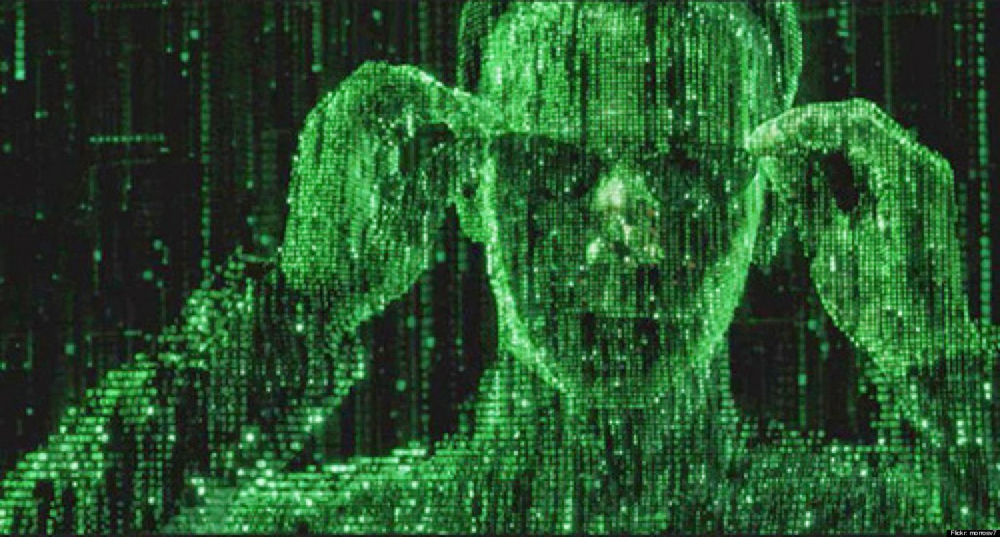

# Neo - Forensics

### [~$ cd ..](../)

>We hacked one of EvilCorps sentries and found something interesting. A single picture, we're not sure what to do with this but we know this sentry was fond of his abilities to hide things in plain site.
>
>-= Challenge by P4PA_0V3RL0RD =-

We were given here the following picture coming or inspired by Matrix:



and by running a `binwalk`, we got:

```
DECIMAL       HEXADECIMAL     DESCRIPTION
--------------------------------------------------------------------------------
0             0x0             JPEG image data, EXIF standard
12            0xC             TIFF image data, little-endian offset of first image directory: 8
226           0xE2            JPEG image data, EXIF standard
238           0xEE            TIFF image data, little-endian offset of first image directory: 8
```

We then added the option `--dd="".*"` and in the output directory, we found the following picture:


Then, a simple:

```bash
strings E2 | grep flag
```

gave us : **flag{f011ow_th3_wh1t3_rabb17}**

EOF
