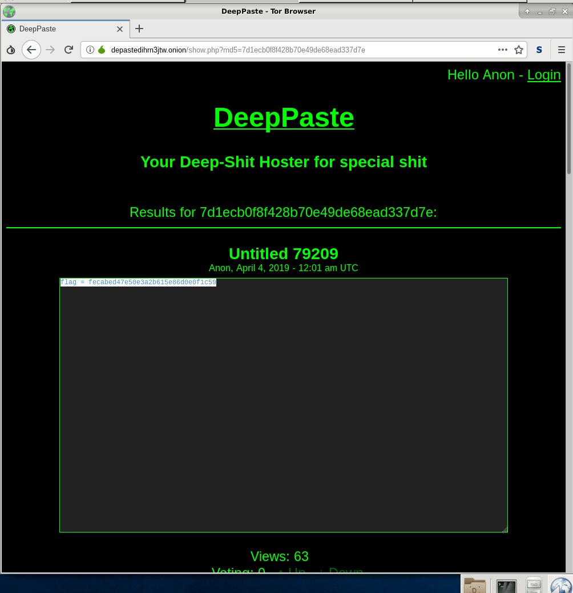
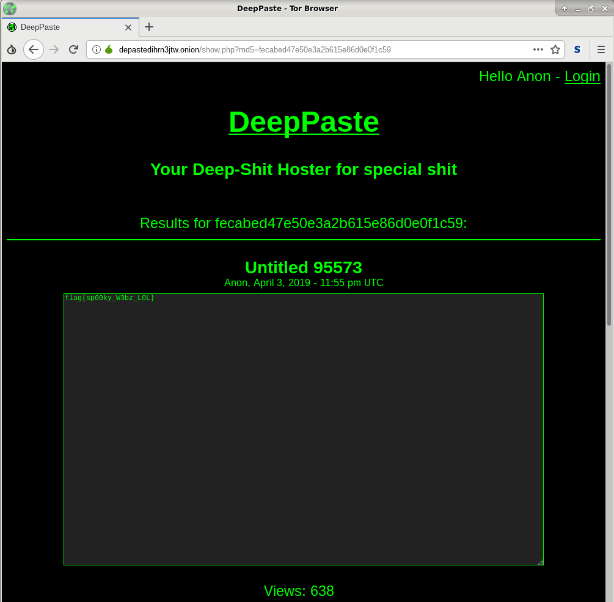

# NIT - Misc

### [~$ cd ..](../)

>The network investigative technique had just triggered and we were starting receive telemetry when, suddenly, a pop-up asked him for administrative access. He freaked out and yanked his cable leaving us with a copious amount of line noise. We've been tracking this guy for a while and really need a win here.
>
>See if you can get anything out of this mess:
>
>A7]^gF*(u(BkVO)1MV#U/oPWADf.4LBQ&)IE+j2TD.GLe2e4XS@q%-(3+b!&3+=g#AMcDXAMuMZ@:V/M2e4jY
>
>-= Created by v0ldemort =-

We didn't immediately recognize the correct encoding and we first tried a simple one-byte-XOR-encryption, unsuccessfully. After a couple of minutes and some useless attempts, we finally thought about ASCII-85 because of the charset, and decoded it:

>depastedihrn3jtw.onion/show.php?md5=7d1ecb0f8f428b70e49de68ead337d7e

By opening the given URL in the TOR browser (because of `onion`), we landed on the following page:

Another MD5 hash is given, and because of the URL of the current page, we guessed that we had to use it as URL parameter:

FLAG: **flag{sp00ky_W3bz_L0L}**

EOF
