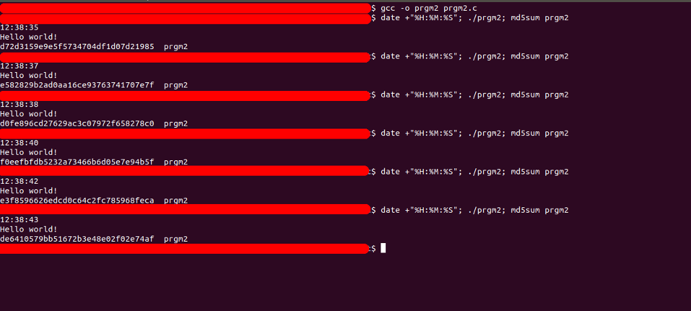

## Self modifying C program

### [~$ cd ..](../)

A few weeks ago, a good friend of mine asked me if it was possible to create such a program, as it could modify itself. After some thoughts, I answered that it was possible, of course, but depends on
what she exactly meant. Let's take a first example:

> ```js
var foo = function(){
	foo = function(){
		console.log("I'm a foo peacemaker");
	}
	console.log("I'm a foo fighter");
	foo();
}
foo();
> ```

Is it what she considered as a self-modifying program ? If yes, then it was a quite common practice, and not necessarily harmful. If she thought about binaries (and it was actually the case), then it's another story ...

## What about binaries ?

__This work was mainly inspired by the article published on 0x00sec.org named [Polycrypt. Experiments on self modifying programs](https://0x00sec.org/t/polycrypt-experiments-on-self-modifying-programs/857)__
The code developed here is not exactly the same, and can be downloaded [here](prgm3.c).

Regarding binaries, it's indeed another story. We can create a [C program](prgm1.c) quite similar to the JavaScript one, for example:

> ```c
>#include <stdio.h>
>#include <stdlib.h>
>#include <sys/mman.h>
>#include <unistd.h>
>#include <string.h>
>
>void foo();
>int main(int argc, char ** argv){
>	void* foo_ptr = (void*) foo; //points on foo() function
>	foo(); //call the original foo()
>	
>	/* Change the permissions of the memory page containing foo() */
>	void* start_page = (void*)((long)foo_ptr & -getpagesize());
>	if(mprotect(start_page, getpagesize(), PROT_READ | PROT_WRITE | PROT_EXEC) < 0) {
>		fprintf(stderr, "Could not mprotect\n");
>		exit(EXIT_FAILURE);
>   }
>   char* shellcode =
>	"\x52"			//push   %rdx: save register on the stack
>	"\x57"			//push   %rdi: save register on the stack
>	"\x56"			//push   %rsi: save register on the stack
>	"\x48\x8d\x3d\x1e\x00\x00\x00"	//lea    0x1e(%rip),%rdi: rdi = @cmd
>	"\x6a\x00"		//pushq  $0x0: push null byte
>	"\x57"			//push   %rdi: push @cmd onto the stack
>	"\x48\x89\xe6"		//mov    %rsp,%rsi: rsi = @[@cmd]
>	"\xba\x00\x00\x00\x00"	//mov    $0x0,%edx: envp = NULL 
>	"\xb8\x3b\x00\x00\x00"	//mov    $0x3b,%eax: execve
>	"\x0f\x05"		//syscall : execve(msg, [msg], NULL)
>	"\x5e"			//pop    %rsi
>	"\x5e"			//pop    %rsi
>	"\x5e"			//pop    %rsi: restore register
>	"\x5f"			//pop    %rdi: restore register
>	"\x5a"			//pop    %rdx: restore register
>	"\xc3"			//retq   
>	"\x90"			//nop
>	"\x90"			//nop
>	"\x90"			//nop
>	"\x90"			//nop
>	"\x90"			//nop
>	"\x90"			//nop
>	"\x2f\x75\x73\x72\x2f\x62\x69\x6e\x2f\x69\x64\x00";	// cmd: /usr/bin/id + null byte
>	memmov(foo_ptr, shellcode, 52); // put the shellcode where foo_ptr points to
>	foo(); //call the new foo()
>	return 0;
>}
>
>void foo(){
>	printf("I'm a foo fighter\n");
>}
> ```

In this example, the method `foo` is overwritten by a shellcode, thanks to `mprotect` function, executing `/usr/bin/id` (home-made non-optimized shellcode ...). But we can do even better !

## Modifying the file content

Is it possible to create a program, being able to modify its own content, but keeping the same behavior (i.e different checksum, but executing always the same instructions)? Yes, it is!

The main idea is as follows: a encrypted protected code is stored in a custom section, and the key used for encryption and decryption (a simple XOR) is stored in .data. As the program is executed,
it will read the content of its own binary and store it in the heap. However, the encrypted content has been loaded in memory as the program was started, which means that the program has to decrypt:
* the portion of the memory where the protected content is (as we did in the previous example) in order to execute it
* as well as the binary data stored in the heap, in order to be able to re-encrypt properly for the next execution.

Then, the program will overwrite itself with the new encrypted protected code. Quite confusing ? Let's get more into details

### Constants

First, we define some constant values and global variables:

> ```c
>#define KEY_SIZE 8
>#define SECTION "..text"
>#define CRYPT  __attribute__((section(SECTION)))
>static unsigned char key[KEY_SIZE + 1] = "\1\1\1\1\1\1\1\1";
>extern char __executable_start;
> ```

where

* KEY_SIZE: the protected code is xored using a 8-bytes key
* SECTION: the name of our custom section (I gave her the name "..text")
* CRYPT: used in order to indicate where the compiler should place the data which follows. See [the doc](https://gcc.gnu.org/onlinedocs/gcc-3.2/gcc/Variable-Attributes.html)
* `key`: the key used to decrypt at the first time
* `__executable_start`: the base address of our running program

The variable `key` is declared as a global `static` variable because it has to be stored in the .data section. Detailed later.

### The main routine

The `main` will open the file being currently executed, and read it. The data will be then stored in the program's heap:

> ```c
>int main(int argc, char** argv){
>	srand(time(NULL)); // "random" values are used for key generation
>	int fd;
>	char* my_data; //will contain the current file's content
>	
>	if ((fd = open(argv[0], O_RDONLY, 0)) < 0) die(NULL, "Could not read file. Exiting\n"); //reads itself
>	struct stat info;
>	fstat(fd, &info);
>	if (!(my_data = malloc(info.st_size))) die(NULL, "Could not allocate memory. Exiting\n"); 
>	read(fd, my_data, info.st_size); //stores its own content in heap
>	close(fd);
>	
>	mutate(my_data, argv[0], info.st_size); //a lot of weird things happen here...
>	xyz(); //the protected routine
>	free(my_data);
>	return 0;
>}
>
>void die(char* p_data, char* p_msg){
>	if (p_data) free(p_data);
>	fprintf(stderr, p_msg, NULL);
>	exit(EXIT_FAILURE);
>}
> ```

As `xyz` is called, the data of the program has been decrypted and updated, and is not (necessarily) the same as the one which was read at the beginning.

## The mutation

The most important part of the program is obviously the `mutate` routine, and we will go step by step. We first need a routine able to give us the location of some sections (.data for the
key and ..text for the protected code). It comes from [here](https://0x00sec.org/t/elfun-file-injector/410) and has been a little bit modified but does exactly the same thing:

> ```c
>Elf64_Shdr* get_section(void* p_data, char* p_section){
>	int i;
>	Elf64_Ehdr* elf_header = (Elf64_Ehdr*) p_data;
>	Elf64_Shdr* section_header_table = (Elf64_Shdr*) (p_data + elf_header->e_shoff);
>	char* strtab_ptr = p_data + section_header_table[elf_header->e_shstrndx].sh_offset;
>	for (i = 0; i < elf_header->e_shnum; i++){
>		if (!strcmp(strtab_ptr + section_header_table[i].sh_name, p_section)) return &section_header_table[i];
>	}
>	return NULL;
>}
> ```

The first argument is the program's data (the content the file), and the second one is the name of the section we want to find. It might be confusing since we have to deal
with offsets and absolute addresses, but the routine is actually quite simple. We first cast the file's data into an `Elf64_Ehdr` (ELF's header) and get the absolute address of
the Section Header Table by adding the offset `e_shoff`. Then we look for the index of the section name string table ( `e_shstrndx` ) and add its offset. Finally, we iterate
over the entries and compare their name against the expected one.

### Read .data and ..text sections

The section .data contains initialized static variables, and therefore it's where the key used during previous encryption (or the original one if the program runs for the first time) 
is stored. We also need to retrieve the protected code stored in our custom section ..text in order to decrypt and execute its content:

> ```c
>void mutate(char* p_data, char* p_fname, int p_fsize){
>	Elf64_Shdr *sec_hdr;
>	int key_off, i;
>	
>	if (!(sec_hdr = get_section(p_data, ".data"))) die(p_data, "Could not find .data section. Exiting\n");
>	key_off = sec_hdr->sh_offset + 16; // __data_start + __dso_handle -> +16 bytes
>	
>	if (!(sec_hdr = get_section(p_data, SECTION))) die(p_data, "Could not find secured section. Exiting\n"); // get custom section data
>	...
> ```

The key starts 16 bytes after the beginning of the data section:

> ```sh
>$ objdump -d -s -j .data selfmod
>
>selfmod:     file format elf64-x86-64
>
>Contents of section .data:
>	202000 00000000 00000000 08202000 00000000  .........  .....
>	202010 01010101 01010101 00                 .........       
>
>Disassembly of section .data:
>
>0000000000202000 <__data_start>:
>	...
>
>0000000000202008 <__dso_handle>:
>	202008:	08 20 20 00 00 00 00 00                             .  .....
>
>0000000000202010 <key>:
>	202010:	01 01 01 01 01 01 01 01 00                          ......... 
> ```

Once we know where the key is and we have the data related to the protected code stored in `sec_hdr`, we have to do some computations to find where the encrypted data is.

**NB**: we have to decrypt the data in the physical file ( `p_data` ), but also the code loaded in memory, which is actually the code of `xyz`:

### Decryption

At the end of the previous code snippet, we add:

> ```c
>void mutate(char* p_data, char* p_fname, int p_fsize){
>	...
>	unsigned char *start	= &__executable_start + sec_hdr->sh_offset;
>	uintptr_t pagestart	= (uintptr_t)start & -getpagesize();
>	int psize				= start + sec_hdr->sh_size - (unsigned char*)pagestart;	
>	if (mprotect((void*)pagestart, psize, PROT_READ | PROT_WRITE | PROT_EXEC) < 0) die(p_data, "Could not make page writable memory. Exiting\n");
>	...
> ```

to make the page writable. The variable `start` points to the protected coded loaded in memory. The address passed to `mprotect` has to be a multiple of the page size, and this is done by masking
the lower bits of `getpagesize`. We get then the size of the area we want to (un)protect by computing the difference between the beginning of the page and the end of the section.
And finally, we create a new pointer, pointing to the beginning of the segment we want to decrypt, the one which will be later saved on disk.
To summarize, we have here the following elements:

* `start`: points to the beginning of the memory page where the ..text section is loaded (containing the protected code of `xyz` )
* `p_data`: points to the string containing the binary content of the current executable, sorted in the heap
* `ptr_seg`: points to the protected section, in the binary data stored in the heap (not the one which will be executed)

The encryption and decryption is a simple XOR using the `static` key. We can add the following code at the end of `mutate`:

> ```c
>void mutate(char* p_data, char* p_fname, int p_fsize){
>	...
>	unsigned char* ptr_seg = p_data + sec_hdr->sh_offset;
>	xor(start, sec_hdr->sh_size);   //decrypt in memory (executed later)
>	xor(ptr_seg, sec_hdr->sh_size); //decrypt in p_data (file)
>	if (mprotect((void*)pagestart, psize, PROT_READ | PROT_EXEC) < 0) die(p_data, "Could not reset permissions. Exiting\n"); //reset permissions
>	...
>}
>
>void xor(unsigned char *p_data, int p_len){
>	int i;
>	for(i = 0; i < p_len; i++)
>		p_data[i] ^= (key[i % KEY_SIZE] - 1);
>}
> ```

The trick here given by 0x00sec's article is to use a key made of "\x01"s, and subtract 1 during encryption/decryption. Indeed, using a null key will make the compiler do an optimization and "skip" it.
It means that at the first time, the protected code is actually XOR'ed with a null key. Indeed, as we compile the program, the protected code is not encrypted (but it could be possible to do so and hardcode
the key). The key made of "\x01"s is then only used at the first time, and will be overwritten as we will see.
 
### Prepare for the next execution

Once the protected code of `xyz` has been decrypted, it's then time to generate a new key, and re-encrypt for the next execution. Just as a reminder, the binary data will overwrite itself at the end, which means
that we have to modify the data in the `p_data` string (the one stored in the heap). 

> ```c
>void mutate(char* p_data, char* p_fname, int p_fsize){
>	...
>	unsigned char* key_addr = p_data + key_off; // points to the key offset in file's binary data, in heap
>	for (i = 0; i < KEY_SIZE; i++)
>		key_addr[i] = key[i] = (rand() % 255); // update variable key as well as the one contained in the binary data
>
>	xor(ptr_seg, sec_hdr->sh_size); // encrypt the portion which will be written to a file
>	if (unlink(p_fname) < 0) die(p_data, "Could not unlink file. Exiting\n"); // delete itself
>	int fd = open(p_fname, O_CREAT | O_TRUNC | O_RDWR, S_IRWXU);
>	if (fd < 0) die(p_data, "Could not recreate file after unlinking. Exiting\n"); //create a file with the same name
>	if (write(fd, p_data, p_fsize) < 0) die(p_data, "Could not write file. Exiting\n"); //write the new binary data
>	close (fd);
>}
> ```

Reminder: we have to deal with two addresses: `p_data` containing file's binary content, and the `ptr_seg`, where the ..text section has been loaded in memory. We need to decrypt both, but not for the same
reason. The string at `p_data` has to be decrypted in order to be properly re-encrypted for the next time, whereas the one at `ptr_seg` is the code of `xyz` which will be executed. And therefore,
we apply the encryption only on the string at `p_data`, the one written in the new file.

### The routine `xyz`

The routine `xyz` has to be marked with the constant `CRYPT`, defined at the beginning: `#define CRYPT  __attribute__((section(SECTION)))`. It indicates to the compiler that this routine must be stored
in the section ..text. For this first part, the function does nothing but:

> ```c
>CRYPT
>void xyz(){
>	printf("Hello world!\n");
>	return;
>}
> ```

Let's compile, execute and compute the checksum:



Download the source code [here](prgm2.c)

## Modify program's behavior

As we saw, it's not a big challenge to build a self-mutating program. In the last part of this article, we will propose a modified version of the previous program, able to modify its own behavior (only once).
In other words, it means that the program will execute `xyz`'s original code only once. To make this happen, we compare the key against the constant "\1\1\1\1\1\1\1\1", and if they are different, we apply a
XOR against another constant to transform the code into another one.

### Shellcode

Let's suppose we want our program to print "Hello world!\n" at the first time and execute `/usr/bin/id` for the second and subsequent times. The idea is then to XOR the assembly code of the `printf("Hello world!\n");` 
with the code of our shellcode, and put the resulting string in the .data section (or directly in the code, why not). Let's begin with the shellcode, which is actually the same in the first example:

> ```asm
>section .text
>	global _start
>
>_start:
>	push rdx				; save rdx
>	push rdi				; save rdi
>	push rsi				; save rsi
>	lea rdi, [rel cmd]		; rdi = address of the command
>	push 0x0				; push null element
>	push rdi				; push the address of the command
>	mov rsi, rsp			; rsi = ["address_of_the_command"]
>	mov rdx, 0x0			; NULL
>	mov rax, 0x3b			; execve syscall
>	syscall
>	pop rsi					; pop and ignore
>	pop rsi					; pop and ignore
>	pop rsi					; restore rsi
>	pop rdi					; restore rdi
>	pop rdx					; restore rdx
>	ret
>
>align 8
>	cmd db '/usr/bin/id', 0
> ```

Let's compile it with `nasm -f elf64 -o shellcode.o shellcode.asm; ld -o shellcode shellcode.o` and dump its content with `objdump` . Here is the result:

> ```sh
>$ objdump -d -s -j .text shellcode
>
>shellcode:     file format elf64-x86-64
>
>Contents of section .text:
>	400080 52575648 8d3d1e00 00006a00 574889e6  RWVH.=....j.WH..
>	400090 ba000000 00b83b00 00000f05 5e5e5e5f  ......;.....^^^_
>	4000a0 5ac39090 90909090 2f757372 2f62696e  Z......./usr/bin
>	4000b0 2f696400                             /id.            
>
>Disassembly of section .text:
>
>0000000000400080 <_start>:
>	400080:	52                   	push   %rdx
>	400081:	57                   	push   %rdi
>	400082:	56                   	push   %rsi
>	400083:	48 8d 3d 1e 00 00 00 	lea    0x1e(%rip),%rdi        # 4000a8 <cmd>
>	40008a:	6a 00                	pushq  $0x0
>	40008c:	57                   	push   %rdi
>	40008d:	48 89 e6             	mov    %rsp,%rsi
>	400090:	ba 00 00 00 00       	mov    $0x0,%edx
>	400095:	b8 3b 00 00 00       	mov    $0x3b,%eax
>	40009a:	0f 05                	syscall 
>	40009c:	5e                   	pop    %rsi
>	40009d:	5e                   	pop    %rsi
>	40009e:	5e                   	pop    %rsi
>	40009f:	5f                   	pop    %rdi
>	4000a0:	5a                   	pop    %rdx
>	4000a1:	c3                   	retq   
>	4000a2:	90                   	nop
>	4000a3:	90                   	nop
>	4000a4:	90                   	nop
>	4000a5:	90                   	nop
>	4000a6:	90                   	nop
>	4000a7:	90                   	nop
>
>00000000004000a8 <cmd>:
>	4000a8:	2f                   	(bad)  
>	4000a9:	75 73                	jne    40011e <cmd+0x76>
>	4000ab:	72 2f                	jb     4000dc <cmd+0x34>
>	4000ad:	62                   	(bad)  
>	4000ae:	69                   	.byte 0x69
>	4000af:	6e                   	outsb  %ds:(%rsi),(%dx)
>	4000b0:	2f                   	(bad)  
>	4000b1:	69                   	.byte 0x69
>	4000b2:	64                   	fs
>	...
> ```

The shellcode is a 52-bytes long string, however, the current code of `xyz` is a little bit short:

> ```sh
>$ objdump -d -s -j ..text prgm2
>
>prgm2:     file format elf64-x86-64
>
>Contents of section ..text:
>	115f 554889e5 488d3d9d 010000e8 f1f7ffff  UH..H.=.........
>	116f 905dc3                               .].             
>
>Disassembly of section ..text:
>
>000000000000115f <xyz>:
>	115f:	55                   	push   %rbp
>	1160:	48 89 e5             	mov    %rsp,%rbp
>	1163:	48 8d 3d 9d 01 00 00 	lea    0x19d(%rip),%rdi        # 1307 <_IO_stdin_used+0x187>
>	116a:	e8 f1 f7 ff ff       	callq  960 <puts@plt>
>	116f:	90                   	nop
>	1170:	5d                   	pop    %rbp
>	1171:	c3                   	retq   
> ```

So let's make it longer by writing `xyz` in this way:

> ```c
>CRYPT
>void xyz(){
>	char msg[14] = {'H','e','l','l','o',' ','w','o','r','l','d','!','\n','\0'};
>	printf(msg, NULL);
>	return;
>}
> ```

and now we have:

> ```sh
>$ objdump -d -s -j ..text prgm3
>
>prgm3:     file format elf64-x86-64
>
>Contents of section ..text:
>	11bf 554889e5 4883ec20 64488b04 25280000  UH..H.. dH..%(..
>	11cf 00488945 f831c0c6 45ea48c6 45eb65c6  .H.E.1..E.H.E.e.
>	11df 45ec6cc6 45ed6cc6 45ee6fc6 45ef20c6  E.l.E.l.E.o.E. .
>	11ef 45f077c6 45f16fc6 45f272c6 45f36cc6  E.w.E.o.E.r.E.l.
>	11ff 45f464c6 45f521c6 45f60ac6 45f70048  E.d.E.!.E...E..H
>	120f 8d45eabe 00000000 4889c7b8 00000000  .E......H.......
>	121f e84cf7ff ff90488b 45f86448 33042528  .L....H.E.dH3.%(
>	122f 00000074 05e827f7 ffffc9c3           ...t..'.....    
>
>Disassembly of section ..text:
>
>00000000000011bf <xyz>:
>	11bf:	55                   	push   %rbp
>	11c0:	48 89 e5             	mov    %rsp,%rbp
>	11c3:	48 83 ec 20          	sub    $0x20,%rsp
>	11c7:	64 48 8b 04 25 28 00 	mov    %fs:0x28,%rax
>	11ce:	00 00 
>	11d0:	48 89 45 f8          	mov    %rax,-0x8(%rbp)
>	11d4:	31 c0                	xor    %eax,%eax
>	11d6:	c6 45 ea 48          	movb   $0x48,-0x16(%rbp)
>	11da:	c6 45 eb 65          	movb   $0x65,-0x15(%rbp)
>	11de:	c6 45 ec 6c          	movb   $0x6c,-0x14(%rbp)
>	11e2:	c6 45 ed 6c          	movb   $0x6c,-0x13(%rbp)
>	11e6:	c6 45 ee 6f          	movb   $0x6f,-0x12(%rbp)
>	11ea:	c6 45 ef 20          	movb   $0x20,-0x11(%rbp)
>	11ee:	c6 45 f0 77          	movb   $0x77,-0x10(%rbp)
>	11f2:	c6 45 f1 6f          	movb   $0x6f,-0xf(%rbp)
>	11f6:	c6 45 f2 72          	movb   $0x72,-0xe(%rbp)
>	11fa:	c6 45 f3 6c          	movb   $0x6c,-0xd(%rbp)
>	11fe:	c6 45 f4 64          	movb   $0x64,-0xc(%rbp)
>	1202:	c6 45 f5 21          	movb   $0x21,-0xb(%rbp)
>	1206:	c6 45 f6 0a          	movb   $0xa,-0xa(%rbp)
>	120a:	c6 45 f7 00          	movb   $0x0,-0x9(%rbp)
>	120e:	48 8d 45 ea          	lea    -0x16(%rbp),%rax
>	1212:	be 00 00 00 00       	mov    $0x0,%esi
>	1217:	48 89 c7             	mov    %rax,%rdi
>	121a:	b8 00 00 00 00       	mov    $0x0,%eax
>	121f:	e8 4c f7 ff ff       	callq  970 <printf@plt>
>	1224:	90                   	nop
>	1225:	48 8b 45 f8          	mov    -0x8(%rbp),%rax
>	1229:	64 48 33 04 25 28 00 	xor    %fs:0x28,%rax
>	1230:	00 00 
>	1232:	74 05                	je     1239 <xyz+0x7a>
>	1234:	e8 27 f7 ff ff       	callq  960 <__stack_chk_fail@plt>
>	1239:	c9                   	leaveq 
>	123a:	c3                   	retq   
> ```

Now, the code is long enough and we can prepare the XORing key using our good friend Python:

> ```python
>shellcode = "525756488d3d1e0000006a00574889e6ba00000000b83b0000000f055e5e5e5f5ac39090909090902f7573722f62696e2f696400".decode("hex")
>xyz_code = "554889e54883ec2064488b042528000000488945f831c0c645ea48c645eb65c645ec6cc645ed6cc645ee6fc645ef20c645f077c645f16fc645f272c645f36cc645f464c645f521c645f60ac645f700488d45eabe000000004889c7b800000000e84cf7ffff90488b45f86448330425280000007405e827f7ffffc9c3".decode("hex")
>xor = [0] * len(shellcode)
for i in xrange(len(shellcode)):
>	xor[i] = ord(shellcode[i])^ord(xyz_code[i])
>print xor
>	[7, 31, 223, 173, 197, 190, 242, 32, 100, 72, 225, 4, 114, 96, 137, 230, 186, 72, 137, 69, 248, 137, 251, 198, 69, 234, 71, 195, 27, 181, 59, 153, 31, 47, 252, 86, 213, 125, 252, 86, 106, 155, 28, 180, 106, 141, 73, 168, 106, 153, 19, 198]
> ```

This long array of numbers is then the one to use to transform the code of `xyz` into the shellcode. Let's define 3 new constant values and redefine the `key`:

> ```c
>#define ORIG_KEY "\1\1\1\1\1\1\1\1"
>#define SHELLCODE_SIZE 52
>unsigned char xor_key[SHELLCODE_SIZE] = {7, 31, 223, 173, 197, 190, 242, 32, 100, 72, 225, 4, 114, 96, 137, 230, 186, 72, 137, 69, 248, 137, 251, 198, 69, 234, 71, 195, 27, 181, 59, 153, 31, 47, 252, 86, 213, 125, 252, 86, 106, 155, 28, 180, 106, 141, 73, 168, 106, 153, 19, 198};
>static unsigned char key[KEY_SIZE + 1] = ORIG_KEY;
> ```

### Retrieve the shellcode

In the previous version of the program, we had in `mutate` two XORing operations in a row to decrypt the binary data in the heap as well as the code loaded in memory. After these two calls to `xor`, we can add:

> ```c
>if (strcmp(key, ORIG_KEY)){
>	for(i = 0; i < SHELLCODE_SIZE; i++){
>		start[i] ^= xor_key[i];
>	}
>}
> ```

It checks if the code is run for the first time, and if it's not the case it transforms the decrypted code in our shellcode. The last thing to modify is the offset of the key. It was stored 16 bytes after
the beginning of .data section, but because of `xor_key`, its has been moved:

> ```sh
>$ objdump -d -s -j .data prgm2
>
>prgm2:     file format elf64-x86-64
>
>Contents of section .data:
>	202000 00000000 00000000 08202000 00000000  .........  .....
>	202010 00000000 00000000 00000000 00000000  ................
>	202020 071fdfad c5bef220 6448e104 726089e6  ....... dH..r`..
>	202030 ba488945 f889fbc6 45ea47c3 1bb53b99  .H.E....E.G...;.
>	202040 1f2ffc56 d57dfc56 6a9b1cb4 6a8d49a8  ./.V.}.Vj...j.I.
>	202050 6a9913c6 00000000 01010101 01010101  j...............
>	202060 00                                   .               
>
>Disassembly of section .data:
>
>0000000000202000 <__data_start>:
>	...
>
>0000000000202008 <__dso_handle>:
>	202008:	08 20 20 00 00 00 00 00 00 00 00 00 00 00 00 00     .  .............
>	...
>
>0000000000202020 <xor_key>:
>	202020:	07 1f df ad c5 be f2 20 64 48 e1 04 72 60 89 e6     ....... dH..r`..
>	202030:	ba 48 89 45 f8 89 fb c6 45 ea 47 c3 1b b5 3b 99     .H.E....E.G...;.
>	202040:	1f 2f fc 56 d5 7d fc 56 6a 9b 1c b4 6a 8d 49 a8     ./.V.}.Vj...j.I.
>	202050:	6a 99 13 c6 00 00 00 00                             j.......
>
>0000000000202058 <key>:
>	202058:	01 01 01 01 01 01 01 01 00                          .........
> ```

The new offset is then 0x58. We can now compile it, and see that "Hello world!" is printed only once...

Full code can be downloaded [here](prgm3.c)

## Future work

Some improvements can be made, and here are some points for reflection for future works:

* Since we always execute the shellcode except at the first time, it could be interesting to invert the condition and apply the XOR only to get the code which prints "Hello world!".
* We could imagine a scenario where the program is a malware controlled by another, asking to execute different shellcodes. The program would then give the current key, and ask for a new shellcode.
* We could also imagine that the modified shellcode depends on the user running this program (prints "Hello world" as it is run by a normal user and a shellcode when it's root ...)
* The key could be fetched from elsewhere, and not put in .data
