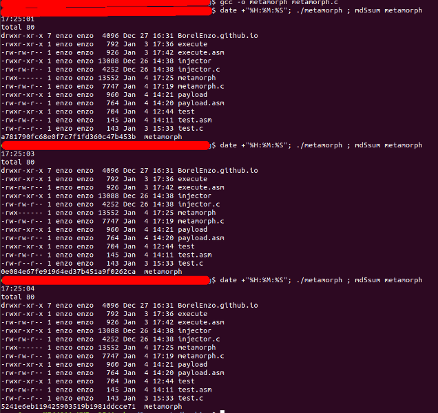

## Self modifying C program - Metamorphic (Basic)

### [~$ cd ..](../)

In the [previous article](./polymorphic1), I described how I wrote a simple **polymorphic** program. "Polymorphic" means that the program (the binary) changes its appearance every time (the md5 sum was
indeed different), but the behavior was always the same. The payload was always decrypted to the same shellcode, and therefore, a malware using this technique to hide its malicious content would be
easily detected, as it could be trivial to create a signature from the decrypted payload.

Metamorphic programs are more difficult to write, but can be way more difficult to detect. Whereas polymorphic program contain a decrypted code which is essentially the same every time, metamorphic programs
can "re-code" themselves. The general behavior will be the normally the same, but the shellcode, and possibly the rest of the program will be different. How is it possible ?

### Brief introduction to metamorphic programs

The idea is to make the code flexible:
* it can be done for example by injecting NOP sleds (as we usually do regarding buffer overflows) between instructions. We have therefore to be able to split instructions (to decode them)
and to pay attention to relative jumps...
* instead of NOP sleds, we can also inject useless instructions (push/pop of the same register, AND against 0xff...ff, double swap, etc.) 
* it's also possible to swap registers, and therefore, we have to keep the code consistent
* we can also reorder instructions

Besides the malicious code, we have therefore to write a bunch of routines (the morphing engine), becoming more and more complex as the malicious code becomes harder to detect.

For this first article on this topic, we propose a simple metamorphic program able to reorder its instructions and shuffle them for the next execution.

Hereafter, we will use the following terms:
* "JMP": the opcode 0xEB (unconditional jump) and its operand
* "useful instruction": instructions other than JMP
* "next instruction in the array" or "in the shellcode" (see example below)
* "next instruction to execute": (see example below)

Let's imagine that we have the following shellcode ( `jmp $+2` does nothing but jumping to the next instruction ):

> ```asm
> jmp $+2
> push rdi		;i1
> jmp $+2
> push rsi		;i2
> jmp $+2
> push rdx		;i3
> jmp $+2
> push rax		;i4
> jmp $+2
> ...
> ```

and we shuffle it in this way (and recompute distances):

> ```asm
>jmp $+5
>push rdx		;i3
>jmp $+5
>push rdi		;i1
>jmp $+5
>push rax		;i4
>jmp $+5
>push rsi		;i2
>jmp $-10
>...
> ```

If we are currently executing `i1`, the "next instruction in the shellcode" is `i4`, but the "next instruction to execute is `i2` (in the non-shuffled version, the "next instruction"'s are the same).

## The shellcode

The goal of the program we wrote was to execute "/bin/ls -l". The difficulty here is to write a shellcode such that none of the operands is expressed relatively to `$rip` because of the shuffling. It means
that we cannot put the constant strings at the end of the shellcode or in the .data section. The shellcode is as follows:

> ```asm
>section .text
>	global _start
>
>_start:
>	push rdx					; save rdx
>	push rdi					; save rdi
>	push rsi					; save rsi
>	push 0x006c2d				; push "-l"
>	push 0x736c2f				; push "/sh"
>	sub rsp, 4					; don't use push here
>	mov dword [rsp], 0x6e69622f ;move "/bin" onto the stack
>	push 0x0					; push null element
>	lea rdi, [rsp+20]			; rdi = address of the argument 
>	push rdi					; push it
>	lea rdi, [rsp+16]			; rdi = address of the command
>	push rdi					; push it
>	mov rsi, rsp				; rsi = @[@"/bin/ls", @"-l" ]
>	mov rdx, 0x0				; NULL
>	mov rax, 0x3b				; execve syscall
>	add rsp, 44					; restore stack pointer
>	syscall
>	pop rsi						; restore rsi
>	pop rdi						; restore rdi
>	pop rdx						; restore rdx
> ```

The register `$rsi` contains the address of an array containing the addresses of the command and its parameters, here: \[@"/bin/sh", @"-l"\]. That's the reason why we put the addresses of these strings
(instructions 10 and 12). The string "/bin/sh" cannot be pushed as an int, that's the reason why we do it in two times, and manually modify `$rsp`.

To make it flexible, we simply have to put `jmp $+2` between instructions ( `jmp $+2` is translated into `eb 00`, which is a null jump):

> ```asm
section .text
>	global _start
>
_start:
>	jmp $+2
>	push rdx					; save rdx
>	jmp $+2
>	push rdi					; save rdi
>	jmp $+2
>	push rsi					; save rsi
>	jmp $+2
>	push 0x006c2d				; push "-l"
>	jmp $+2
>	push 0x736c2f				; push "/sh"
>	jmp $+2
>	sub rsp, 4					; don't use push here
>	jmp $+2
>	mov dword [rsp], 0x6e69622f ;move "/bin" onto the stack
>	jmp $+2
>	push 0x0					; push null element
>	jmp $+2
>	lea rdi, [rsp+20]			; rdi = address of the argument
>	jmp $+2
>	push rdi					; push it
>	jmp $+2
>	lea rdi, [rsp+16]			; rdi = address of the command
>	jmp $+2
>	push rdi					; push it
>	jmp $+2
>	mov rsi, rsp				; rsi = @[@"/bin/ls", @"-l" ]
>	jmp $+2
>	mov rdx, 0x0				; NULL
>	jmp $+2
>	mov rax, 0x3b				; execve syscall
>	jmp $+2
>	add rsp, 44					; restore stack pointer
>	jmp $+2
>	syscall
>	jmp $+2
>	pop rsi						; restore rsi
>	jmp $+2
>	pop rdi						; restore rdi
>	jmp $+2
>	pop rdx						; restore rdx
>	jmp $+2
> ```

It's important to have a leading and a trailing JMP, because once the shellcode is shuffled, we have to reach the first useful instruction at the beginning, and the next instruction
to execute as we reach the last instruction of the shellcode.

## Constants, globals, and imports

The following imports are required:

> ```c
>#include <stdio.h>
>#include <stdlib.h>
>#include <sys/stat.h>
>#include <fcntl.h>
>#include <unistd.h>
>#include <string.h>
>#include <time.h>
>#include <elf.h>
>#include <sys/mman.h>
> ```

The shellcode is 102-bytes long and is not shuffled as we write the program. It is stored in a global `static` variable because we want it in the .data section. Since we will not use `string`'s function,
we can ignore the trailing null-byte:

> ```c
>#define SHELLCODE_SIZE 102
>static unsigned char shellcode[SHELLCODE_SIZE] = "\xeb\x00R\xeb\x00W\xeb\x00V\xeb\x00h-l\x00\x00\xeb\x00h/ls\x00\xeb\x00H\x83\xec\x04\xeb\x00\xc7\x04$/bin\xeb\x00j\x00\xeb\x00H\x8d|$\x14\xeb\x00W\xeb\x00H\x8d|$\x10\xeb\x00W\xeb\x00H\x89\xe6\xeb\x00\xba\x00\x00\x00\x00\xeb\x00\xb8;\x00\x00\x00\xeb\x00H\x83\xc4,\xeb\x00\x0f\x05\xeb\x00^\xeb\x00_\xeb\x00Z\xeb\x00";
> ```

We use the following structure to store the shellcode instructions:

> ```c
>typedef struct Instr_struct{
>	char* i_code;		//shellcode "chunk". Points somewhere the string $shellcode
>	char  i_code_len;	//length of the instruction
>	char  i_index;		//execution index
>	char  i_jump;		//jump to reach next instruction
>} Instr;
> ```

The program will overwrite itself, and therefore, the variable `shellcode` will contain a different string every time, ready to be executed. The structure `Instr` will only help us to shuffle and compute
the jumps.

## The main routine

The main routine is quite simple. First, the program will read its own binary content. Then, the routine `mutate` is called and magic happens inside. The variable `data` is modified in the routine,
so that what corresponds to the .data section in `data` contains, after executing `mutate`, the new shellcode. The binary of the running program is then replaced by a file having the same name and finally, the shellcode
is executed, after granting the execution permission to the memory page.

> ```c
>int main(int argc, char** argv){
>	char* data; 
>	struct stat info; 
>	int fd;
>	
>	/** Reads itself **/
>	if ((fd = open(argv[0], O_RDONLY, 0)) < 0) die(NULL, "Could not read myself\n"); 
>	fstat(fd, &info); 
>	if (!(data = malloc(info.st_size))) die(data, "Could not allocate memory\n"); 
>	read(fd, data, info.st_size); 
>	close(fd); 
>	
>	mutate(data);
>	
>	/** Overwrites itself **/
>	if (unlink(argv[0]) < 0) die(data, "Could not unlink myself\n"); 
>	if ((fd = open(argv[0], O_CREAT|O_TRUNC|O_RDWR, S_IRWXU)) < 0) die(data, "Could not re-create myself\n"); 
>	if (write(fd, data, info.st_size) < 0) die(data, "Could not re-write myself\n"); 
>	close(fd);
>	free(data);
>	
>	/** Execute shellcode **/
>	uintptr_t pagestart	 = (uintptr_t)shellcode & -getpagesize();
>	if (mprotect((void*)pagestart, ((uintptr_t)shellcode + SHELLCODE_SIZE - pagestart), PROT_READ | PROT_WRITE | PROT_EXEC) < 0)
>		die(data, "Could not change permissions before executing. Exiting\n");
>	((void(*)())shellcode)();
>}
>
>void die(char* p_data, char* p_msg){
>	if (p_data) free(p_data); 
>	fprintf(stderr, p_msg, NULL); 
>	exit(EXIT_FAILURE); 
>}
> ```

The `die` routine is used only for debugging purpose, as it simply prints a message, eventually frees the dynamically allocated buffer and exits.

## Helpers

The routine `mutate` is the most complicated, that's the reason why the some helpers have been written to make it easier to understand. The first one is based on the one given [here](https://0x00sec.org/t/elfun-file-injector/410)
or the one we used in [the previous article](./polymorphic1). It reads the data as an ELF header and finds the offset of the .data section. 

> ```c
>Elf64_Shdr* get_section(void* p_data){
>	int i;
>	Elf64_Ehdr* elf_header = (Elf64_Ehdr*) p_data;
>	Elf64_Shdr* section_header_table = (Elf64_Shdr*) (p_data + elf_header->e_shoff);
>	char* strtab_ptr = p_data + section_header_table[elf_header->e_shstrndx].sh_offset;
>	for (i = 0; i < elf_header->e_shnum; i++){
>		if (!strcmp(strtab_ptr + section_header_table[i].sh_name, ".data")) return &section_header_table[i];
>	}
>	return NULL;
>}
> ```

We also created a routine named `split_instructions`, which ... splits instructions, and returns a pointer to an array of `Instr`'s pointers:

> ```c
>Instr** split_instructions(char* p_data, int p_nb_instrs){
>	Instr** instrs = malloc(p_nb_instrs * sizeof(Instr*));	
>	int i, j;
>	unsigned char k;
>	for (i = 0; i < p_nb_instrs; i++){
>		instrs[i] = malloc(sizeof(Instr));
>	}
>	j = shellcode[1] + 2; //first opcode after initial jump: shellcode[1] is the distance and +2 is for the jmp instruction itself
>	for(i = 0; i < p_nb_instrs; i++){
>		k = j + 1; //second char of next instruction
>		while (k < SHELLCODE_SIZE && shellcode[k] != 0xeb) k++;
>		//now, k = next jmp
>		/** Next jump has been found. Shellcode[j+1:k] is an instruction **/
>		instrs[i]->i_code_len = k - j;
>		instrs[i]->i_code = &shellcode[j];
>		instrs[i]->i_index = i;
>		instrs[i]->i_jump = (char)shellcode[k + 1];
>		j = k + instrs[i]->i_jump + 2 ; //jumps to next instruction TO EXECUTE 
>	}
>	return instrs;
>}
> ```

It takes two arguments: the first one if the binay file data read in `main`, and the second one is the number of instructions (detailed later). It begins by dynamically allocating memory and set `j = shellcode[1]+2`.
If we look at the shellcode, we can see the second byte contains a 0x00 at the beginning and is actually the distance between the current JMP and the first instruction to execute. We add 2 to this value
because we have to take into account the current JMP (the 1st one) which is 2-bytes long. At this moment, `j` points to the first opcode of an useful instruction. The variable `k` is set to `j+1` and is incremented
until reaching the next JMP (0xeb opcode). The difference between `j` and `k` is the length of the code of the useful instruction, and `j` is the address of the code of the instruction starts.

The variable `i` is used to set the attribute `i_ index`, used later during the shuffling. Since we pass from one instruction to another by using JMPs, their indexes in the list are the same as the `i_index`. Finally,
since `k` points to the 0xeb after instruction's code, the next offset is at `k+1`. The next `j` is then given by adding the current `k`, the relative jump and the length of a JMP.

## The mutation routine

The goal of the mutation routine is to walk through the shuffled code, shuffle it once again, and recompute jumps. The first thing to do is to count how many instructions we have, according to the number of JMPs (reminder: there is one JMP more):

> ```c
>void mutate(char* p_data){
>	int nb_instr = 0, i, j;
>	unsigned char count;
>	char* cursor = malloc(SHELLCODE_SIZE);
>	Instr* instr = NULL;
>	
>	/** Count how many jumps there are **/
>	for (i = 0; i < SHELLCODE_SIZE; i++){
>		if (shellcode[i] == 0xeb) nb_instr++;
>	}
>	nb_instr--;
>	
>	//instrs: array containing all "useful" instructions, in the right order 
>	Instr** instrs = split_instructions(p_data, nb_instr);
>	...
> ```

Once we have the list `instrs` with instructions stored according to the execution order (their index `i` in the list is the same as their attribute `i_index` ), we want to shuffle the list. However, we need
to have a way to know where is stored the next instruction to execute, for each instruction. This is done by creating the array `instrs_idx`:

> ```c
>	...
>	/** Shuffle **/
>	int instrs_idx[nb_instr];
>	for (i = 0; i < nb_instr; i++)
>		instrs_idx[i] = i;
>	...
> ```

It's now time to shuffle the array and update `instrs_idx` to be able to know where is stored the pointer of the i-th instruction in `instrs`.

## Shuffle 

We are still in `mutate`, juste after the previous snippet. The `while` condition will be detailed later. The idea here is to swap pointers in `instrs`, and update `instrs_idx` properly. 

> ```c
>	...
>	srand(time(NULL));
>	do{
>		for (i = 0; i < nb_instr -1; i++) {
>			j = i + rand() / (RAND_MAX / (nb_instr - i) + 1);
>			//swap instructions
>			instr = instrs[i];
>			instrs[i] = instrs[j];
>			instrs[j] = instr;
>			//swap the indexes, but according to the i_index!
>			int idx = instrs_idx[instrs[i]->i_index];
>			instrs_idx[instrs[i]->i_index] = instrs_idx[instrs[j]->i_index];
>			instrs_idx[instrs[j]->i_index] = idx;
>		}	
>	}
>	while((count = set_jumps(instrs, instrs_idx, nb_instr)) == 0xff); //if all offsets are okay, continue
>	...
> ```

We cannot simply swap indexes in `instrs_idx`, because it would be totally wrong. Let's take an example.

> ```
> instrs = +----------+----------+----------+----------+----------+
>          |  instr3  |  instr2  |  instr0  |  instr4  |  instr1  |
>          +----------+----------+----------+----------+----------+
>
> instrs_idx = +-----+-----+-----+-----+-----+
>              |  2  |  4  |  1  |  0  |  3  |
>              +-----+-----+-----+-----+-----+
> ```

Indeed, in order to build the new shellcode correctly we have to execute the instruction in this order: `instrs\[2\]`, `instrs\[4\]`, `instrs\[1\]`, `instrs\[0\]`, and `instrs\[3\]`.
However, if we want to swap instruction at `i = 1, j = 2` it will give us:

> ```
> instrs = +----------+----------+----------+----------+----------+
>          |  instr3  |  instr0  |  instr2  |  instr4  |  instr1  |
>          +----------+----------+----------+----------+----------+
> ```

but `instrs_idx` will NOT become:

> ```
> +-----+-----+-----+-----+-----+
> |  2  |  1  |  4  |  0  |  3  |
> +-----+-----+-----+-----+-----+
> ```

What we need to do is to use the `i_index`, represented here by the number in `instrX` to swap values in `instrs_idx`: we do not swap `instrs_idx\[1\]` and `instrs_idx\[2\]`, but `instrs_idx\[0\]` and `instrs_idx\[2\]`:

> ```
> instrs_idx = +-----+-----+-----+-----+-----+
>              |  1  |  4  |  2  |  0  |  3  |
>              +-----+-----+-----+-----+-----+
> ```

It's now time to compute jumps. Problem: we have to be sure that none of them has a distance equal to 0xeb... It's what the routine in the `while` condition checks

### Compute jumps

We created another routine to compute jumps, in order to be able to call it as long as there are distances equal to 0xeb. The routine returns -1 in such case, and the value of the initial jump otherwise.

> ```c
>int set_jumps(Instr** p_instrs, int* p_instrs_idx, int p_nb_instrs){
>	int i, j, idx, idx1;
>	unsigned char count;
>	
>	/** Set jumps BETWEEN "useful" instructions**/
>	for (i = 0; i < p_nb_instrs -1; i++){
>		count = 0;
>		idx = p_instrs_idx[i];		//index of the current instruction in shuffled array
>		idx1 = p_instrs_idx[i+1];	//index next instruction (to execute) in shuffled array 
>		if (idx1 > idx){
>			//move forward
>			//start from the NEXT instruction IN THE ARRAY before reaching the next instruction TO EXECUTE
>			for (j = idx+1; j < idx1; j++)
>				count += (2 + p_instrs[j]->i_code_len); //+2 because jump instruction is 2-bytes long
>		}
>		else{
>			//move backward
>			//start from CURRENT instruction until reaching the next instruction TO EXECUTE
>			for (j = idx; j >= idx1; j--)
>				count -= (2 + p_instrs[j]->i_code_len); //same reason for -2
>		}
>		p_instrs[idx]->i_jump = count;
>		if (count == 0xeb) return -1; //if the jump is equal to 0xeb (also jmp's opcode), return -1
>	}
>	
>	/** Set initial jump (reach the first "useful" instruction) **/ 
>	count = 0;
>	for (i = 0; i < p_nb_instrs && i < p_instrs_idx[0]; i++) //instrs_idx[0] contains the index in the shuffled array of the first instruction to execute
>		count += 2 + p_instrs[i]->i_code_len;
>	return (count == 0xeb) ? -1 : count;
>}
> ```

In the first part of the routine, we compute jumps **between** instructions ( => not the initial one). The variables `idx` and `idx1` represent the positions in the shuffled array of two instructions which are
consecutively **executed**. If `idx1` is greater, it means the the next instruction to execute is placed after the current one in the shuffled array. Then, we start to count from the next instruction ad stop before reaching the expected instruction:

> ```
> +----------+
> | JMP -> 0 |
> +----------+
> |  instr5  |
> +----------+
> | JMP -> x |
> +----------+
> |  instr0  | #idx
> +----------+
> | JMP -> 1 |
> +----------+ ---+ start at idx+1
> |  instr2  |    |
> +----------+    |
> | JMP -> 3 |    |
> +----------+    |
> |  instr3  |    |
> +----------+    |
> | JMP -> 4 |    |
> +----------+ <--+ stop before idx1
> |  instr1  | #idx1
> +----------+
> | JMP -> 2 |
> +----------+
> |  instr4  |
> +----------+
> | JMP -> 5 |
> +----------+
> ```

However, if `idx1` is smaller than `idx` (the next instuction to execute is placer before the current one), we have to move backward:

> ```
> +----------+
> | JMP -> 0 |
> +----------+
> |  instr5  |
> +----------+
> | JMP -> x |
> +----------+
> |  instr0  |
> +----------+
> | JMP -> 1 |
> +----------+ <----+
> |  instr2  | #idx1|
> +----------+      |
> | JMP -> 3 |      |
> +----------+      |
> |  instr3  |      |
> +----------+      |
> | JMP -> 4 |      |
> +----------+      |
> |  instr1  | #idx |
> +----------+      |
> | JMP -> 2 |      |
> +----------+ -----+
> |  instr4  |
> +----------+
> | JMP -> 5 |
> +----------+
> ```

If a jump has a distance equal to 0xeb, the routine immediately returns -1 to re-shuffle. Otherwise, the second part of the routine will compute the distance for the initial jump.
It's the same principle, even simpler since we know that we have to move forward until reaching the instruction  `instrs[instrs_idx[0]]`.

**NB**: Be careful, the value returned by `set_jumps` is an integer, but stored in `count`, an `unsigned char`, in `mutate`, that's the reason why we compare against 0xff and not -1!

## Create the future shellcode

If `set_jumps` returns a value other than -1, it means that all distances are corrects, and the return value is used as follows (still in `mutate`, at the end):

> ```c
>	...
>	/** Build the new shellcode **/
>	*cursor++ = 0xeb;
>	*cursor++ = count; //initial jump distance
>	...
> ```

We can now build the shellcode by appending code contained in each `Instr`:

> ```c
>	...
>	for (i = 0; i < nb_instr; i++){
>		instr = instrs[i];
>		for (j = 0; j < instr->i_code_len; j++){
>			*cursor = instr->i_code[j]; cursor++; // append "useful" instruction's code
>		}
>		*cursor++ = 0xeb; //jmp opcode
>		*cursor++ = instr->i_jump; //distance to reach next instruction
>	}
>	...
> ```

## Updating shellcode and free pointers

Once the new shellcode is written in `cursor`, it's time to replace the cursor at the beginning and to copy the new shellcode somewhere in `p_data`. To know exactly where, we use the routine `get_section` and copy the new shellcode
at the given offset. We have to add 0x20 bytes because the shellcode is not placed at beginning of the section:

> ```sh
>$ objdump -d -j .data metamorph
>
>metamorph:     file format elf64-x86-64
>
>
>Disassembly of section .data:
>
>0000000000202000 <__data_start>:
>	...
>
>0000000000202008 <__dso_handle>:
>	202008:	08 20 20 00 00 00 00 00 00 00 00 00 00 00 00 00     .  .............
>	...
>
>0000000000202020 <shellcode>:
>	202020:	eb 00 52 eb 00 57 eb 00 56 eb 00 68 2d 6c 00 00     ..R..W..V..h-l..
>	202030:	eb 00 68 2f 6c 73 00 eb 00 48 83 ec 04 eb 00 c7     ..h/ls...H......
>	202040:	04 24 2f 62 69 6e eb 00 6a 00 eb 00 48 8d 7c 24     .$/bin..j...H.|$
>	202050:	14 eb 00 57 eb 00 48 8d 7c 24 10 eb 00 57 eb 00     ...W..H.|$...W..
>	202060:	48 89 e6 eb 00 ba 00 00 00 00 eb 00 b8 3b 00 00     H............;..
>	202070:	00 eb 00 48 83 c4 2c eb 00 0f 05 eb 00 5e eb 00     ...H..,......^..
>	202080:	5f eb 00 5a eb 00                                   _..Z..
> ```

It actually starts at 0x202020, 32 bytes after the beginning. Hence, we have

> ```c
>	...
>	/** Replace the shellcode in p_data**/
>	cursor -= SHELLCODE_SIZE; //replace the cursor at the beginning
>	Elf64_Shdr *sec_hdr;
>	if ((sec_hdr = get_section(p_data)))
>		memcpy(p_data+sec_hdr->sh_offset + 0x20, cursor, SHELLCODE_SIZE);
>	
>	/** Destroy instructions **/
>	for (i = 0; i < nb_instr; i++)
>		free(instrs[i]);
>	free(instrs);
>	free(cursor);
> ```

The routine `mutate` ends here, by modifying the shellcode in `p_data` (not the variable `shellcode` !). Because of the file overwriting, it will be the future `shellcode` !
We can now run the program and check its MD5:



Download source code [here](metamorph1.c)
